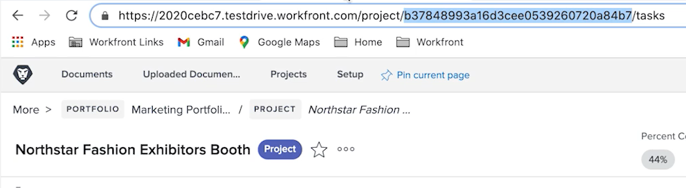

# Übung zum Festlegen/Abrufen von Variablen

Erfahren Sie, wie Sie mithilfe der Module „Set- und Get-Variable“ die in einem Pfad verfügbaren Felder in einem anderen Pfad verwenden können.

## Übungsübersicht

Suchen Sie nach Informationen zu einem Projekt in Workfront und senden Sie eine E-Mail mit relevanten Informationen.

## Zu befolgende Schritte

1. Erstellen Sie ein neues Szenario und nennen Sie es „Variablen zwischen Routing-Pfaden freigeben.“
1. Wählen Sie als Trigger das Modul „Suchen“ in der Workfront-App aus.

   + Setzen Sie den Eintragstyp auf „Projekt“.
   + Wählen Sie als Ergebnismenge „Alle übereinstimmenden Einträge“.
   + Setzen Sie die Suchkriterien auf „Status gleich CUR“.
   + Wählen Sie als Ausgaben ID, Name, Beschreibung und Sponsor-ID.

   

   

1. Klicken Sie auf „OK“ und benennen Sie dieses Modul in „Nach aktuellen Projekten suchen“ um.
1. Fügen Sie ein weiteres Modul hinzu und wählen Sie das Workfront-Modul „Eintrag lesen“.

   + Wählen Sie als Eintragstyp „Benutzer“.
   + Wählen Sie als Ausgaben „Name“.
   + Ordnen Sie die Sponsor-ID aus dem Suchmodul dem ID-Feld zu.

1. Klicken Sie auf „OK“.
1. Benennen Sie das Modul in „Nach Sponsorennamen suchen“ um.

   

1. Speichern Sie das Szenario und klicken Sie auf „Einmal ausführen“.

   Wenn Sie im Modul „Eintrag lesen“ eine Fehlermeldung erhalten, liegt das wahrscheinlich daran, dass das Modul „Suchen“ ein Projekt findet, für das kein Sponsor angegeben ist.

   **Um diesen Fehler zu vermeiden, erstellen Sie zwei Pfade: einen für Projekte mit und einen für Projekte ohne Sponsor-ID.**

1. Fügen Sie einen Router zwischen den beiden Modulen ein, indem Sie auf das Schraubenschlüssel-Symbol zwischen dem Router und dem Modul „Eintrag lesen“ klicken. Richten Sie einen Filter namens „Sponsor vorhanden“ ein und setzen Sie die Bedingung auf „Sponsor-ID vorhanden“.

   

1. Klicken Sie auf den Router, um einen weiteren Pfad zu erstellen. Fügen Sie ein Modul zum Senden einer E-Mail aus der E-Mail-App hinzu.

   + Geben Sie Ihre eigene E-Mail-Adresse in das Feld „An“ ein.
   + Geben Sie in das Betreff-Feld „Aktuelle Projektinformationen“ ein.
   + Geben Sie in das Feld „Inhalt“ den Projektnamen, die Beschreibung und den Sponsor ein.
   + Sie können die Ausgabe des Sponsorennamens nicht aus dem Modul „Eintrag lesen“ ziehen. Sie können die Sponsor-ID nur über das Suchmodul vor dem Router abrufen. Sie müssen eine Möglichkeit finden, den Sponsorennamen vom anderen Routerpfad aus aufzurufen.

   

1. Klicken Sie zunächst auf „OK“ und benennen Sie dieses Modul in „Projektinfo senden“ um

   **Verwenden Sie Set/Get-Variablen, um Daten zwischen verschiedenen Pfaden freizugeben.**

1. Fügen Sie nach dem Modul „Nach Sponsorennamen suchen“ ein Modul „Set-Variablen-Tool“ ein.

   + Geben Sie als Variablennamen „Sponsorenname“ ein.
   + Belassen Sie die Lebensdauer der Variablen auf „Ein Zyklus“.
   + Ordnen Sie das Feld dem Namen zu, den das Modul „Nach Sponsorennamen suchen“ ausgibt.

1. Klicken Sie auf „OK“ und benennen Sie das Modul in „Sponsorenname festlegen“ um.

   

1. Klicken Sie anschließend mit der rechten Maustaste zwischen den Router und das Modul „E-Mail senden“, um ein Modul „Get-Variablen-Tool“ hinzuzufügen. Geben Sie „Sponsorenname“ in das Feld „Variablenname“ ein.
1. Klicken Sie auf „OK“. Benennen Sie das Modul in „Sponsorname abrufen“ um.

   

1. Gehen Sie zurück zum Modul „E-Mail senden“ und ordnen Sie den Wert aus dem Modul „Sponsorenname abrufen“ dem Inhaltsfeld zu. Klicken Sie auf „OK“.

   

   >[!IMPORTANT]
   >
   >Bevor Sie das Szenario testen, empfehlen wir Ihnen, die Anzahl der Projekte, die Sie bearbeiten, zu begrenzen, um eine Flut von E-Mails zu vermeiden.

1. Durchsuchen Sie Ihr Workfront-Testlaufwerk nach dem Projekt „Northstar Fashion Exhibitors Booth“. Dies ist ein aktuelles Projekt mit einem Sponsor. Kopieren Sie die Projekt-ID aus der URL.

   

1. Klicken Sie in Ihrem Szenario auf das Modul „Nach aktuellen Projekten suchen“. Fügen Sie eine weitere Bedingung zu den Suchkriterien hinzu, indem Sie auf die grüne Schaltfläche „UND-Regel hinzufügen“ klicken. Geben Sie an, dass die ID der kopierten Projekt-ID entsprechen muss. Klicken Sie auf „OK“.
1. Speichern Sie das Szenario und klicken Sie auf „Einmal ausführen“.
1. Überprüfen Sie die Ausführungsinspektoren und die E-Mail, die Sie erhalten.

   
