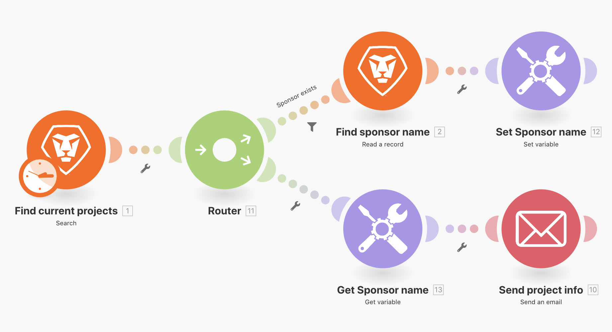
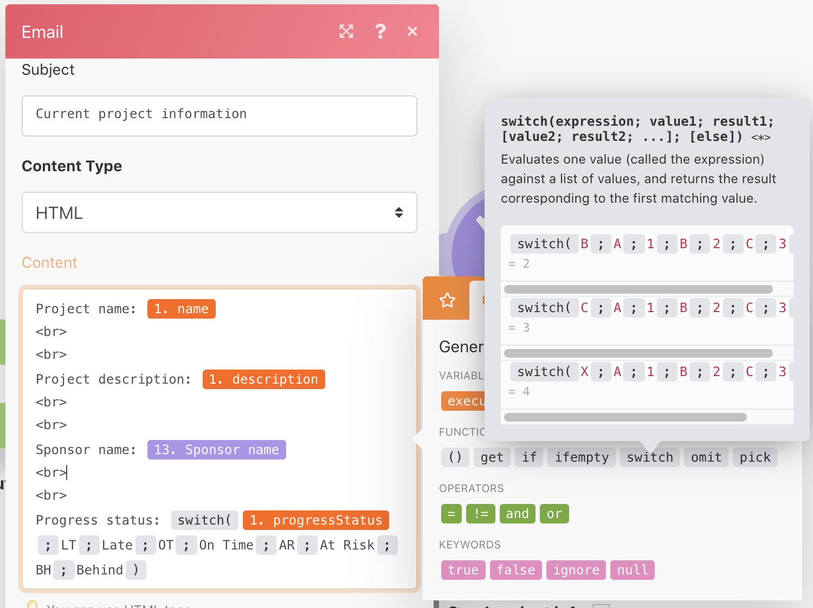

# Übung zur Switch-Funktion

Erfahren Sie, wie Sie die Umschaltfunktionalität nutzen können, indem Sie die Umschaltfunktion verwenden.

## Übungsübersicht

Verwenden Sie für einfache Datenänderungen die Switch-Funktion, um einen Wert innerhalb eines Modulfelds in einen anderen umzuwandeln. Ändern Sie in dieser Übung den Zwei-Buchstaben-Schlüssel zum tatsächlichen Namen für den Projektfortschrittsstatus, den Sie in einer E-Mail versenden möchten.

## Zu befolgende Schritte

1. Klonen Sie das Szenario mit dem Namen „Freigeben von Variablen zwischen Routing-Pfaden“.
1. Nennen Sie das neue Szenario „Freigeben von Variablen zwischen Routing-Pfaden – Umschalten“.
1. Klicken Sie auf das Trigger-Modul und fügen Sie den Fortschrittsstatus in den Ausgabeabschnitt ein.
1. Fügen Sie im Modul „E-Mail senden“ dem Inhaltsfeld „Fortschrittsstatus“ hinzu.

   + Wenn Sie einfach den Wert aus dem Suchmodul anwenden, gibt es einen zweibuchstabigen Code für den Fortschrittsstatus.
   + Um den Code für den vollständigen Namen jedes möglichen Fortschrittsstatus „umzuschalten“, verwenden Sie die Funktion „Umschalten“ auf der Registerkarte „Allgemeine Funktionen“.

1. Die Umschaltfunktion verwendet den Wert oder Ausdruck des Fortschrittsstatus als Schlüssel und gibt dann den auf diesem Schlüssel basierenden Ausgabewert zurück.

   + An der ersten Stelle nach dem Fortschrittsstatus („VS“) wird ein Schlüsselwert definiert, an der zweiten Stelle die entsprechende Ausgabe („Verspätet“).
   + An dritter Stelle wird der nächste Schlüsselwert definiert, an vierter Stelle die entsprechende Ausgabe usw., und zwar für so viele Schlüssel wie gewünscht.

     
