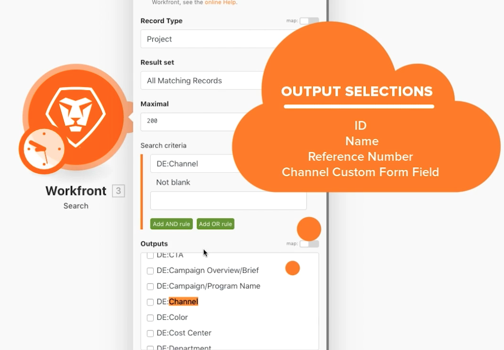

# Schaltmodul-Übung

Erfahren Sie, wie Sie das Switch-Modul verwenden können, um komplexere oder dynamische Datentransformationen durchzuführen.

## Übungsübersicht

Suchen Sie nach Briefpost-Projekten auf Ihrem Testlaufwerk und ändern Sie den Namen jedes Projekts anhand eines Werts, der in einem benutzerdefinierten, dem Projekt zugeordneten Feld ausgewählt wurde.

## Zu befolgende Schritte

1. Erstellen Sie ein neues Szenario und nennen Sie es „Verwendung des Switch-Moduls“.
1. Verwenden Sie für das Trigger-Modul das Workfront-Suchmodul.
1. Richten Sie Ihre Workfront-Verbindung ein und setzen Sie den Eintragstyp auf „Projekt“.
1. Geben Sie in den Suchkriterien an, dass nur Projekte mit einem Wert im benutzerdefinierten Feld „Kanal“ angezeigt werden sollen.
1. Wählen Sie als Ausgaben ID, Name, Referenznummer und das benutzerdefinierte Feld „Kanal“.

   

1. Fügen Sie das Switch-Modul aus der Option „Tools“ hinzu.
1. Weisen Sie für das Eingabefeld das benutzerdefinierte Feld „Kanal“ aus dem Suchmodul zu.

   

1. Fügen Sie als Nächstes Fälle für jeden möglichen Wert aus dem benutzerdefinierten Feld „Kanal“ hinzu. Der mögliche Wert wird in das Feld „Muster“ eingetragen. Sie können festlegen, dass das Ausgabefeld einen spezifischen 3 Zeichen langen Code enthält, gefolgt von der Projektreferenznummer und dem Projektnamen.

   **Ihr Zuordnungsfenster sollte wie folgt aussehen:**

   

1. Sie können beliebig viele zusätzliche Fälle hinzufügen. Beachten Sie das Feld „Sonst“ am unteren Rand. Dies wird verwendet, wenn der Eingabewert mit keinem der Fälle übereinstimmt.

   **Aktualisieren Sie den Projektnamen in Workfront.**

   

1. Fügen Sie ein Workfront-Modul zum Aktualisieren von Datensätzen hinzu.
1. Weisen Sie im ID-Feld die ID des Trigger-Moduls zu.
1. Setzen Sie den Eintragstyp auf „Projekt“.
1. Wählen Sie das Feld „Name“ aus dem Abschnitt „Zuzuordnende Felder auswählen“ und weisen Sie es der Ausgabe des Switch-Moduls zu.
1. Speichern Sie Ihr Szenario und führen Sie es einmal aus. Sehen Sie sich die aktualisierten Projektnamen auf Ihrem Testlaufwerk an.
