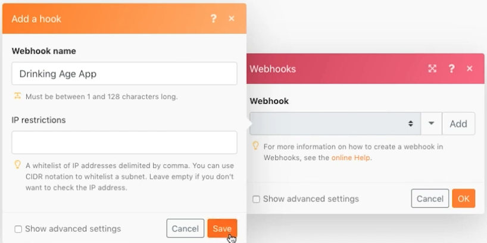
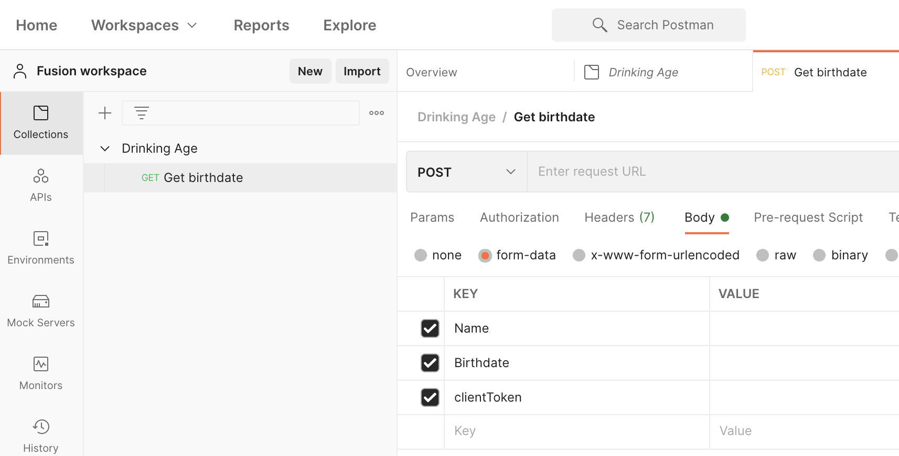

# Webhooks

Erfahren Sie, wie Sie mit Webhook initiierte Szenarien erstellen, Trigger vornehmen und verwalten.

## Übungsübersicht

Der Zweck dieses Szenarios besteht darin, eine App zu erstellen, um an Supermärkte zu verkaufen, damit sie leicht feststellen können, ob ein Kunde alt genug ist, um Alkohol zu kaufen. Der Kassierer muss einfach den Namen und das Geburtsdatum des Kunden an eine URL posten, die ihm zur Verfügung gestellt wurde. Dieser Beitrag Trigger das Szenario, in dem die Antwort berechnet und an den Anfragenden zurückgegeben wird.

1. Das Szenario besteht aus drei Webhooks.
1. Das Trigger-Modul ist ein benutzerdefinierter Webhook, der auf einen Beitrag wartet.
1. Wenn er einen Beitrag erhält, wird er an eines der nächsten Module ausgegeben.
1. Das nächste Modul gibt eine Antwort an den Anforderer zurück.

   

## Schritte, die ausgeführt werden müssen

**Richten Sie den Trigger-Webhook ein.**

1. Erstellen Sie ein neues Szenario und nennen Sie es &quot;Verwenden von Webhooks&quot;.
1. Fügen Sie für den Trigger das benutzerdefinierte Webhook-Modul aus der Webhooks-App hinzu.
1. Klicken Sie auf Hinzufügen , um einen neuen Webhook zu erstellen.
1. Geben Sie den Webhook-Namen von &quot;Drinking age app&quot;ein.
1. Lassen Sie IP-Einschränkungen leer, d. h. jeder kann Daten an sie senden.
1. Klicken Sie auf Speichern.

   

1. Im Bereich Webhooks-Zuordnung wurde eine URL für diesen Webhook erstellt. Klicken Sie auf &quot;Adresse in Zwischenablage kopieren&quot;, um diese URL zu kopieren.
1. Klicken Sie auf OK.
1. Klicken Sie einmal auf Ausführen .
1. Verwenden Sie die URL in Postman, um einen Namen und ein Geburtsdatum an Ihren benutzerdefinierten Webhook zu senden. Anweisungen zum Einrichten von Postman finden Sie in der [Webhooks-Anleitung](https://experienceleague.adobe.com/docs/workfront-learn/tutorials-workfront/fusion/beyond-basic-modules/webhooks-walkthrough.html?lang=en) Tutorial.

   **Das Bedienfeld Webhooks-Modul sollte wie folgt aussehen:**

   

   **Der Webhook befindet sich jetzt in einem Status, in dem er Daten zur Bestimmung der Datenstruktur überwacht.**

1. Sie können die Datenstruktur der Payload definieren, die Sie erwarten (Datenstrukturen werden später besprochen). Wenn Sie keine Datenstruktur definieren, bestimmt Fusion die Datenstruktur automatisch, wenn der Beitrag gesendet wird.
1. Auf der Postman-Seite möchten Sie an die kopierte URL senden. Der Beitrag sollte grundlegende Formulardaten enthalten. Für dieses Beispiel benötigen Sie drei Felder: Name, Geburtsdatum und clientToken.

   

1. Nachdem Sie auf Von Postman senden geklickt haben, sollten Sie einen Hinweis erhalten, dass der Beitrag akzeptiert wurde.
1. Dies ist der Punkt, an dem Ihr Szenario zeigt, dass die Datenstruktur erfolgreich ermittelt wurde.
1. Sie können sehen, dass die Daten empfangen wurden, indem Sie den Ausführungsinspektor öffnen.

   

   **Richten Sie das Routing für Client-Token ein.**

1. Fügen Sie dem Trigger-Modul einen Router hinzu.
1. Fügen Sie im oberen Pfad ein Webhook-Antwortmodul hinzu. Dies ist unser Pfad für , wenn das Client-Token nicht übereinstimmt.
1. Legen Sie den Status auf 401 fest.
1. Setzen Sie den Hauptteil auf {&quot;error&quot;: &quot;Anfrage konnte nicht authentifiziert werden. Bitte überprüfen Sie Ihr clientToken&quot;}.

   

1. Erstellen Sie einen Filter zwischen dem Router und dem Webhook-Antwortmodul. Geben Sie ihm den Namen &quot;Client-Token stimmt nicht überein&quot;.
1. Verwenden Sie für die Bedingung das Feld clientToken aus dem Trigger-Modul und führen Sie einen numerischen Vergleich mit der Zahl 5121933 durch.

   

1. Fügen Sie im unteren Pfad ein weiteres Webhook-Antwortmodul hinzu. Dies ist unser Pfad für den Fall, dass das Client-Token übereinstimmt.
1. Legen Sie den Status auf 200 fest.
1. Verwenden Sie beim Einrichten des Hauptteils die Zuordnungsbereichsfunktionen, um zu testen, ob die Person 21 oder älter ist. Falls sie es sind, kehren Sie zurück: &quot;Du bist alt genug zu trinken!&quot;, sonst kehren Sie zurück: &quot;Du bist aus Glück...&quot;

   

1. Erstellen Sie auf dem unteren Pfad einen Filter zwischen dem Router und dem Webhook-Antwortmodul. Nennen Sie ihn &quot;Client-Token stimmt überein&quot;.
1. Verwenden Sie für die Bedingung das Feld clientToken aus dem Trigger-Modul und führen Sie einen numerischen &quot;Gleich&quot;Vergleich mit der Zahl 5121933 durch.

   

1. Klicken Sie unter &quot;Ausführen einmal&quot;auf die Schaltfläche &quot;Planung&quot;, um Ihr Szenario zu aktivieren, sodass Sie jedes Mal, wenn ein neuer Beitrag empfangen wird, einen der beiden Pfade durchlaufen und eine Antwort generieren können.
