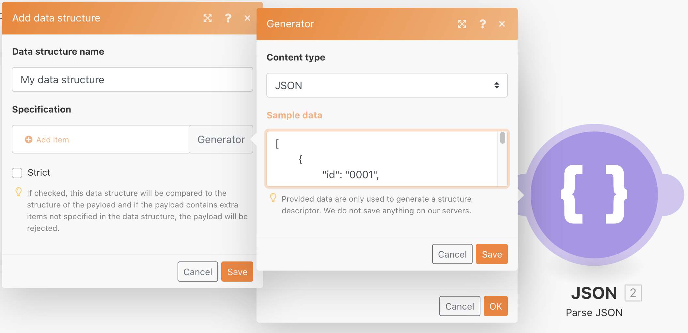

# Arbeiten mit JSON

Erfahren Sie, wie Sie JSON in einem Szenario erstellen und analysieren, um Ihre Designanforderungen zu unterstützen.

## Übungsübersicht

Ziel dieser Übung ist es, konzeptionell zu zeigen, wie die in ein Szenario gesendeten Informationen in einem JSON-Format verwendet und in Felder und Elemente analysiert werden, die Sie in Ihrem Szenario zuordnen können. Anschließend können Sie Informationen aus diesen zugeordneten Arrays abrufen oder die Informationen in JSON aggregieren, um sie dann an ein anderes System zu senden, das JSON als empfangende Eingabe erwartet.

## Schritte, die ausgeführt werden müssen

**Erstellen Sie eine Datenstruktur und analysieren Sie JSON.**

1. Erstellen Sie ein neues Szenario und nennen Sie es &quot;Arbeiten mit JSON-Ringdaten&quot;.
1. Verwenden Sie für das Trigger-Modul das Modul Variable festlegen .
1. Geben Sie für den Variablennamen &quot;Daten ablegen&quot;ein.
1. Kopieren Sie für den Variablenwert den Inhalt des Dokuments &quot;_Donut Data - Sample JSON.rtf&quot;, das Sie im Ordner Fusion Übungsdateien in Ihrem Testlaufwerk finden.

   

1. Benennen Sie dieses Modul &quot;JSON von einem anderen Connector&quot;um.
1. Fügen Sie ein JSON-Parse-Modul hinzu.
1. Klicken Sie im Feld Datenstruktur auf Hinzufügen .
1. Wählen Sie den Generator aus und fügen Sie die JSON-Beispieldaten Donut Data - Sample ein, die Sie in das Feld Beispieldaten kopiert haben.

   

1. Klicken Sie auf Speichern und benennen Sie die Datenstruktur &quot;Daten ablegen&quot;. Klicken Sie dann auf Speichern.
1. Ordnen Sie die Donut-Daten aus dem Set-Variablenmodul dem JSON-Zeichenfolgenfeld zu.

   

1. Speichern Sie das Szenario und klicken Sie dann auf Einmal ausführen , um die Ausgabe anzuzeigen.

   **Die Ausgabe des Parse-JSON-Moduls sollte wie folgt aussehen:**

   

   **Ordnen Sie bestimmten Array-Variablen zu.**

1. Fügen Sie nach dem JSON-Modul Parse einen Router hinzu.
1. Fügen Sie im obersten Pfad ein Set-Variablenmodul hinzu.
1. Geben Sie für den Variablennamen &quot;Batter types by donut&quot;ein.
1. Verwenden Sie für den Wert Variable die Funktion map , um die Stapeltypen aus dem Batter-Array abzurufen.

   

1. Klicken Sie auf OK und dann einmal ausführen.
1. Öffnen Sie den Ausführungsinspektor, um das Ausgabebundle für jeden der drei Vorgänge anzuzeigen und die Stapeltypen für jeden der drei Vorgänge anzuzeigen.

   

   **Aggregieren Sie die Szenario-Daten in JSON.**

1. Fügen Sie im unteren Routing-Pfad ein Aggregat zum JSON-Modul hinzu.
1. Wählen Sie für das Quellmodul den Iterator - das JSON-Modul &quot;Parse&quot;.
1. Erstellen oder wählen Sie für die Datenstruktur eine beliebige Datenstruktur. Verwenden Sie für dieses Beispiel Ringdaten.
1. Ordnen Sie die Felder für dieses Beispiel direkt zu, wie unten dargestellt.
1. Beachten Sie beim Aufstocken und Aufstocken, dass es sich um Arrays handelt. Klicken Sie daher auf Element hinzufügen , um sie zuzuordnen.

   

1. Speichern Sie das Szenario und klicken Sie einmal auf Ausführen .

Sehen Sie sich den Ausführungsinspektor für das Modul Aggregat zu JSON an und stellen Sie fest, wie Sie drei Bundles zu einer JSON-Zeichenfolge aggregieren konnten. Sie können diese Zeichenfolge dann an andere Systeme senden, die JSON erwarten.

