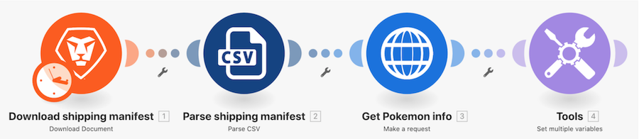

# Einführung in universelle Connectoren – Anleitung

## Übersicht

Rufen Sie mithilfe eines Pokemon-Charakters in einer Tabelle die Poke-API über einen HTTP-Connector auf, um weitere Informationen über diesen Charakter zu sammeln und zu veröffentlichen.

## Einführung in universelle Connectoren – Anleitung

Workfront empfiehlt, sich das Anleitungsvideo anzusehen, bevor Sie versuchen, die Übung in Ihrer eigenen Umgebung neu zu erstellen.

>[!VIDEO](https://video.tv.adobe.com/v/335270/?quality=12&learn=on&enablevpops=1)

### Übungs-URLs

Website der Pokemon-API: `https://pokeapi.co/`

URL der Übung: `https://pokeapi.co/api/v2/pokemon/{Character}`

## Möchten Sie mehr erfahren? Wir empfehlen Folgendes:

[Workfront Fusion-Dokumentation](https://experienceleague.adobe.com/de/docs/workfront-fusion/using/get-started-with-fusion/understand-workfront-fusion/workfront-fusion-overview)
