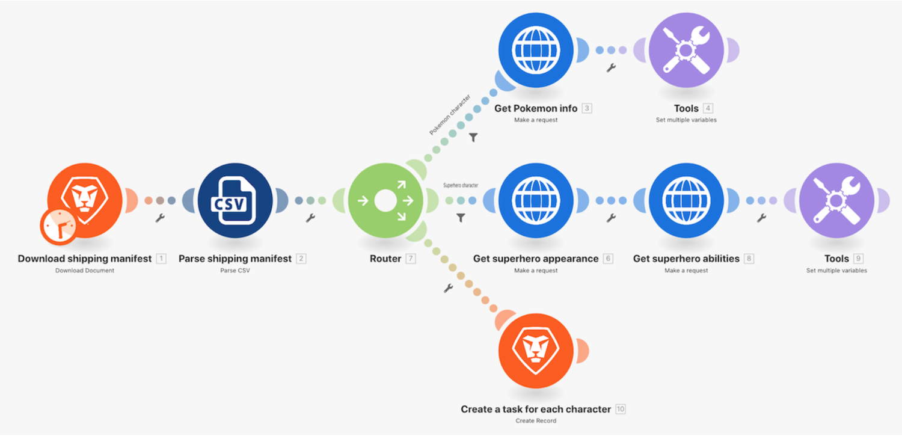
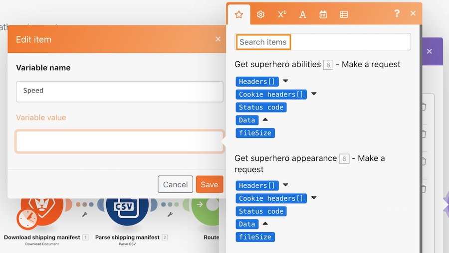
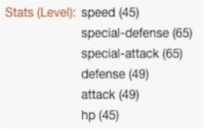
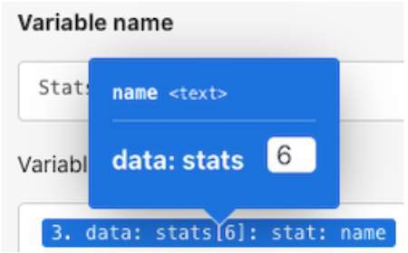

# Router – Anleitung

Verwenden Sie einen Router, um die Bündel „Pokemon vs. Superhelden“ auf den richtigen Weg zu bringen, und erstellen Sie dann eine Aufgabe für jede Figur.

## Router – Anleitung

Workfront empfiehlt, sich das Anleitungsvideo anzusehen, bevor Sie versuchen, die Übung in Ihrer eigenen Umgebung neu zu erstellen.

>[!VIDEO](https://video.tv.adobe.com/v/335272/?quality=12&learn=on&enablevpops=1)

## Übungs-URLs

* Website der Superhero-API: `https://www.superheroapi.com/`
* Erste URL für die Übung: `https://www.superheroapi.com/api/{access-token}/{character-id}/appearance`
* Zweite URL für die Übung: `https://www.superheroapi.com/api/{access-token}/{character-id}/powerstats`

Wenn Sie Probleme haben, auf Ihr eigenes Superhelden-Token zuzugreifen, können Sie dieses gemeinsame Token verwenden: 10110256647253588. Bitte achten Sie darauf, wie oft Sie die Superhelden-API aufrufen, damit dieses gemeinsame Token weiterhin für alle funktioniert.

## Elemente im Zuordnungsfenster suchen

Das Fenster „Elemente suchen“ oben im Zuordnungsfenster hilft Ihnen bei der Suche nach Feldern im Fenster, selbst wenn diese in Arrays verschachtelt sind. Bei der Suche wird nicht zwischen Groß- und Kleinschreibung unterschieden.

## Tipps und Tricks für die Arbeit mit APIs

Bis zu diesem Punkt haben Sie mit einer sehr einfachen API (Application Programming Interface) gearbeitet, die keine zusätzliche Authentifizierung erfordert, um die im Szenario benötigten Informationen abzurufen. Nachfolgend finden Sie einige Tipps, die Ihnen die Arbeit mit APIs und universellen Connectoren erleichtern.

## Schritt 1: Bestimmen des API-Typs

Workfront und viele andere Softwaresysteme basieren auf einer REST-API (Representational State Transfer), was heutzutage der einfachste und gängigste API-Typ ist. Es gibt jedoch noch einige andere, z. B.:

* SOAP (Simple Object Access Protocol) (Die Proof-API in Workfront ist SOAP-basiert)
* FTP (File Transfer Protocol)
* SFTP (Secure File Transfer Protocol)
* Wenn Sie mehr erfahren möchten, führen Sie eine Internet-Suche nach API-Typen und Schlüsselwörtern durch.

>[!NOTE]
>
>Wenn Sie eine Verbindung zu größeren Plattformen wie Salesforce herstellen, stellen verschiedene Bereiche dieser Plattformen unterschiedliche APIs zur Verfügung. Stellen Sie sicher, dass Sie die richtige für den Dienst finden, zu dem Sie eine Verbindung herstellen möchten.

## Schritt 2: Bestimmen des für die API erforderlichen Authentifizierungstyps

Die API-Authentifizierung ist eine Form der Identifizierung, die verwendet wird, um den Zugriff auf einen Dienst zu kontrollieren, z. B. beim Versuch, eine Verbindung über Workfront Fusion herzustellen. Damit können Sie gegenüber einem anderen System nachweisen, dass Sie zum Zugriff auf das System berechtigt sind. OAuth 2 ist heutzutage die am häufigsten verwendete Authentifizierungsmethode. Erfahren Sie mehr durch eine Internet-Suche zur API-Authentifizierung.

Die Authentifizierung kann der schwierigste Aspekt bei der Arbeit mit einer API sein. Eines der wertvollsten Funktionen der universellen Connectoren von Workfront Fusion ist, dass Workfront Fusion die Authentifizierung für Sie übernehmen kann, wenn Sie gängige Authentifizierungsmethoden wie Basisauthentifizierung, OAuth 2, API Key und andere verwenden. Sobald Sie eine Verbindung mit dem entsprechenden Workfront Fusion-Modul für Ihre Authentifizierungsmethode (z. B. OAuth 2) erstellt haben, generiert Workfront Fusion jedes Mal, wenn Sie Ihr Szenario ausführen möchten, API-Schlüssel und/oder Token.

Im Übersichtsartikel zur erweiterten Authentifizierung auf Experience League erfahren Sie mehr über die verschiedenen Authentifizierungsmethoden unter Workfront.

## Schritt 3: Lesen der API-Dokumentation und Finden der benötigten Endpunkte

Wenn eine API mit einem anderen System interagiert, werden die Berührungspunkte dieser Kommunikation als Endpunkte bezeichnet. Ein Endpunkt ist der Ort, an den APIs Anfragen senden und an dem sich die Ressource befindet.

Wenn Sie über einen universellen Connector mit einer API interagieren, müssen Sie wissen, welche Endpunkte die API unterstützt und welche Daten für jede Anfrage erforderlich sind. Die API-Dokumentation sollte die Endpunkte einer API und die Durchführung gängiger Vorgänge wie Erstellen, Lesen, Aktualisieren oder Löschen beschreiben. Die Durchführung dieser Aufrufe erfordert etwas Übung, vor allem, wenn Sie zum ersten Mal API-Aufrufe tätigen oder mit einer neuen API arbeiten.

Erfahren Sie auf Experience League mehr über universelle Connectoren in Workfront Fusion und darüber, wie Sie sie einrichten, um eine Verbindung zu den APIs herzustellen, die Sie benötigen.

## Schlussbemerkung

Sie können die gesamte Liste unserer vorkonfigurierten App-Connectoren in Experience League einsehen. Wenn Sie dem Produkt-Team von Workfront Fusion einen neuen App-Connector vorschlagen möchten, reichen Sie Ihre Idee im Innovation Lab ein. Wenn Sie noch nie etwas dort eingereicht haben, können Sie mehr über das Innovation Lab erfahren sowie darüber, wie Sie für Ideen abstimmen und an der zweimal jährlich stattfindenden Priorisierung des Leaderboards teilnehmen können. Wenn Sie bereits Zugang zum Innovation Lab haben, melden Sie sich an und reichen Sie Ihre Ideen ein.

## Sie sind dran

>[!NOTE]
>
>Die Übungen und Herausforderungen sind optional und nicht notwendig, um die Fusion-Schulung abzuschließen.

Diese Übung baut auf dem auf, was Sie in der exemplarischen Vorgehensweise gelernt haben, aber die Lösung wird nicht bereitgestellt.

Erstellen Sie im Modul „Mehrere Variablen für Pokemon-Figuren festlegen“ eine Variable namens „Statistik (Stufe)“. Übertragen Sie den Namen der Pokemon-Statistik in diese Variable. Verwenden Sie die Array-Wert-Funktion, um die Anzeige des Arrays so zu ändern, dass jede Statistik eine neue Zeile ist, wie unten dargestellt.

**Tipp:** Es gibt nur sechs verschiedene Pokemon-Statistiken mit einer entsprechenden Stufe.

**Aufgabe:** Versuchen Sie, die Array-Formeln zu verwenden, um die Fähigkeiten auf die gleiche Weise wie oben als verschiedene Zeilen und nicht als durch ein Komma getrennte Wertefolge anzuzeigen. Im folgenden Screenshot finden Sie einen Tipp.

## Möchten Sie mehr erfahren? Wir empfehlen Folgendes:

[Workfront Fusion-Dokumentation](https://experienceleague.adobe.com/de/docs/workfront-fusion/using/get-started-with-fusion/understand-workfront-fusion/workfront-fusion-overview)
