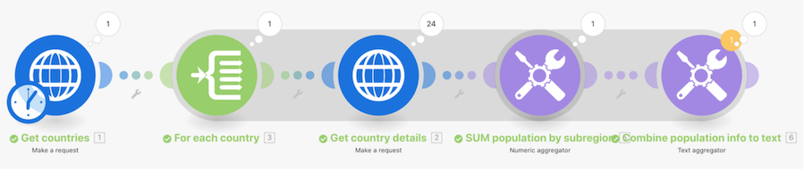

# Erweiterte Aggregation – Anleitung

Aufruf eines Web-Dienstes zur Abfrage von Details zu mehreren Ländern und zur Ermittlung der Gesamtbevölkerung aller Länder, gruppiert nach Unterregionen.

## Erweiterte Aggregation – Anleitung

Workfront empfiehlt, sich das Anleitungsvideo anzusehen, bevor Sie versuchen, die Übung in Ihrer eigenen Umgebung neu zu erstellen.

>[!VIDEO](https://video.tv.adobe.com/v/335281/?quality=12&learn=on)

## Übungs-URLs

* `https://restcountries.com/v2/lang/es`
* `https://restcountries.com/v2/name/{country name}`

## Stärkung des Aggregationsprinzips

Immer wenn ein Modul mehrere Bündel ausgibt, wird jedes nachfolgende Modul jedes Bündel ausführen.

Um dies zu verhindern, fügen Sie hinter einem Modul, das möglicherweise mehrere Bündel erzeugt, einen Aggregator ein.

Sie werden einen Schatten sehen, der jedes Segment in Ihrem Szenario von einem **Anfangsiterator** bis zum **Endaggregator** umgibt. So lassen sich diese Segmente in Ihrem Workfront Fusion-Szenario leicht erkennen.

## Sie sind dran

>[!NOTE]
>
>Die Übungen und Herausforderungen sind optional und nicht notwendig, um die Fusion-Schulung abzuschließen.

Diese Übung baut auf dem auf, was Sie in der exemplarischen Vorgehensweise gelernt haben, aber die Lösung wird nicht bereitgestellt.

Erstellen Sie ein neues Szenario, um alle Stunden zu summieren, die für Aufgaben in Projekten aus dem Marketing-Portfolio aufgezeichnet wurden. Senden Sie dann eine E-Mail mit dem Inhalt „Ihr Projekt-Team {Project Name} hat {summed hours} der insgesamt {planned hours} geplanten Stunden verbucht, sodass {percentage} des Plans erfüllt sind.“

**Herausforderung:** Versuchen Sie, nun dasselbe zu tun, aber nur für die in diesem Jahr erfassten Stunden.

## Möchten Sie mehr erfahren? Wir empfehlen Folgendes:

[Dokumentation zu Workfront Fusion](https://experienceleague.adobe.com/docs/workfront/using/adobe-workfront-fusion/workfront-fusion-2.html?lang=de)
