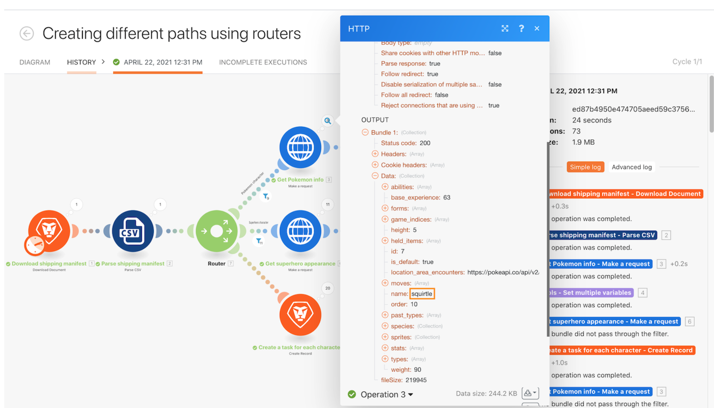

# Anleitung zum Ausführungsverlauf

## Übersicht

Überprüfen Sie den Ausführungsverlauf für das Szenario &quot;Verwenden des mächtigen Filters&quot;, um zu verstehen, was bei Ausführungen passiert ist und wie sie bei Ausführung strukturiert waren.

## Anleitung zum Ausführungsverlauf

Workfront empfiehlt, sich das Anleitungsvideo anzusehen, bevor Sie versuchen, die Übung in Ihrer eigenen Umgebung neu zu erstellen.

>[!VIDEO](https://video.tv.adobe.com/v/335283/?quality=12)

>[!TIP]
>
>Eine schrittweise Anleitung zum Abschließen der exemplarischen Vorgehensweise finden Sie im Abschnitt [Anleitung zum Ausführungsverlauf](https://experienceleague.adobe.com/docs/workfront-learn/tutorials-workfront/fusion/exercises/execution-history.html?lang=en) Übung.

## Volltextsuche auf der Registerkarte &quot;Verlauf&quot;

Die Volltextsuche ist im Tab Verlauf eines Szenarios verfügbar, sodass Sie nach allen im Szenario verarbeiteten Daten suchen können.

Anstatt jede Ausführung für die Suche nach Daten zu öffnen, durchsucht die Volltextsuche alle Ausführungen innerhalb eines einzigen Szenarios. Die Suchergebnisse enthalten eine Liste der Ausführungen, in denen die Daten gefunden wurden, und Sie können auf jede Ausführung klicken, um weitere Informationen zu erhalten.

Die Suchergebnisse enthalten einige nützliche Symbole in der Abbildung unten.

A - Der Status der Ausführung.

B - Gibt an, ob sich die Daten in der Eingabe oder Ausgabe des Moduls befanden, in dem sie gefunden wurden.

C - Die Ausführungs-ID.

D - Kopieren Sie die Ausführungs-ID.

Wenn Sie auf eine Ausführung klicken, lädt Workfront Fusion die Ausführung und das Modul, in dem das Suchergebnis gefunden wurde. Er öffnet den Ausführungsinspektor für das Modul, das die Suchdaten enthält.

## Möchten Sie mehr erfahren? Wir empfehlen Folgendes:

[Dokumentation zu Workfront Fusion](https://experienceleague.adobe.com/docs/workfront/using/adobe-workfront-fusion/workfront-fusion-2.html?lang=en)
