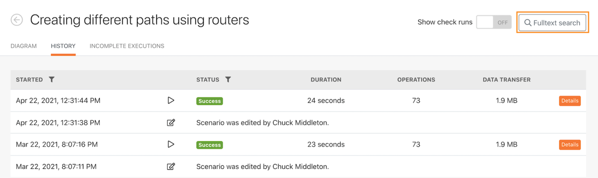

# Exemplarische Vorgehensweise für den Ausführungsverlauf

Überprüfen Sie den Ausführungsverlauf für das Szenario „Verwenden des mächtigen Filters“, um zu verstehen, was bei den Ausführungen passiert ist und wie sie strukturiert waren, als sie ausgeführt wurden.

## Exemplarische Vorgehensweise für den Ausführungsverlauf

Workfront empfiehlt, sich das Anleitungsvideo anzusehen, bevor Sie versuchen, die Übung in Ihrer eigenen Umgebung neu zu erstellen.

>[!VIDEO](https://video.tv.adobe.com/v/335283/?quality=12&learn=on&enablevpops)

## Volltextsuche in der Registerkarte „Verlauf“

Die Volltextsuche ist auf der Registerkarte „Verlauf“ eines Szenarios verfügbar und ermöglicht die Suche nach allen im Szenario verarbeiteten Daten.

Anstatt jede Ausführung zu öffnen, um nach Daten zu suchen, durchsucht die Volltextsuche alle Ausführungen innerhalb eines einzigen Szenarios. Die Suchergebnisse enthalten eine Liste der Ausführungen, in denen die Daten gefunden wurden. Sie können auf eine beliebige Ausführung klicken, um weitere Informationen zu erhalten.

Die Suchergebnisse enthalten einige nützliche Symbole, die Sie in der folgenden Abbildung sehen.

A – Der Status der Ausführung.

B – Ob sich die Daten in der Eingabe oder der Ausgabe des Moduls befanden, in dem sie gefunden wurden.

C – Die Ausführungs-ID.

D – Zum Kopieren der Ausführungs-ID.

Wenn Sie auf eine Ausführung klicken, lädt Workfront Fusion die Ausführung und das Modul, in dem das Suchergebnis gefunden wurde. Außerdem es öffnet sich der Ausführungsinspektor für das Modul, das die Suchdaten enthält.

## Möchten Sie mehr erfahren? Wir empfehlen Folgendes:

[Dokumentation zu Workfront Fusion](https://experienceleague.adobe.com/de/docs/workfront-fusion/using/get-started-with-fusion/understand-workfront-fusion/workfront-fusion-overview)
