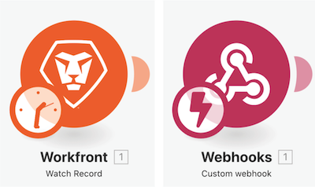
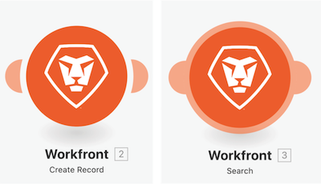

# Vertraut werden mit zusätzlichen Apps und gängigen Modulen

## Erinnerung zu Modultypen

### Trigger-Module

Kann nur als erstes Modul verwendet werden und kann null, eins oder mehrere Bündel zurückgeben, die einzeln in nachfolgenden Modulen verarbeitet werden, sofern sie nicht aggregiert werden.

* **Sofortiger Trigger** (mit Blitzsymbol) – Wird sofort ausgelöst, je nach Webhook.
* **Geplanter Trigger** (mit Uhrensymbol) – Spezielle Funktionen, um den zuletzt verarbeiteten Eintrag zu verfolgen.

### Aktionen und Suchmodule

* **Aktion** – Dient zum Ausführen von CRUD-Vorgängen (Erstellen, Lesen, Aktualisieren und Löschen).
* **Suchvorgänge** – Wird verwendet, um nach null, einem oder mehreren Einträgen zu suchen, und gibt diese als Bündel zurück, die einzeln in nachfolgenden Modulen verarbeitet werden, sofern sie nicht aggregiert werden.

### Vertraut werden mit zusätzlichen Apps und gängigen Modulen

In diesem Video lernen Sie Folgendes:

* Was Trigger, Aktionen und Suchvorgänge sind und inwiefern sie sich unterscheiden
* Modultypen in verschiedenen App-Connectoren und deren Funktionsweise

>[!VIDEO](https://video.tv.adobe.com/v/335287/?quality=12&learn=on&enablevpops=1)
