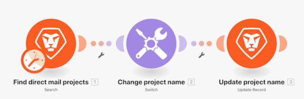

# Switch-Modul – Anleitung

Erfahren Sie, wie Sie das Switch-Modul verwenden können, um komplexere oder dynamische Datentransformationen durchzuführen.

## Switch-Modul – Anleitung

Workfront empfiehlt, sich das Anleitungsvideo anzusehen, bevor Sie versuchen, die Übung in Ihrer eigenen Umgebung neu zu erstellen.

>[!VIDEO](https://video.tv.adobe.com/v/335290/?quality=12&learn=on&enablevpops=1)

## Möchten Sie mehr erfahren? Wir empfehlen Folgendes:

[Workfront Fusion-Dokumentation](https://experienceleague.adobe.com/de/docs/workfront-fusion/using/get-started-with-fusion/understand-workfront-fusion/workfront-fusion-overview)
