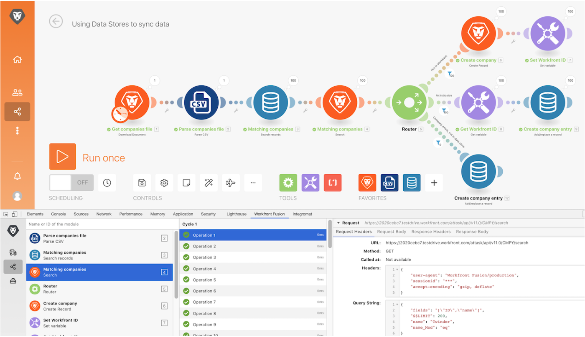

# Schrittweise Anleitung für das Entwickler-Tool

Installieren und verwenden Sie die verschiedenen Bereiche im Entwickler-Tool in Workfront, um sich eingehender mit Anfragen/Antworten und fortgeschrittenen Tricks zum Szenario-Design auseinanderzusetzen.

## Schrittweise Anleitung für das Entwickler-Tool

Workfront empfiehlt, sich das Anleitungsvideo anzusehen, bevor Sie versuchen, die Übung in Ihrer eigenen Umgebung neu zu erstellen.

>[!VIDEO](https://video.tv.adobe.com/v/335303/?quality=12&learn=on&enablevpops=1)

## Herunterladen des Entwickler-Tools

Das Entwickler-Tool verfügt über eine Reihe fortschrittlicher Funktionen, die Ihre Fähigkeit verbessern, Szenarien zu verstehen und Fehler zu beheben. Laden Sie das Dokument „workfront-fusion-devtool.zip“ herunter, das Sie im Ordner „Fusion-Übungsdateien“ in Ihrem Testlaufwerk finden.

## Möchten Sie mehr erfahren? Wir empfehlen Folgendes:

[Workfront Fusion-Dokumentation](https://experienceleague.adobe.com/de/docs/workfront-fusion/using/get-started-with-fusion/understand-workfront-fusion/workfront-fusion-overview)
