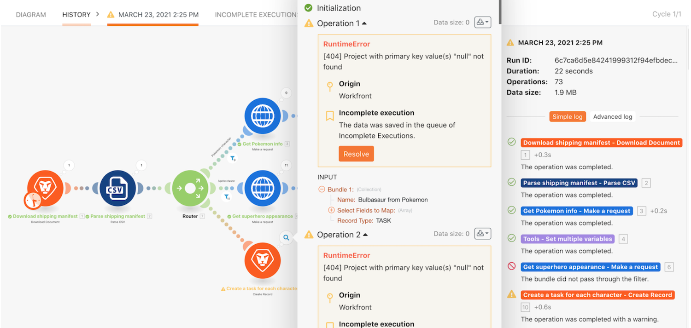

# Exemplarische Vorgehensweise zu unvollständigen Ausführungen

Informieren Sie sich über die nützliche Angewohnheit, unvollständige Ausführungen zu speichern, und lernen Sie den Nutzen kennen, den die erneute Ausführung von Bündeln nach der Auswertung und der Korrektur von Fehlern hat.

## Exemplarische Vorgehensweise zu unvollständigen Ausführungen

Workfront empfiehlt, sich das Anleitungsvideo anzusehen, bevor Sie versuchen, die Übung in Ihrer eigenen Umgebung neu zu erstellen.

>[!VIDEO](https://video.tv.adobe.com/v/335308/?quality=12&learn=on&enablevpops=1)

## Möchten Sie mehr erfahren? Wir empfehlen Folgendes:

[Workfront Fusion-Dokumentation](https://experienceleague.adobe.com/de/docs/workfront-fusion/using/get-started-with-fusion/understand-workfront-fusion/workfront-fusion-overview)
