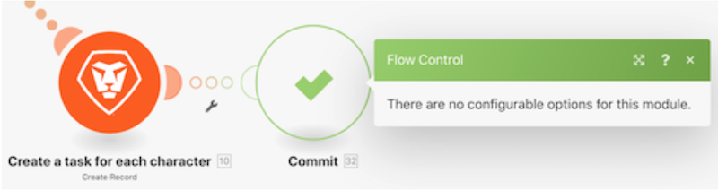

# Grundlegendes zu Richtlinien zur Fehlerbehebung

In diesem Video erfahren Sie:

* Die drei Fehler-Handler-Anweisungen, die die Ausführung fortsetzen
* Die beiden Fehler-Handler-Anweisungen, die die Ausführung stoppen

>[!VIDEO](https://video.tv.adobe.com/v/335305/?quality=12)

## Richtlinien — Szenario läuft weiter

### Fortsetzen

* Eine Ersatzausgabe wird angegeben und an das Modul geliefert, bei dem ein Fehler auftritt.
* Die nachfolgenden Module werden verarbeitet.
* Der Ausführungsstatus des Szenarios wird als &quot;Erfolg&quot;markiert.

### Break

* Der Ausführungsstatus des Szenarios wird in der Warteschlange unvollständiger Ausführungen gespeichert, wo der Fehler manuell behoben werden kann. Es gibt jedoch einige Ausnahmen, die hier erwähnt werden.
* Die nachfolgenden Module werden nicht verarbeitet.
* Wenn es nicht verarbeitete Bundles gibt, wird das Szenario normal ausgeführt.
* Der Ausführungsstatus des Szenarios wird als &quot;Warnung&quot;markiert.

### Ignorieren

* Der Fehler wird ignoriert und die nachfolgenden Module werden nicht verarbeitet.
* Wenn es nicht verarbeitete Bundles gibt, wird das Szenario normal ausgeführt.
* Der Ausführungsstatus des Szenarios wird als &quot;Erfolg&quot;markiert.

## Direktiven — Szenario stoppt

### Rollback

* Die Ausführung des Szenarios wird sofort angehalten und eine Rollback-Phase für alle Module gestartet, um sie auf ihren ursprünglichen Zustand zurückzusetzen.
* Die nachfolgenden Module werden nicht verarbeitet.
* Außer einigen Fehlertypen wird das Szenario nach der &quot;Anzahl aufeinander folgender Fehler&quot;deaktiviert, die unter den Szenario-Einstellungen angegeben ist.
* Der Ausführungsstatus des Szenarios wird als &quot;Fehler&quot;markiert.

>[!NOTE]
>
>Dies ist das Standardverhalten, wenn keine Fehler-Handler-Route an das Modul angehängt ist und die Einstellung &quot;Speichern unvollständiger Ausführungen zulassen&quot;unter den Szenario-Einstellungen nicht aktiviert ist.

### Zusichern

* Der Fehler wird ignoriert und die nachfolgenden Module werden nicht verarbeitet.
* Wenn es nicht verarbeitete Bundles gibt, wird das Szenario normal ausgeführt.
* Der Ausführungsstatus des Szenarios wird als &quot;Erfolg&quot;markiert.

