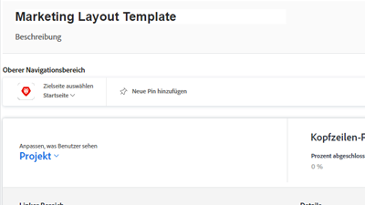
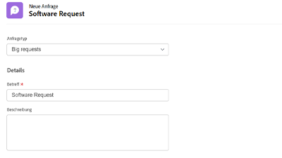
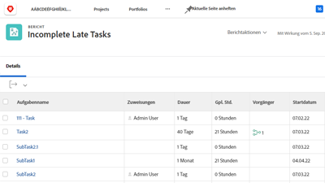

# Workfront Tutorials {#overview}

Eine Bibliothek mit Schulungsvideos und Artikeln, die Ihnen dabei helfen, die Funktionen und Einstellungen von Workfront besser zu verstehen.  Dazu gehört eine Sammlung von Best Practices, kuratierten Übungen und anderen Ressourcen, die Ihnen und Ihrer Organisation dabei helfen, Workfront erfolgreich zu nutzen.

>[!VIDEO](https://video.tv.adobe.com/v/335063/?quality=12)

<!-- 

This is the landing page of the user guide. It should be the first list item in the TOC.md file. 
See other user landing pages to get ideas. 

-->

## Neuigkeiten

Informieren Sie sich über die neuesten Aktualisierungen der Tutorials für jede Workfront-Produktversion. Hier finden Sie Informationen zur neuesten Version:

* Das Symbol Favoriten und Neuigkeiten wurde in der oberen Navigation in Workfront getrennt. Eine kurze Zusammenfassung zu jedem finden Sie im <a href="/help/manage-work/projects/find-projects.md">Projekte suchen</a> Tutorial.

* Konfigurieren Sie ein benutzerdefiniertes Formular für die Verwendung mit mehreren Objekttypen. Siehe wie in <a href="/help/custom-data/custom-forms/custom-forms-creating-and-sharing-a-custom-form.md">Erstellen und Freigeben eines benutzerdefinierten Formulars</a> Tutorial.

## Mitarbeiterauswahl

<table>
  <tr>
   <td>
      
      

         <a href="/help/administration-and-setup/layout-templates/find-layout-templates.md"><strong>Layoutvorlagen suchen und erstellen</strong></a>
<!----          <em>foo</em> --->
      

      

         
         Erfahren Sie, wie Sie eine einfache Layoutvorlage erstellen.
      

    </td>
   <td>
      
      

         <a href="/help/manage-work/issues-requests/make-a-request.md"><strong>Anfrage stellen</strong></a>
<!----          <em>foo</em> --->
      

      

       
         Erfahren Sie, wie Sie Anforderungen erstellen, anzeigen und bearbeiten.
      

<td>
      
      

         <a href="/help/reporting/basic-reporting/create-a-simple-report.md"><strong>Einfache Berichte erstellen</strong></a>
<!----          <em>foo</em> --->
      

      

         
         Erfahren Sie, wie Sie einen einfachen benutzerspezifischen Bericht erstellen.
      

    </td>
  </tr>
</table>

