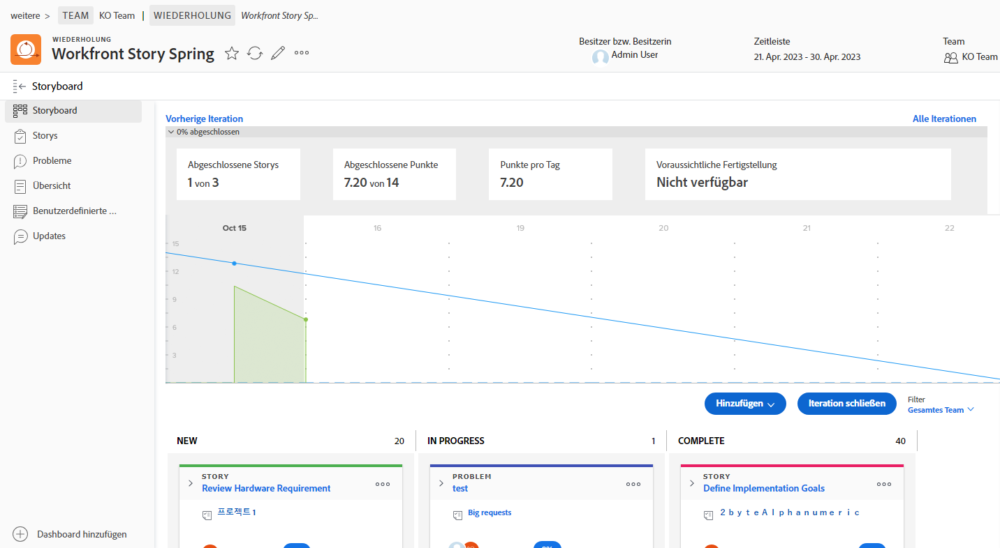
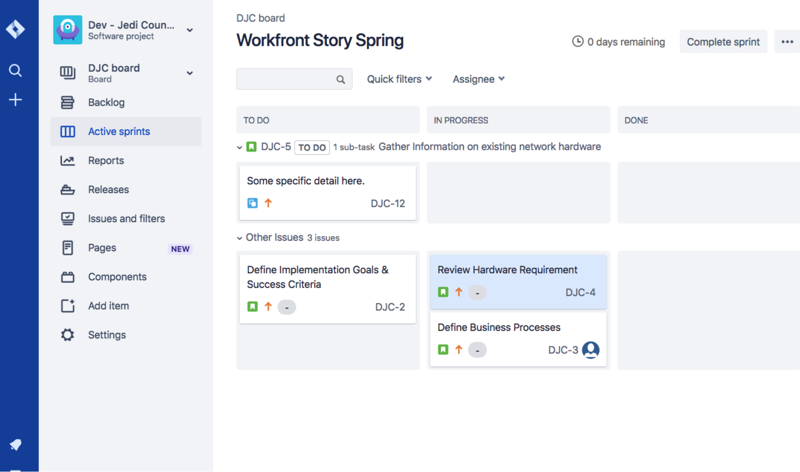
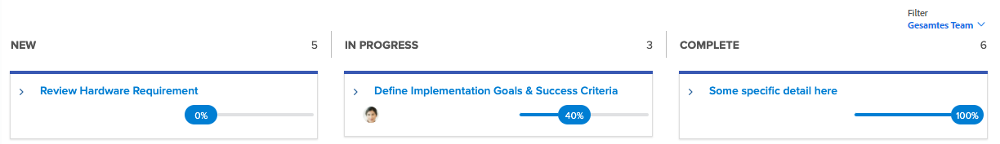

# Erstellen Sie die Sichtbarkeit mit dem [!DNL Jira] Integration

[!DNL Jira]  ist ein Produkt, mit dem Projekte und Probleme für Entwicklungs- und technische Supportteams verfolgt werden. Während viele Teams Jira verwenden, um den Fortschritt auf Aufgabenebene zu verfolgen, verwenden sie [!DNL Workfront] um ein echtes Projektmanagement durchzuführen, da sie eine allgemeine Fortschrittsansicht erhalten können. Mit dem [!DNL Jira]  nativer Integration, können diese Informationen automatisch zwischen den beiden Anwendungen übertragen werden.

## Was ist [!DNL Jira] ?

[!DNL Jira]  ist ein Produkt, das von [!DNL Atlassian] zur Verfolgung von Projekten und Problemen für Entwicklungs- und technische Supportteams. Viele Teams verwenden [!DNL Jira]  zur Verfolgung des Fortschritts auf Aufgabenebene, sie verwenden jedoch auch [!DNL Workfront] zur Verwaltung von Projekten. Dies bedeutet, dass Teams ihre Bemühungen verdoppeln, indem sie Aufgaben in erstellen [!DNL Workfront] und [!DNL Jira] . Mit der [!DNL Jira]  native Integration, diese Art von Informationen kann automatisch zwischen den beiden Anwendungen übertragen werden.

## Was kann eine [!DNL Jira]  Integration?

Hier haben wir einen Sprint [!DNL Workfront] titled[!DNL Workfront] Story Spring.&quot;

Joan Harris, der Leiter des Agile-Teams des Dev-Jedi-Rats, verwendet das Scrum-Board- und Burndown-Diagramm, um den Fortschritt des Gesamtsprints zu messen. Es gibt dem Team eine schöne visuelle Darstellung dessen, was vor sich geht. Darüber hinaus fließen diese Informationen in einen Geschäftsbericht ein, der vierteljährlich überprüft wird. Der Großteil des Teams nimmt jedoch Aktualisierungen in der [!DNL Jira] , nicht [!DNL Workfront].

Joans Team verwendet [!DNL Jira]  für mehrere Jahre und finden es eine gute Möglichkeit für sie, einzelne Aufgaben und/oder Fehler zu verfolgen, die ihnen zur Arbeit zugewiesen wurden. Joan benötigt diese Informationen aber wirklich, um eine Verbindung herzustellen [!DNL Workfront] und diese ausführenden Berichte schließlich zu füttern.

Durch die [!DNL Jira]  native Integration, alle an Aufgaben, Meldungen oder Bugs vorgenommenen Aktualisierungen können die Aufgaben, Meldungen und/oder Probleme automatisch in [!DNL Workfront].

Wenn also das Team-Mitglied, das der Meldung &quot;Hardwareanforderungen überprüfen&quot;zugewiesen ist, eine Aktualisierung des Status in [!DNL Jira] , indem Sie sie von &quot;Neu&quot;zu &quot;In Bearbeitung&quot;verschieben, ändert diese Aktualisierung automatisch den Status der Meldung in [!DNL Workfront] sowie

