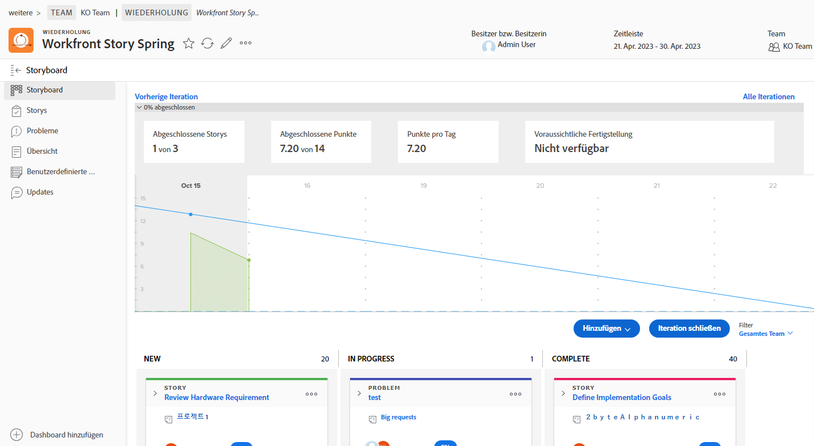
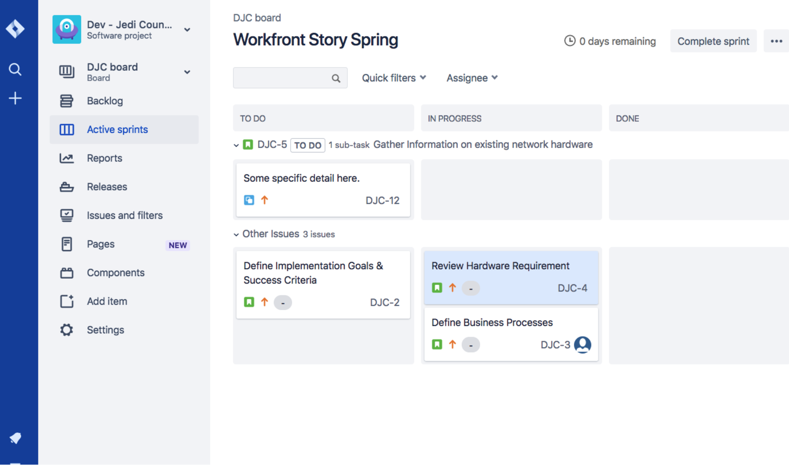
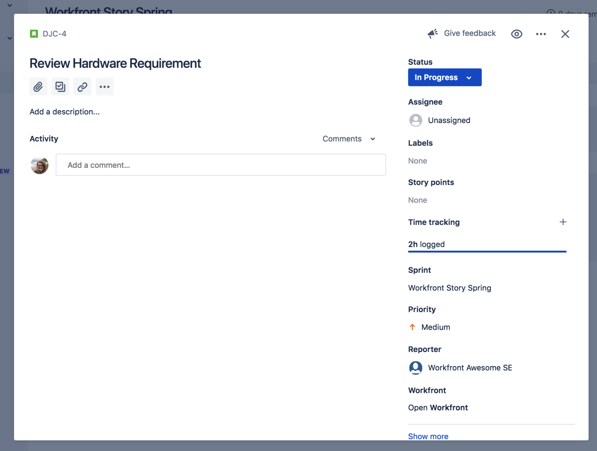
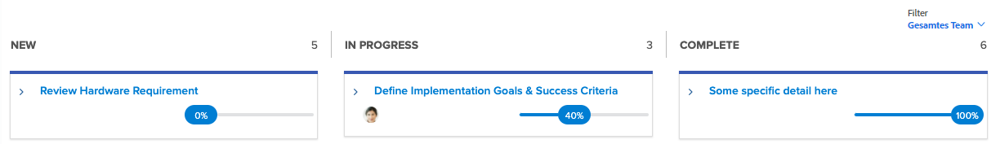

# Schaffen von Sichtbarkeit durch die [!DNL Jira]-Integration

[!DNL Jira] ist ein Produkt zur Verfolgung von Projekten und Problemen für Entwicklungs- und technische Support-Teams. Während viele Teams Jira verwenden, um den Fortschritt auf Aufgabenebene zu verfolgen, nutzen sie [!DNL Workfront] für echtes Projekt-Management, da dies einen Überblick über den Fortschritt auf höchster Ebene bietet. Mit der nativen [!DNL Jira]-Integration können diese Informationen automatisch zwischen den beiden Anwendungen übertragen werden.

## Was ist [!DNL Jira]?

[!DNL Jira] ist ein von [!DNL Atlassian] entwickeltes Produkt zur Verfolgung von Projekten und Problemen für Entwicklungs- und technische Support-Teams. Viele Teams verwenden [!DNL Jira], um den Fortschritt auf Aufgabenebene zu verfolgen, aber gleichzeitig [!DNL Workfront], um Projekte zu verwalten. Das bedeutet für die Teams doppelte Arbeit, da sie Aufgaben sowohl in [!DNL Workfront] als auch in [!DNL Jira] erstellen. Mit der nativen [!DNL Jira]-Integration können diese Informationen jedoch automatisch zwischen den beiden Anwendungen übertragen werden.

## Wie kann ich Adobe Workfront for Jira installieren?

Unter [Adobe Workfront for Jira](https://experienceleague.adobe.com/docs/workfront/using/adobe-workfront-integrations/workfront-for-jira/workfront-for-jira.html?lang=de) erfahren Sie, wie Sie Adobe Workfront for Jira installieren und konfigurieren.

## Was kann eine [!DNL Jira]-Integration leisten?

Hier haben wir einen Sprint in [!DNL Workfront] mit dem Titel „[!DNL Workfront] Story Spring“.

Joan Harris, die Leiterin des agilen Dev-Jedi-Council-Teams, verwendet das Scrum-Board und das Burndown-Diagramm, um den Fortschritt des gesamten Sprints zu messen. So erhält das Team eine schöne visuelle Darstellung des Vorgangs. Darüber hinaus fließen diese Informationen in einen vierteljährlich überprüften Geschäftsführungsbericht ein. Der Großteil des Teams nimmt seine Aktualisierungen jedoch in [!DNL Jira] vor, nicht in [!DNL Workfront].

Das Team von Joan verwendet [!DNL Jira] schon seit mehreren Jahren und findet, dass es eine gute Möglichkeit ist, einzelne Aufgaben und/oder Fehler zu verfolgen, an denen sie arbeiten sollen. Aber Joan braucht diese Informationen wirklich, um eine Verbindung zu [!DNL Workfront] herzustellen und letztendlich die Berichte für die Geschäftsführung zu erstellen.

Durch die native [!DNL Jira]-Integration können alle Aktualisierungen von Aufgaben, Storys und Fehlern automatisch die Aufgaben, Storys und/oder Probleme in [!DNL Workfront] aktualisieren.

Wenn also das Team-Mitglied, das für die Story „Hardware-Anforderung prüfen“ zuständig ist, den Status in [!DNL Jira] von „Neu“ auf „In Bearbeitung“ ändert, wird durch diese Aktualisierung automatisch auch der Status der Story in [!DNL Workfront] geändert.

