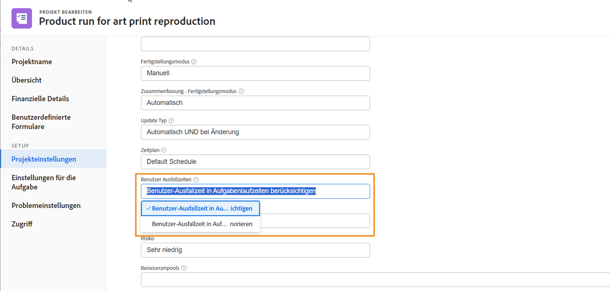
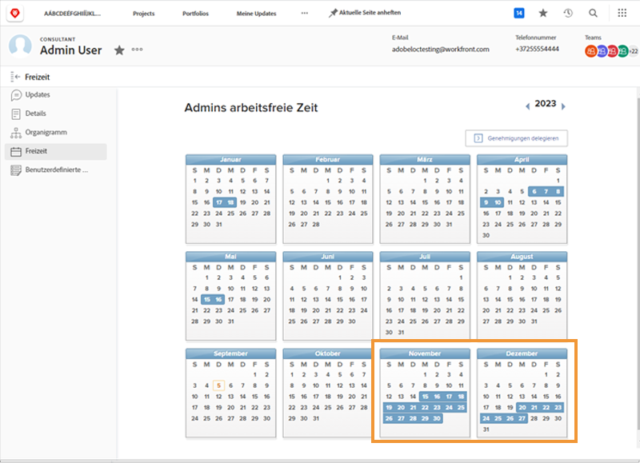
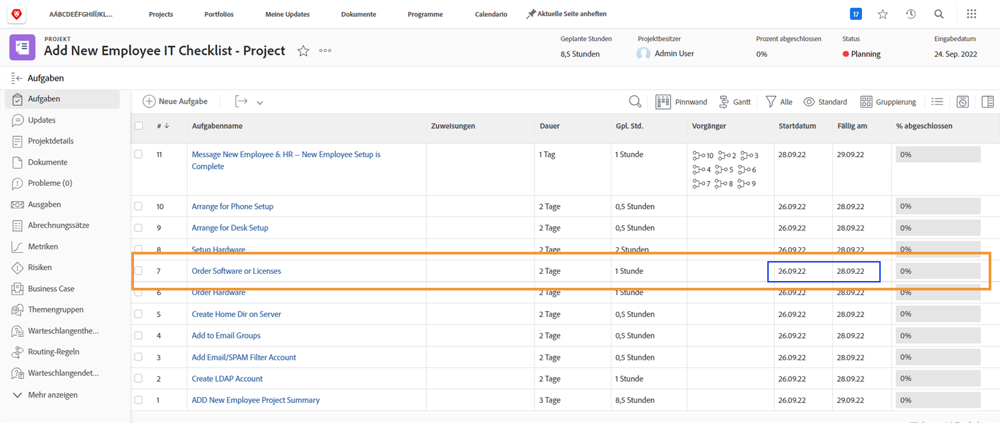
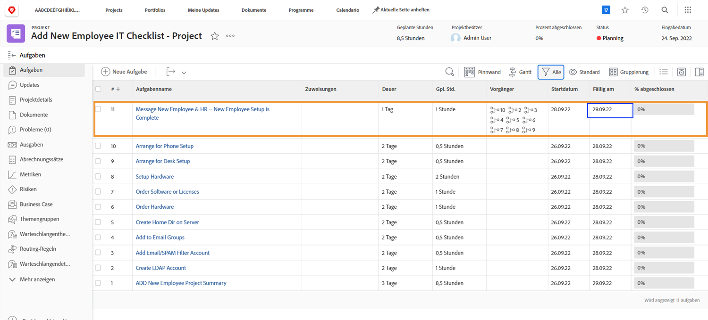
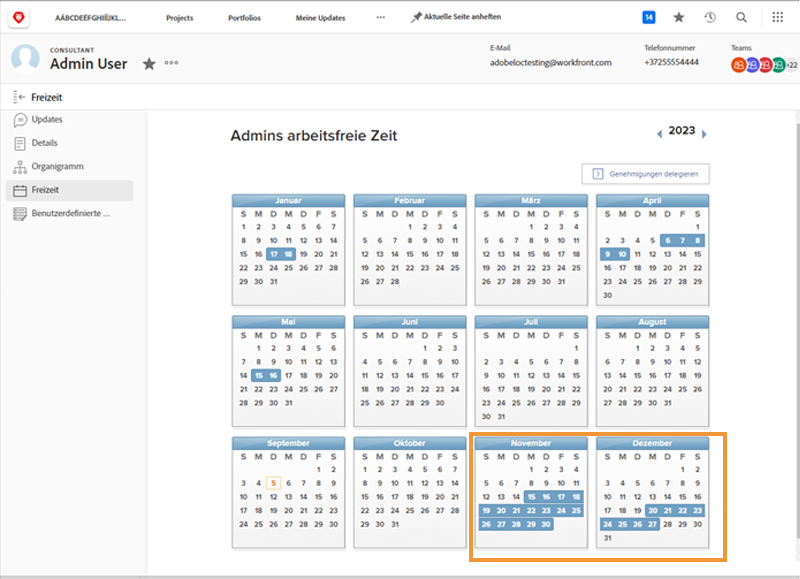

# Wie sich Ausfallzeiten auf Projektzeitleisten auswirken

Ob die Freizeit zugewiesener Benutzender in die Projektzeitleisten einfließt, hängt von einer Projekteinstellung namens [!UICONTROL Benutzerausfallzeiten] ab. Diese Einstellung legt fest, ob durch die Ausfallzeiten der Hauptverantwortlichen für die Aufgabe die geplanten Termine für diese Aufgabe im Projekt angepasst werden sollen.

Schauen wir uns an, was mit einer Projektzeitleiste passiert, wenn jede der Einstellungen ausgewählt ist –[!UICONTROL Benutzer-Ausfallzeit in Aufgabenlaufzeiten berücksichtigen] oder [!UICONTROL Benutzer-Ausfallzeit in Aufgabenlaufzeiten ignorieren].

## Benutzer-Ausfallzeit in Aufgabenlaufzeiten berücksichtigen

Diese Option ist die Standardeinstellung von Workfront.

In diesem Beispiel hat der oder die Hauptverantwortliche für die Aufgabe freie Tage in seinem bzw. ihrem persönlichen Kalender markiert.

Die Projektleitung möchte dieser Person eine Aufgabe zuweisen, deren geplante Termine sich mit ihren freien Tagen überschneiden.

Wenn dieser Person die Aufgabe zugewiesen wird, werden die geplanten Termine automatisch angepasst. Nun hat sich das geplante Erledigungsdatum der Aufgabe um mehrere Tage verlängert, um die Ausfallzeit der Person zu berücksichtigen. Es ist wichtig zu beachten, dass diese Änderung die geplanten Termine für andere Aufgaben im Projekt und möglicherweise das geplante Abschlussdatum des gesamten Projekts beeinflussen kann.

## [!UICONTROL Benutzer-Ausfallzeit in Aufgabenlaufzeiten ignorieren]

Bei dieser Option bleiben die geplanten Termine der Aufgabe wie ursprünglich geplant erhalten, auch wenn der oder die Hauptverantwortliche während der Dauer dieser Aufgabe ausfällt.

Das Team-Mitglied hat freie Tage in seinem Kalender markiert.

Die Projektleitung weist ihm eine Aufgabe zu, die sich mit der Ausfallzeit überschneidet. Auch nachdem die Person zugewiesen ist, bleiben die geplanten Aufgabetermine so wie ursprünglich geplant.

Um sicherzustellen, dass die Arbeit rechtzeitig erledigt wird, kann es hilfreich sein, eine andere Person zu beauftragen, die die Aufgabe bearbeiten kann, während die ursprünglich beauftragte Person nicht im Büro ist.

## Anpassung der Einstellung auf Projektebene

So ändern Sie die Einstellung für die Benutzerausfallzeiten in einem Projekt:

* Öffnen Sie das Projekt, indem Sie auf seinen Namen in Workfront klicken.

* Wählen Sie [!UICONTROL Bearbeiten] im 3-Punkte-Menü in der Kopfzeile der Seite rechts neben dem Projektnamen.

* Blättern Sie zum Abschnitt [!UICONTROL Projekteinstellungen] und suchen Sie das Feld [!UICONTROL Benutzer-Ausfallzeiten].

* Wählen Sie die Option, die Sie auf dieses Projekt anwenden möchten – [!UICONTROL Benutzer-Ausfallzeit in Aufgabenlaufzeiten berücksichtigen] oder [!UICONTROL Benutzer-Ausfallzeit in Aufgabenlaufzeiten ignorieren].

* Klicken Sie auf die Schaltfläche [!UICONTROL Speichern] in der oberen rechten Fensterecke.

**Hinweis**: Diese Einstellung ist nicht verfügbar, wenn Sie [!UICONTROL Projektdetails] im Menü des linken Bedienfelds auf der Projektseite wählen.

Eine globale Einstellung dafür gibt es in den Projektvoreinstellungen im [!UICONTROL Einrichtungsmenü]. Diese Einstellung wird von Ihren Systemadmins verwaltet. Gruppenadmins können diese Einstellung möglicherweise für die von ihnen verwalteten Gruppen anpassen.

Workfront empfiehlt, die Einstellung in der Weise vorzunehmen, wie die meisten Ihrer Projekte in Ihrem Unternehmen Ausfallzeiten handhaben sollen.

Die Einstellung kann auch über die Vorlagendetails in Projektvorlagen integriert werden.
