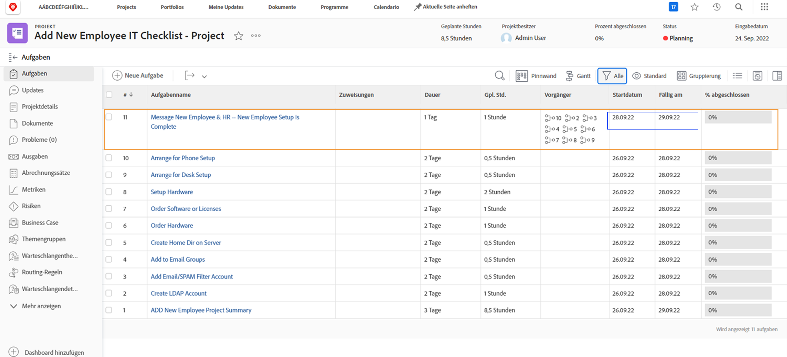

# Auswirkungen der Zeitüberschreitung auf die Projektzeitpläne

Ob die Zeitpunkte eines zugewiesenen Benutzers in der Projekt-Timeline von einer Projekteinstellung mit dem Namen [!UICONTROL Zeitlimit für Benutzer]. Mit dieser Einstellung wird festgelegt, ob die Zeitspanne, die der primäre Verantwortliche der Aufgabe für diese Aufgabe benötigt, die für das Projekt geplanten Daten anpasst.

Sehen wir uns an, was mit einer Projekt-Timeline passiert, wenn jede der Einstellungen ausgewählt ist - C[!UICONTROL Benutzerzeitlimit in Aufgabendauer berücksichtigen] oder [!UICONTROL Ignorieren der Benutzerzeit in der Aufgabendauer].

## Benutzer-Ausfallzeit in Aufgabenlaufzeiten berücksichtigen

Diese Option ist die Standardeinstellung von Workfront.

In diesem Beispiel hat der primäre Verantwortliche für die Aufgabe im Kalender seiner Person Tage mit Markierungen.

Der Projektmanager möchte diese Person einer Aufgabe zuweisen, deren geplante Daten sich über die Zeitspanne des Benutzers hinausgehen.

Wenn dieser Benutzer der Aufgabe zugewiesen wird, werden die geplanten Datumsangaben automatisch angepasst. Jetzt wurde das geplante Abschlussdatum der Aufgabe um mehrere Tage verlängert, um die Zeitspanne des Benutzers aufzunehmen. Es ist wichtig zu beachten, dass diese Änderung die geplanten Termine für andere Aufgaben im Projekt und möglicherweise das geplante Abschlussdatum des Projekts beeinflussen kann.

## [!UICONTROL Benutzer-Ausfallzeit in Aufgabenlaufzeiten ignorieren]

Mit dieser Option bleiben die geplanten Termine der Aufgabe wie ursprünglich geplant, auch wenn der Hauptverantwortliche während der Dauer dieser Aufgabe über eine Zeitspanne verfügt.

Der Teammitglied hat Tage frei markiert auf seinem Kalender.

Der Projektmanager weist ihnen eine Aufgabe zu, die sich mit der Zeitdauer überschneidet. Sobald der Benutzer zugewiesen wurde, bleiben die geplanten Aufgabendaten wie ursprünglich geplant.

Um sicherzustellen, dass die Arbeit rechtzeitig erledigt wird, kann es hilfreich sein, eine andere Person zuzuweisen, die an der Aufgabe arbeiten kann, während der ursprüngliche Bevollmächtigte nicht im Büro ist.

## Passen Sie die Einstellung auf Projektebene an.

So ändern Sie die Einstellung für die Benutzerzeit in einem Projekt:

* Öffnen Sie das Projekt, indem Sie in Workfront auf seinen Namen klicken.

* Auswählen [!UICONTROL Bearbeiten] über das Menü mit 3 Punkten in der Kopfzeile der Seite rechts neben dem Projektnamen.

* Scrollen Sie zum [!UICONTROL Projekteinstellungen] und suchen Sie nach [!UICONTROL Zeitlimit für Benutzer] -Feld.

* Wählen Sie die Option aus, die Sie auf dieses Projekt anwenden möchten — [!UICONTROL Benutzerzeitlimit in Aufgabendauern berücksichtigen] I[!UICONTROL Nutzerzeitlimit in Aufgabendauer ignorieren].

* Klicken Sie auf [!UICONTROL Speichern] in der oberen rechten Ecke des Fensters.

**Hinweis**: Diese Einstellung ist nicht verfügbar, wenn Sie [!UICONTROL Projektdetails] im linken Bedienfeldmenü der Projektseite.

Eine globale Einstellung dafür ist in den Projektvoreinstellungen im Abschnitt [!UICONTROL Einrichtung] Menü. Diese Einstellung wird von Ihrem Systemadministrator verwaltet. Gruppenadministratoren können diese Einstellung möglicherweise für die von ihnen verwalteten Gruppen anpassen.

Workfront empfiehlt, die Einstellung so festzulegen, wie Sie möchten, dass die meisten Ihrer Projekte eine Zeitüberschreitung in Ihrem Unternehmen verarbeiten.

Die Einstellung kann auch in Projektvorlagen über die Vorlagendetails integriert werden.
