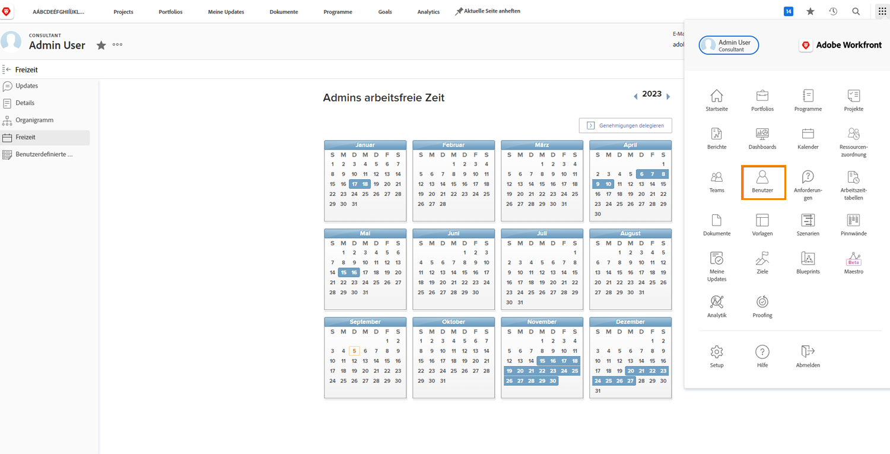

# Verwalten von Ausfallzeiten anderer Benutzender

Die Geschäftsleitung oder andere Führungskräfte können die Ausfallzeitenkalender ihrer Team-Mitglieder verwalten, wenn ihnen über ihre Workfront-Zugriffsebene Berechtigungen zum Bearbeiten von Benutzenden zugewiesen wurden. Zugriffsebenen werden von Workfront-Systemadmins erstellt und zugewiesen.

Workfront empfiehlt, dass Ihr Unternehmen eine Richtlinie oder ein Verfahren für den Fall hat, dass eine Führungskraft den persönlichen Ausfallzeitenkalender einer Person aktualisiert.

So verwalten Sie den Kalender einer anderen Person:

* Klicken Sie auf das [!UICONTROL Hauptmenü] und wählen Sie „Benutzer“ aus.

* Verwenden Sie das Suchsymbol, um die Person zu finden, oder scrollen Sie durch die Liste.

* Klicken Sie in der Liste auf den Namen der Person.

* Klicken Sie auf der Profilseite der Person im Menü des linken Bedienfelds auf [!UICONTROL Ausfallzeit].

* Klicken Sie auf ein Datum im Kalender.

* Workfront geht von einem vollen Fehltag aus. Wenn dies der Fall ist, klicken Sie auf die Schaltfläche [!UICONTROL Speichern].

* Ändern Sie für mehrere aufeinander folgende Tage das Bis-Datum in den letzten Tag der Abwesenheit. Klicken Sie auf die Schaltfläche [!UICONTROL Speichern].

* Wenn es nur um einen Teil des Tages geht, deaktivieren Sie die Option [!UICONTROL Ganztägig]. Geben Sie dann die Stunden an, die die Person an diesem Tag arbeiten wird (die Stunden, in denen sie verfügbar ist). Klicken Sie auf die Schaltfläche [!UICONTROL Speichern].
