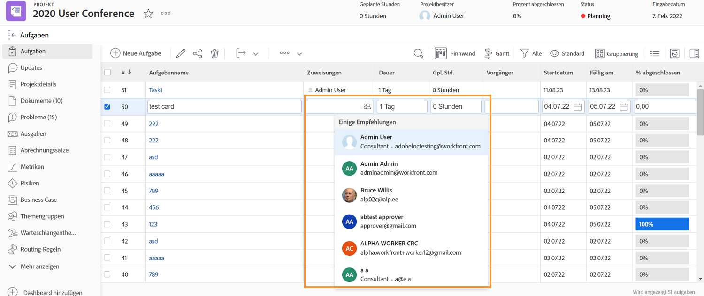
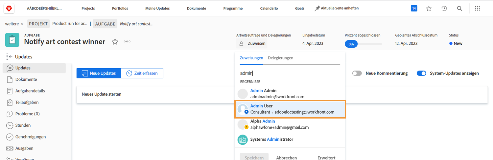

# Anzeigen der Ausfallzeiten bei der Zuweisung von Aufgaben

Während der Aufgabenzuweisung weist Sie ein kleines Symbol darauf hin, dass eine Person in ihrem persönlichen Kalender für die Dauer der Aufgabe eine Ausfallzeit eingetragen hat.

Bei der Zuweisung aus dem Projektplan durch Eingabe des Benutzernamens wird dieser grau dargestellt und ein kleines blaues Warnsymbol neben seinem Avatar-Bild angezeigt.

Wenn Sie Aufgaben über die Kopfzeile der Aufgabenseite zuweisen, weist Sie ein kleines blaues Flugzeugsymbol neben dem Avatar der Person darauf hin, dass für diese während der Dauer dieser Aufgabe eine Ausfallzeit vorliegt.

