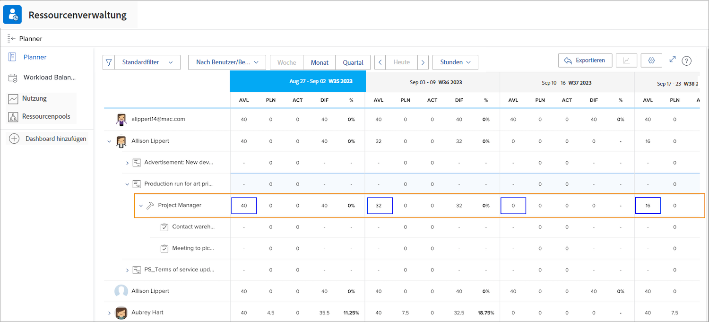
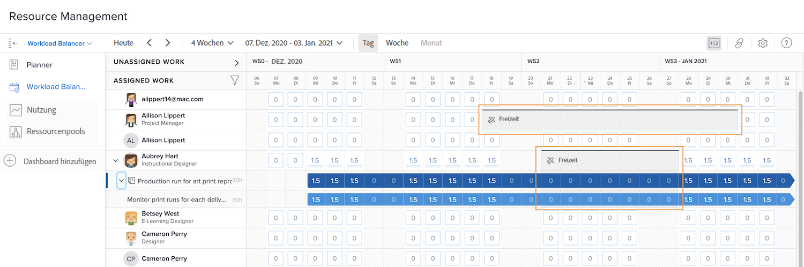

# Sichtbarkeit in Ressourcen-Management-Tools

Zu wissen, wer wann verfügbar ist, ist für die Ressourcenplanung und -verwaltung von entscheidender Bedeutung. Wenn Benutzende ihre persönliche Freizeit im Workfront-Kalender markieren, können diese Informationen auch in den Ressurcen-Tools von Workfront angezeigt werden.

## Ressourcenplaner

Die Ausfallzeit einer Person wird in der Spalte „Verfügbar (AVL)“ des Ressourcenplaners angezeigt. Workfront zieht die in ihrem Kalender markierte Ausfallzeit von der verfügbaren Zeit ab, die Workfront auf Grundlage des zugewiesenen Zeitplans, des Aufgabengebietsanteils usw. berechnet.

## Workload-Balancer

Im Workload Balancer erscheinen die Ausfallzeiten als graue Balken im Kalender. Diese Sichtbarkeit hilft Ressourcen-Managerinnen und -Managern und anderen, fundiertere Entscheidungen bei der Arbeitszuweisung zu treffen.

Die Ausfallzeitmarkierung verhindert jedoch nicht, dass der Person über den Workload Balancer Arbeit zugewiesen wird. Wenn Arbeit zugewiesen wird, zeigt der Workload Balancer an, dass die Person während der Ausfallphase überlastet ist.

