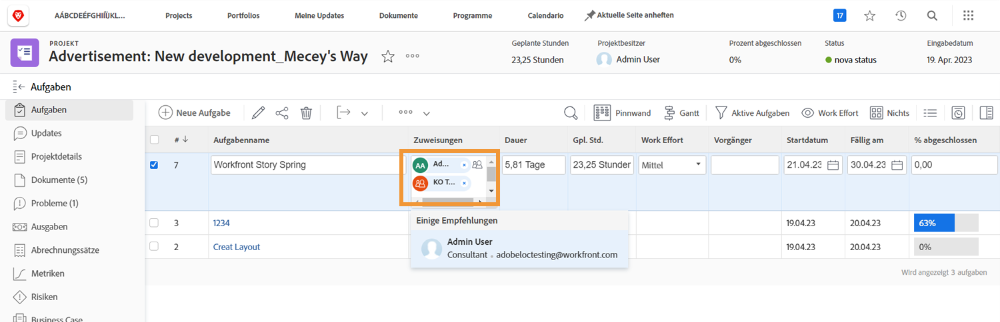
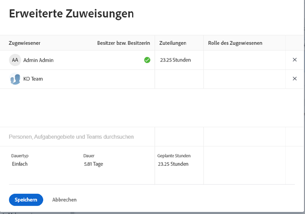
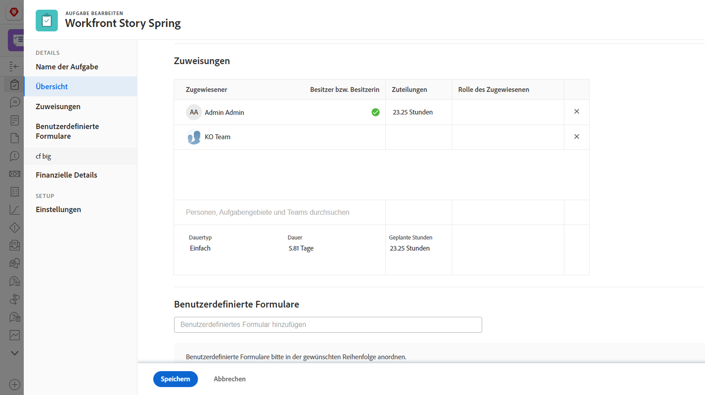

# Was ist eine primär zugewiesene Person?

Eine primäre zugewiesene Person ist vorhanden, wenn einer Aufgabe zwei oder mehr Benutzende zugewiesen sind. Die Anwendung der Einstellung „Benutzer-Ausfallzeit“ in Workfront basiert auf dem Kalender mit den Ausfallzeiten der primär zugewiesenen Person.

Ermitteln Sie auf der Projektseite, wer die primär zugewiesene Person ist. Klicken Sie in das Feld „Zuweisungen“ und dann in der Ecke auf das Symbol für erweiterte Zuweisungen.

Im Fenster „Erweiterte Zuweisungen“ wird die primär zugewiesene Person (oder Aufgabenbesitzer) mit einem grünen Häkchen gekennzeichnet. Bewegen Sie den Mauszeiger über eine andere Person und klicken Sie auf den Link „Als primär festlegen“, um den Aufgabenbesitzer zu ändern.

Sie können die primär zugewiesene Person auch auf der Aufgabenseite anpassen. Markieren Sie das Kontrollkästchen in der Projektliste und klicken Sie auf das Symbol „Bearbeiten“. Scrollen Sie zum Abschnitt „Arbeitsaufträge“ und klicken Sie auf die Schaltfläche, um den Aufgabenbesitzer festzulegen.

