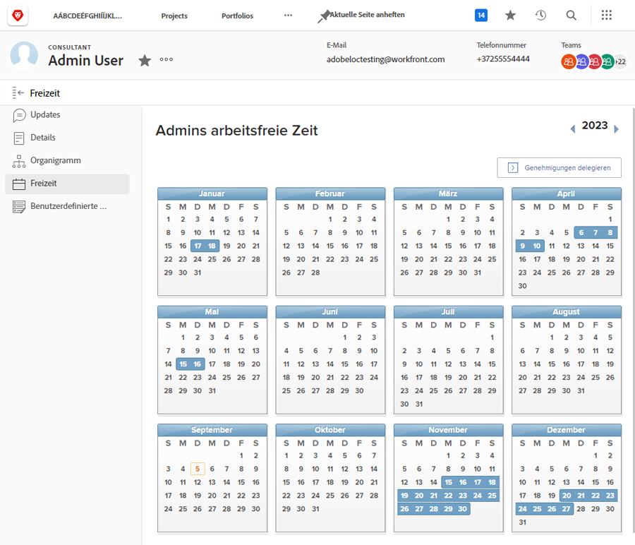
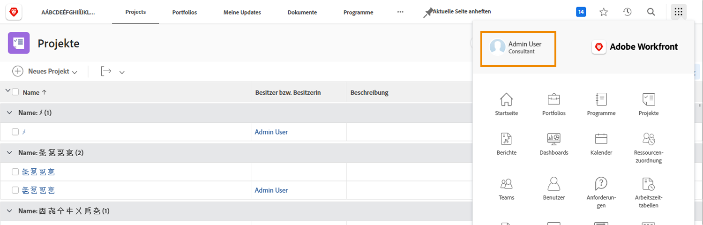
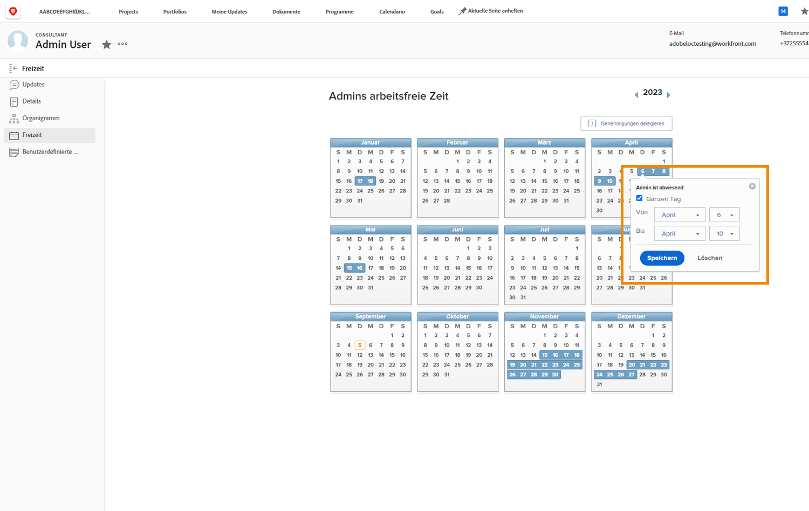

# Warum sollten Sie den Kalender für Ausfallzeiten benutzen?

Wenn Planende und Projekt-Managerinnen und -Manager in Workfront Aufgaben zuweisen, trägt das Wissen darüber, welche Team-Mitglieder für die zugewiesene Arbeit zur Verfügung stehen, zu einem pünktlichen Projektabschluss bei.

Genaue Verfügbarkeitsdaten fließen auch in die aktuelle und zukünftige Arbeitsplanung ein, da die Ressourcen-Managerinnen und -Manager die Zuordnung in den Ressourcenplanungs- und Management-Tools von Workfront überprüfen.

Benutzende mit Arbeits- und Planlizenzen von Workfront können den Kalender für persönliche Ausfallzeiten nutzen, um anzugeben, wann sie während der üblichen Arbeitszeiten nicht verfügbar sind. Schon ein halber freier Tag könnte die Erledigung der ihnen zugeteilten Aufgaben beeinträchtigen.

**Hinweis**: Workfront ist nicht dafür konzipiert, die in Ihrem Unternehmen vorhandenen Systeme zur Verwaltung, Ansammlung oder Nachverfolgung der persönlichen Ausfallzeiten zu ersetzen. Befolgen Sie für die Beantragung und Verwaltung von Ausfallzeiten die Richtlinien Ihres Unternehmens.

## Markieren Ihrer Ausfallzeiten

Ihr Kalender für persönliche Ausfallzeiten befindet sich auf Ihrer Benutzerseite in Workfront, die Sie über das Hauptmenü erreichen. Klicken Sie in der linken Ecke auf Ihren Namen.

* Klicken Sie auf Ihrer Benutzerseite in Workfront im Menü des linken Bedienfelds auf „Ausfallzeiten“.

* Standardmäßig wird das aktuelle Jahr angezeigt. Verwenden Sie bei Bedarf die Pfeile, um ein anderes Jahr auszuwählen (oben rechts im Kalenderfenster).

* Klicken Sie auf ein Datum im Kalender.

* Workfront geht davon aus, dass Sie sich den ganzen ausgewählten Tag freinehmen. Wenn dies der Fall ist, klicken Sie auf die Schaltfläche „Speichern“.

* Wenn Sie sich an mehreren aufeinanderfolgenden Tagen freinehmen, ändern Sie das „Bis-Datum“ auf den letzten Tag, an dem Sie nicht anwesend sein werden. Klicken Sie auf die Schaltfläche „Speichern“.

* Wenn Sie sich nicht den ganzen Tag freinehmen möchten, deaktivieren Sie das Kontrollkästchen „Ganztägig“. Geben Sie dann die Stunden an, die Sie an diesem Tag arbeiten werden (die Zeit, zu der Sie verfügbar sind). Klicken Sie auf die Schaltfläche „Speichern“.

Ihre Ausfallzeiten werden durch blaue Kästchen im Kalender angezeigt. Diese Ausfallzeiten werden auch an anderen Stellen in Workfront angezeigt, um die Projekt- und Ressourcenplanung zu unterstützen.

**Profi-Tipp**: Wenn Ihnen bereits eine Aufgabe zugewiesen wurde und Sie danach Ausfallzeit im Kalender markieren, wird keine Benachrichtigung an die Projektleiterin bzw. den Projektleiter gesendet, um die Information weiterzugeben, dass Sie nicht verfügbar sind. Denken Sie also daran, die Projektleiterin bzw. den Projektleiter über alle neuen Ausfallzeiten zu informieren, die sich auf laufende Projekte oder die Ihnen zugewiesene Arbeit auswirken könnten.
