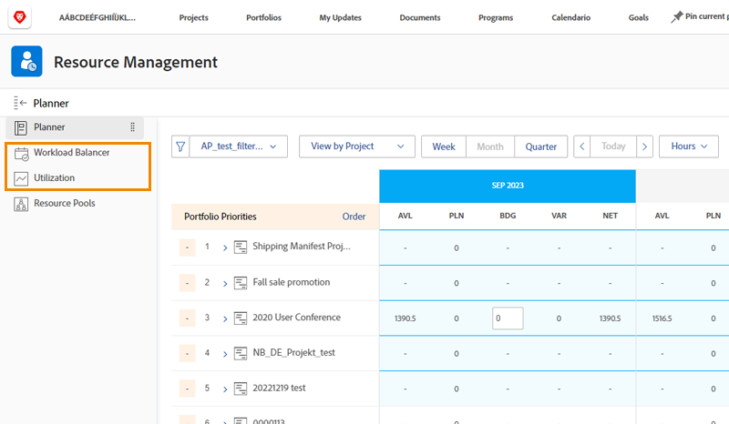

# Setups des Ressourcen-Managements, Workload Balancer und Nutzungsbericht

[!DNL Workfront] bietet Daten über mehrere Tools in [!DNL Workfront] hinweg, um Ihre Ressourcenentscheidungen zu vereinfachen und Ihre Prozesse reibungsloser zu gestalten. Um zu sehen, was mit Ihren Ressourcen passiert, sollten Sie sicherstellen, dass Ihre Managerinnen und Manager, Ihre Benutzerinnen und Benutzer sowie Ihre Projekte ordnungsgemäß konfiguriert sind. Diese Konfigurationen sind hilfreich, auch wenn Sie nicht planen, alle Ressourcen-Management-Tools von [!DNL Workfront's] zu verwenden.

In diesem Abschnitt lernen Sie Folgendes:

* Wie Ressourcen-Managerinnen und -Manager mit dem richtigen Zugriff eingerichtet werden
* Wie der Workload Balancer und der Nutzungsbericht angezeigt werden

## Setups des Ressourcen-Managements

Zunächst müssen wir sicherstellen, dass die richtigen Personen Zugriff auf die Ressourcen Ihres Unternehmens haben und diese verwalten können.

&lt;!Laden Sie das Handbuch herunter, um eine Schritt-für-Schritt-Anleitung zu erhalten.&gt;

## Workload Balancer und Nutzungsbericht

Zusammen mit dem Ressourcen-Planer und den Ressourcen-Pools haben Benutzerinnen und Benutzer Zugriff auf zusätzliche Tools wie den Workload Balancer und den Nutzungsbericht, wenn sie die Berechtigung „Bearbeiten“ auf der Zugriffsebene haben.

Für den Zugriff auf oder die Verwaltung von Ressourcen über diese Tools ist keine andere Einstellung erforderlich.

