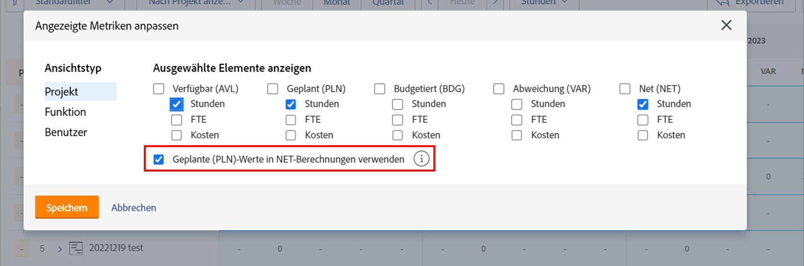
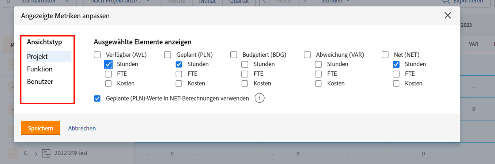
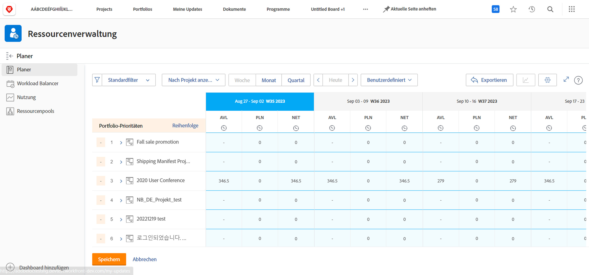

# Anzeigen nach Aufgabengebiet in [!DNL Resource Planner]

In diesem Video werden Sie:

* Die Ansicht [!UICONTROL Nach Aufgabengebiet anzeigen] sehen
* Erfahren Sie, wie Ressourceninformationen in dieser Ansicht angezeigt werden

>[!VIDEO](https://video.tv.adobe.com/v/335169/?quality=12&learn=on&enablevpops)

Bei der Option „Nach Aufgabengebiet anzeigen“ wird standardmäßig die Spalte „Budgetiert“ angezeigt, die die geschätzte Anzahl der für ein Projekt benötigten Ressourcen aus einem Business-Case bezieht, sofern dieser ausgefüllt wurde. Dies bedeutet auch, dass die Spalte „Netto“ standardmäßig die Zahlen aus der Spalte „Budgetiert“ verwendet, um Ihnen mitzuteilen, wie viele Ressourcen noch übrig sind.

Möglicherweise verwendet Ihr Unternehmen jedoch keine Business-Cases zur Schätzung dieser Beträge oder kann diese nicht verwenden. Stattdessen verwenden Sie die geplanten Stunden, die bereits für ein Projekt eingegeben wurden. Über die Option „Anpassen“ können Sie auswählen, welche Spalten in der ausgewählten Ansicht angezeigt werden und wie die Spalte „Netto“ berechnet werden soll.

So ändern Sie die angezeigten Spalten und die Berechnung der Nettospalte, damit sie auf geplanten Stunden basiert:

* Klicken Sie auf das Dropdown-Menü „Stunden“ und wählen Sie „Anpassen“ aus.

* Legen Sie im Feld „Angezeigte Metriken anpassen“ fest, welche Spalten angezeigt werden, und aktivieren Sie das Kontrollkästchen neben „Geplante (PLN)-Werte in NET-Berechnungen verwenden“.

**Hinweis**: Sie können die Spalten und Berechnungen für die verschiedenen Ansichtstypen im Ressourcenplaner bearbeiten, indem Sie auf der linken Seite des Feldes eine Option auswählen.

* Wenn Sie auf „Speichern“ klicken, wird das Feld geschlossen und der Bildschirm aktualisiert.

Der Ressourcenplaner zeigt Ihnen, was Sie über Ihr Angebot und Ihre Nachfrage wissen müssen, ohne komplexe Tabellen und umständliche Kommunikation.

Mit den verfügbaren Informationen und den Tools, die Ihnen zur Verfügung stehen, können Sie die Kapazität Ihres Teams zur Ausführung der für Sie wichtigen Arbeiten anpassen.
