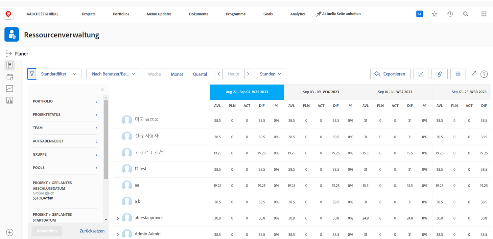

# Anzeigen der Auslastung und Filtern des Ressourcenplaners

Mit dem Ressourcenplaner erhalten Sie einen klaren Überblick über die Projekte, an denen Sie interessiert sind, und können in Echtzeit sehen, wie Ihr Personal für die Durchführung dieser Projekte aufgestellt ist.

* Sie möchten zum Beispiel wissen, was mit der Kapazität passiert, wenn die neueste Server-Aktualisierungsinitiative zu Ihrer obersten Priorität wird.

* Der Ressourcenplaner zeigt die Verfügbarkeit Ihrer Mitarbeitenden und wie sich die Zuweisung von Ressourcen für ein Projekt auf die Verfügbarkeit von Projekten mit niedrigerer Priorität auswirkt.

Sie können nicht nur erkennen, wie sich die Ressourcenzuweisung auf die aktuelle Arbeit auswirkt, sondern auch über den unmittelbaren Bedarf an Ressourcenplanung hinaus längerfristige Ressourcenzuweisungen bewerten, um festzustellen, ob einzelnen Personen zu viel (oder zu wenig) zugewiesen wurde.

## Filtern des Ressourcenplaners

Der Ressourcenplaner wird automatisch mit einem Standardsatz von Filtern geöffnet. Sie können diese Filter wie folgt bearbeiten:

* Zeitrahmen
* Portfolio/Programm
* Ressourcen-Pools usw.

Auf diese Weise können Sie sich darauf konzentrieren, welche Ressourcen wann verfügbar sind.
