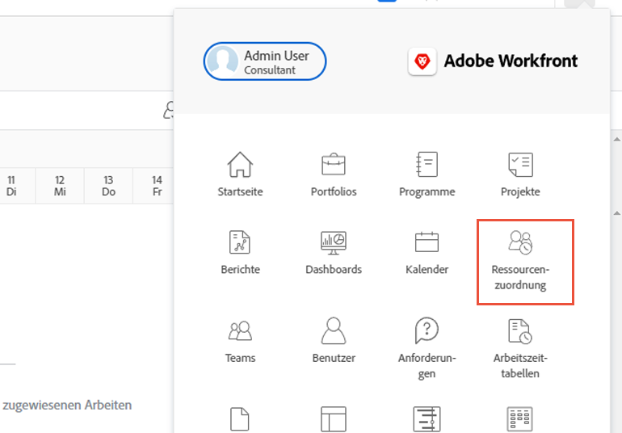
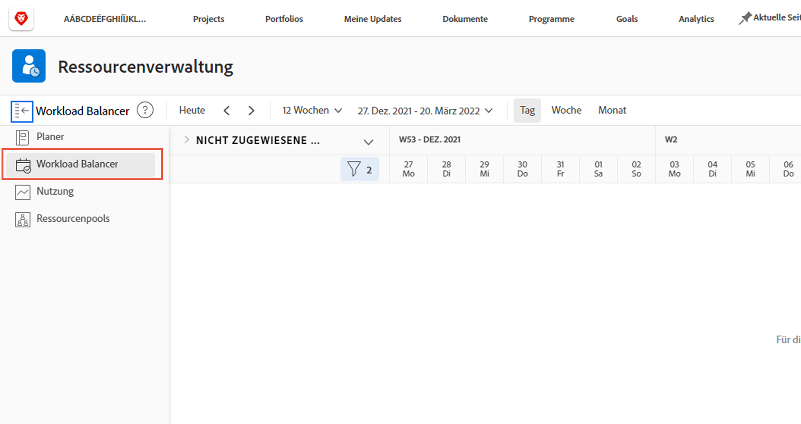
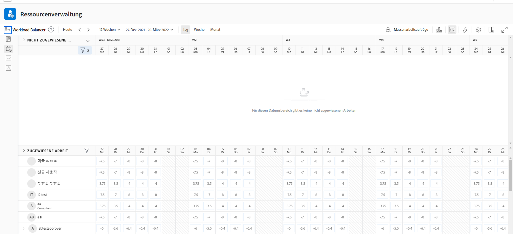
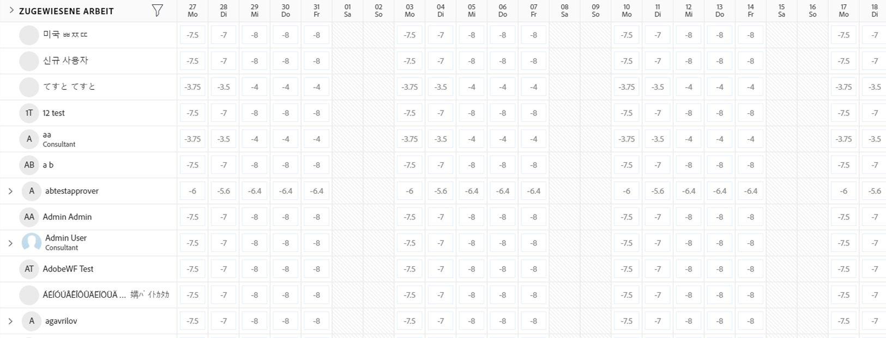
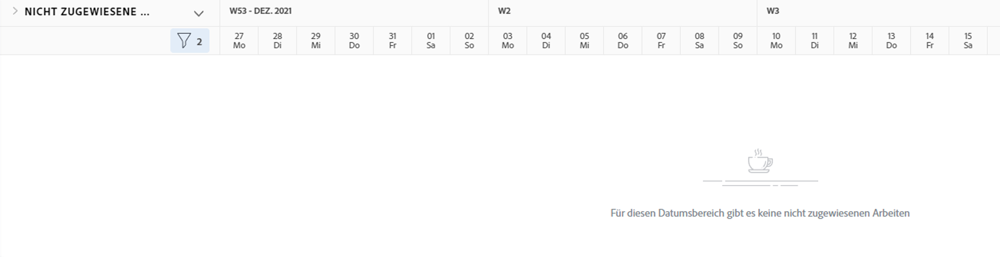

# Suchen Sie die [!DNL Workload Balancer]

Es kann für jeden eine Herausforderung sein, zu wissen, welche Ressourcen verfügbar sind und wie sie verteilt werden. Aus diesem Grund hat Workfront die [!DNL Workload Balancer].

Ihr Zweck besteht darin, Ihnen bessere Einblicke in die tägliche und wöchentliche Arbeitslast der von Ihnen verwalteten Personen zu geben und diese zu verwalten. Auf diese Weise können Sie über mehrere Projekte hinweg bessere, auf Rolle und Verfügbarkeit basierende Zuweisungen vornehmen.

* Klicken [!UICONTROL Ressourcen] im [!UICONTROL Hauptmenü].
* Navigieren Sie zu [!UICONTROL Planung] im Bereich &quot;Ressourcenverwaltung&quot;.
* Klicken Sie auf [!UICONTROL &quot;Wechsel zum Lastenausgleich&quot;] Link.

Die [!DNL Workload Balancer] ist die Standardoption, wenn Sie zum Bereich Ressourcenverwaltung des Workfront-Tools wechseln.

## Bereiche im Arbeitslastausgleich

Zwei Abschnitte werden im [!DNL Workload Balancer]: Zugewiesene Arbeit und nicht zugewiesene Arbeit.

Der Bereich &quot;Zugewiesene Arbeit&quot;zeigt eine Liste der Benutzer und der Arbeit an, die ihnen in Workfront bereits zugewiesen wurden. Standardmäßig wird dieser Bereich nach Benutzern gefiltert, die Teil der Workfront-Teams sind, denen Sie angehören. Auf diese Weise können Sie sehen, welchen Teammitgliedern die Arbeit zugewiesen wurde.

Im Arbeitsbereich &quot;Nicht zugewiesen&quot;werden Arbeiten angezeigt, die noch zugewiesen werden müssen, unabhängig davon, ob es sich um eine Person, eine Rolle oder ein Team handelt. Zunächst wird dieser Bereich jedoch nichts anzeigen.

Wenn Sie mit dem leeren Arbeitsbereich &quot;Nicht zugewiesen&quot;beginnen, können Sie sich zunächst auf die aktuellen Arbeitslasten Ihrer Benutzer im Bereich &quot;Zugewiesene Arbeit&quot;konzentrieren, bevor Sie Zuweisungen vornehmen.
