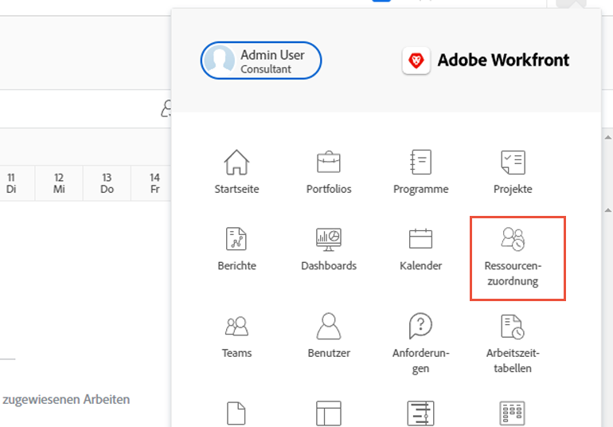
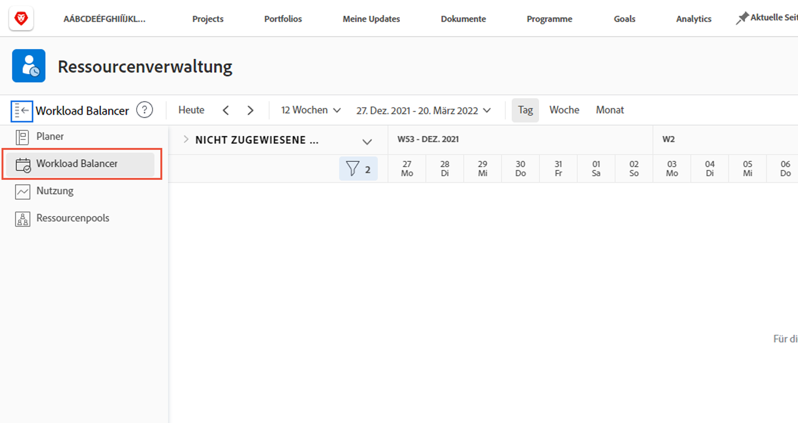
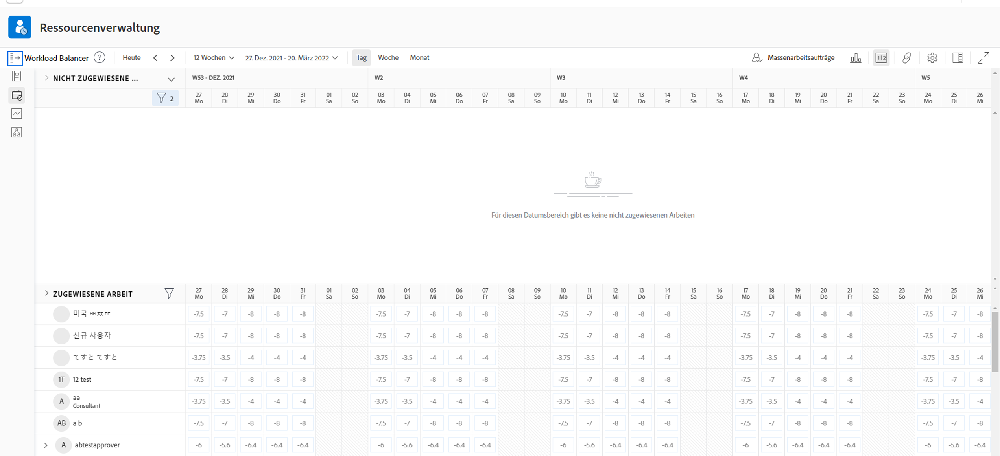
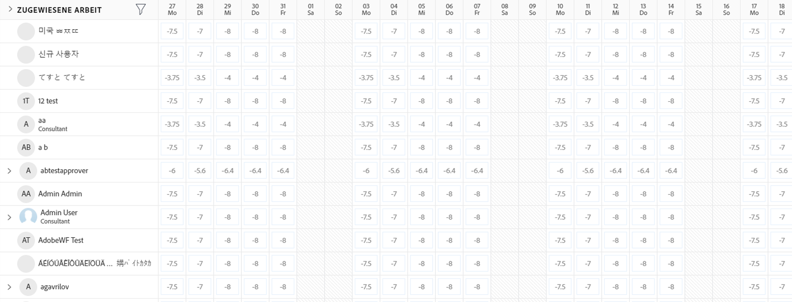
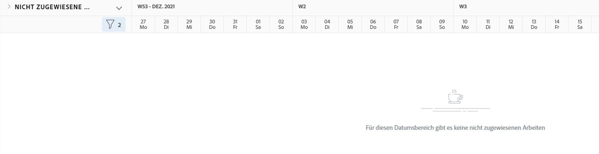

# Suchen des [!DNL Workload Balancer]

Es kann für jeden eine Herausforderung sein, zu wissen, welche Ressourcen verfügbar sind und wie sie verteilt werden. Aus diesem Grund wurde für Workfront der [!DNL Workload Balancer] erstellt.

Sein Zweck besteht darin, Ihnen bessere Einblicke in die tägliche und wöchentliche Arbeitslast der von Ihnen verwalteten Personen zu geben und diese zu verwalten. Auf diese Weise können Sie über mehrere Projekte hinweg bessere, auf Rolle und Verfügbarkeit basierende Zuweisungen vornehmen.

* Klicken Sie auf [!UICONTROL Ressourcen] im [!UICONTROL Hauptmenü].
* Navigieren Sie im Bereich „Ressourcen-Management“ zum Abschnitt [!UICONTROL Planung].
* Klicken Sie auf den Abschnitt [!UICONTROL „Workload Balancer“], der angezeigt wird.

## Bereiche im Workload Balancer

Zwei Abschnitte werden im [!DNL Workload Balancer] angezeigt: Zugewiesene Arbeiten und nicht zugewiesene Arbeiten.

Der Bereich „Zugewiesene Arbeit“ zeigt eine Liste der Benutzenden und der Arbeit an, die ihnen in Workfront bereits zugewiesen wurden. Standardmäßig wird dieser Bereich nach Benutzenden gefiltert, die Teil der Workfront-Teams sind, denen Sie angehören. Auf diese Weise können Sie sehen, welchen Team-Mitgliedern die Arbeit zugewiesen wurde.

Im Arbeitsbereich „Nicht zugewiesen“ werden Arbeiten angezeigt, die noch zugewiesen werden müssen, unabhängig davon, ob es sich um eine Person, ein Aufgabengebiet oder ein Team handelt. Zunächst wird in diesem Bereich jedoch nichts angezeigt.

Wenn Sie mit dem leeren Arbeitsbereich „Nicht zugewiesen“ beginnen, können Sie sich zunächst auf die aktuellen Arbeitslasten der Benutzenden im Bereich „Zugewiesene Arbeit“ konzentrieren, bevor Sie Zuweisungen vornehmen.
