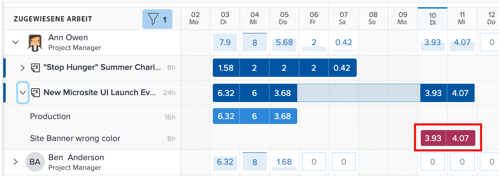

# Zu berücksichtigende Einstellungen für den Workload Balancer

Es gibt einige Workload Balancer-Einstellungen, die Sie bei Überprüfung der einzelnen Arbeitslasten Ihrer Benutzenden berücksichtigen sollten:

* Problemzuweisungen
* Voraussichtliche Termine
* Abgeschlossene Arbeiten

Diese können über das Symbol für die Workload Balancer-Einstellungen ein- und ausgeschaltet werden.

## Für Probleme aufgewendete Stunden einbeziehen

Standardmäßig zeigt der Workload Balancer nur Aufgaben an. Benutzenden können jedoch Anfragen und Probleme zugewiesen werden, die erfüllt oder behoben werden müssen und die ihnen einen Teil der Zeit rauben, die sie für die Projektarbeit aufwenden können.

Um ein besseres Verständnis der gesamten Arbeitslast einer Person zu erhalten, empfiehlt Workfront, Probleme in die Liste der zugewiesenen Benutzeraufgaben mit aufzunehmen.

Aktivieren Sie einfach die Option „Stundenaufwand für Probleme einbeziehen“ im Bereich „Workload Balancer-Einstellungen“.

Im Bereich „Zugewiesene Arbeit“ werden die Probleme als hellbraune Balken angezeigt.

### Projekttermine

Eine weitere Option für die Workload Balancer-Einstellung ist die Anzeige der Arbeitslasten basierend auf prognostizierten Daten.

Die Standardeinstellung zeigt die zugewiesene Arbeit basierend auf den im Projekt eingegebenen geplanten Daten an.

Da die prognostizierten Daten auf dem Fortschritt und dem Abschluss früherer Aufgaben im Projekt basieren, können Sie eine Echtzeitansicht des Beginns oder der Fertigstellung einer Aufgabe abrufen. Dies ist insbesondere bei der Betrachtung von Arbeitslasten nützlich.

Mit der Option „Geplante Termine anzeigen“ in den Workload Balancer-Einstellungen können Sie zwischen der Anzeige geplanter und prognostizierter Termine wechseln.

### Abgeschlossene Aufgaben

Abgeschlossene Aufgaben werden im Workload Balancer zusammen mit Aufgaben angezeigt, die gerade in Bearbeitung sind oder demnächst beginnen. Um besser zu erkennen, welche zusätzlichen Arbeiten Benutzende ausführen können, sollten Sie abgeschlossene Arbeiten ausschließen.

Deaktivieren Sie die Option „Abgeschlossene Arbeit anzeigen“ in den Workload Balancer-Einstellungen.

