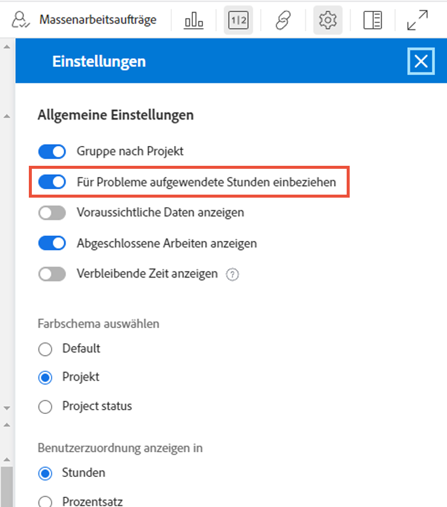

# Zu berücksichtigende Einstellungen für den Lastenausgleich

Es gibt einige Einstellungen für den Lastenausgleich, die Sie beim Eintauchen in die einzelnen Arbeitslasten Ihrer Benutzer berücksichtigen sollten:

* Problemzuweisungen
* Voraussichtliche Termine
* Abgeschlossene Arbeiten

Diese können über das Symbol Workload Balancer Settings aktiviert oder deaktiviert werden.

## Für Anfragen aufgewendete Stunden einbeziehen

Standardmäßig zeigt der Lastenausgleich nur Aufgaben an. Benutzer können jedoch Anforderungen und Problemen zugewiesen werden, die erfüllt oder gelöst werden müssen und die für die Projektarbeit ausreichend Zeit benötigen.

Um ein besseres Verständnis der gesamten Arbeitslast eines Benutzers zu erhalten, empfiehlt Workfront, Probleme in die Liste der zugewiesenen Benutzeraufgaben aufzunehmen.

Aktivieren Sie einfach die Option Stunden aus Problemen einschließen im Bereich Einstellungen für den Arbeitslastausgleich .

Im Bereich &quot;Zugewiesene Arbeit&quot;werden Probleme als leichte Balken angezeigt.

### Projekttermine

Eine weitere Option, die über die Einstellungen für den Lastenausgleich verfügbar ist, ist die Anzeige der Arbeitslasten basierend auf den prognostizierten Daten.

Die Standardeinstellung zeigt zugewiesene Arbeit basierend auf den im Projekt geplanten Daten an.

Da die prognostizierten Daten auf dem Fortschritt und dem Abschluss früherer Aufgaben im Projekt basieren, können Sie eine Echtzeitansicht des Beginns oder der Fertigstellung einer Aufgabe erhalten. Dies ist insbesondere bei der Betrachtung von Arbeitslasten nützlich.

Sie können mit der Option Vorgeschlagene Daten anzeigen in den Einstellungen für den Lastenausgleich zwischen der Anzeige geplanter und prognostizierter Daten wechseln.

### Abgeschlossene Aufgaben

Abgeschlossene Aufgaben werden im Arbeitslade-Balancer zusammen mit den laufenden Aufgaben oder deren Beginn angezeigt. Um ein besseres Verständnis davon zu erhalten, welche zusätzlichen Arbeiten Benutzer ausführen können, sollten Sie abgeschlossene Arbeiten ausschließen.

Deaktivieren Sie die Option Abgeschlossene Arbeit anzeigen in den Einstellungen für den Lastenausgleich.

