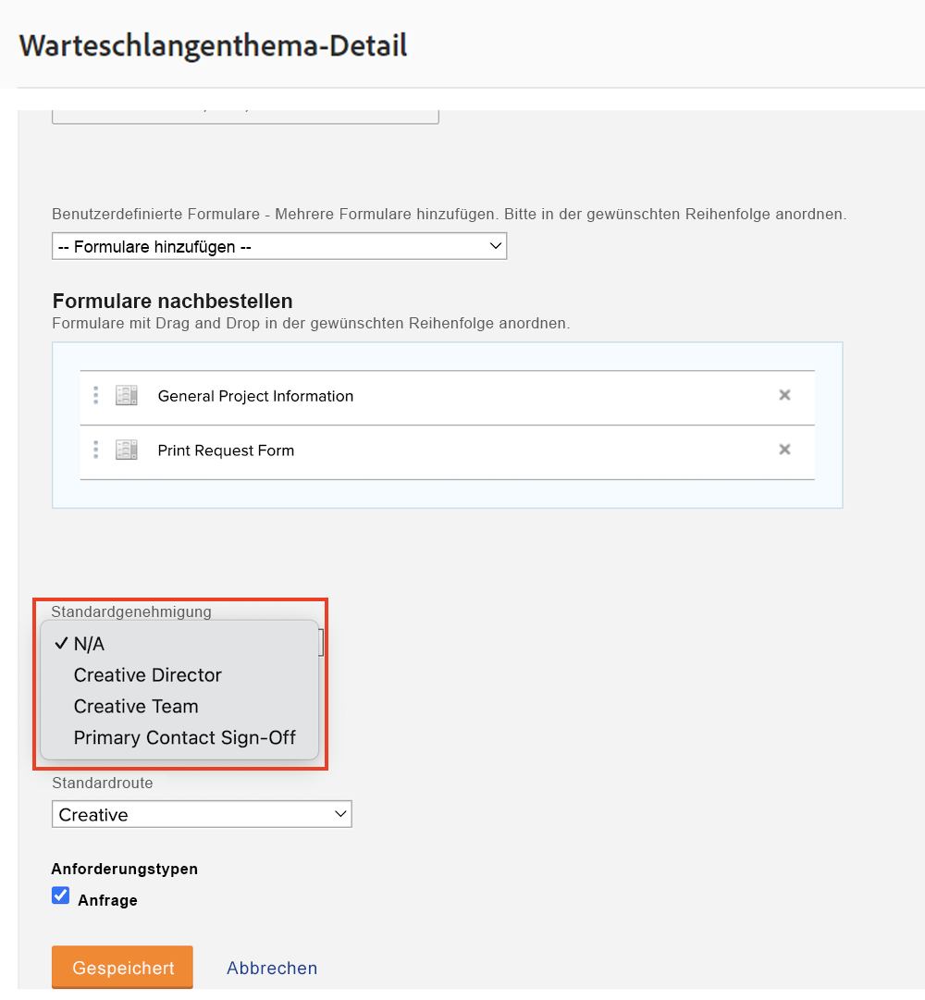
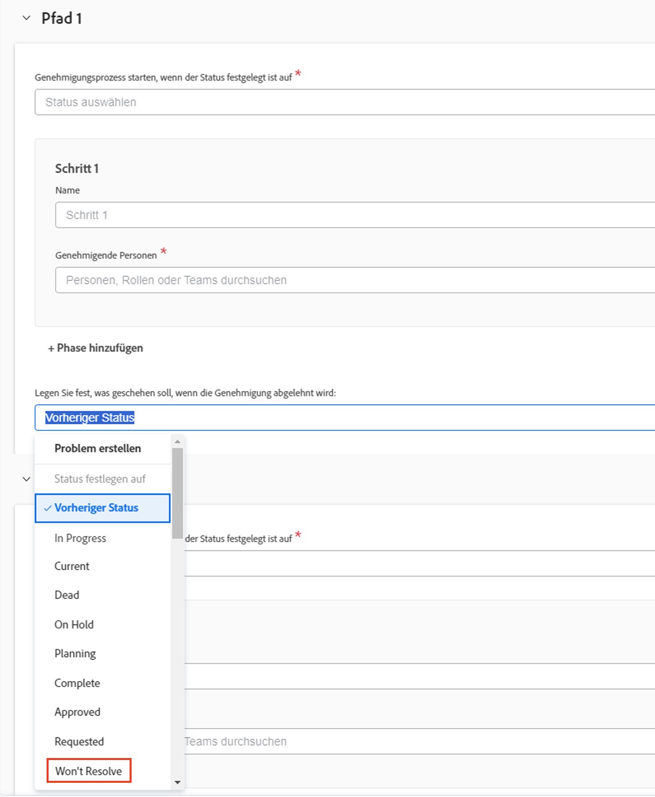

# Erstellen eines globalen und eines einmaligen Genehmigungsprozesses

Genehmigungsverfahren für Projekte, Aufgaben und Probleme ermöglichen es der Projekt-Managerin oder dem Projekt-Manager, sich von Fachleuten bestätigen zu lassen, dass die Arbeit richtig gemacht wurde, bevor es weitergeht. Die Projekt-Managerin bzw. der Projekt-Manager kann einen Genehmigungsprozess für jede Situation erstellen (dies wird als einmaliger Genehmigungsprozess bezeichnet) oder aus einer Liste von möglicherweise zuvor erstellten Genehmigungsprozessen wählen, um gängige Bedürfnisse zu erfüllen (diese werden als globale oder vorhandene Genehmigungsprozesse bezeichnet).

In beiden Instanzen wird die genehmigende Person, wenn sich der Objektstatus in einen im Genehmigungsverfahren festgelegten Status ändert, auf verschiedene Weise benachrichtigt, um die Arbeit zu überprüfen und sie zu genehmigen oder abzulehnen. Da es sein kann, dass das gesamte Projekt bis zur Genehmigung pausiert wird, sollten sich die Genehmigenden schon im Voraus darüber im Klaren sein, dass sie möglicherweise um eine Genehmigung ersucht werden. Sind genehmigende Personen aus irgendeinem Grund abwesend, können sie dann ihre Genehmigungen an qualifizierte Vertretende delegieren. Siehe [Delegieren von Aufgaben, Problemen und Genehmigungen](/help/manage-work/approval-processes-and-milestone-paths/delegate-approvals.md) für Details.

In diesem Video erfahren Sie, wie Sie einen globalen und einen einmaligen Genehmigungsprozess für ein Projekt, eine Aufgabe oder ein Problem erstellen.

>[!VIDEO](https://video.tv.adobe.com/v/335225/?quality=12&learn=on)

>[!TIP]
>
>Sie können ein einmaliges Genehmigungsverfahren für ein Projekt oder eine Aufgabe zu einer Projektvorlage hinzufügen.

>[!NOTE]
>
>Sie können eine einmalige Genehmigung für Projekte und Probleme auf die gleiche Weise einrichten, wie es im Video für Aufgaben beschrieben wird.

## Anwenden automatischer Problemgenehmigungen in einer Anfrage-Warteschlange

Wenn Sie automatische Problemgenehmigungen in einer Anfrage-Warteschlange einrichten möchten, kann dies nur mithilfe eines globalen Genehmigungsprozesses für Probleme durchgeführt und auf ein [!UICONTROL Warteschlangen-Thema] angewendet werden. 

Wählen Sie beim Erstellen oder Bearbeiten eines [!UICONTROL Warteschlangen-Themas] im Feld **[!UICONTROL Standardgenehmigung]** den globalen Genehmigungsprozess aus.

Möglicherweise müssen Sie den Problem-Genehmigungsprozess bearbeiten, um sicherzustellen, dass der Problemstatus nicht auf **[!UICONTROL Vorheriger Status]** gesetzt ist, wenn die Genehmigung abgelehnt wird. Der Grund dafür ist, dass der vorherige Status **[!UICONTROL Neu]** lautet. Dies ist auch der Status, der den Genehmigungsprozess auslöst und deshalb bei der Genehmigung angezeigt wird. Um Verwirrung zu vermeiden, wenn die Genehmigung eines Problems abgelehnt wird, sollten Sie den Status auf einen Wert wie **[!UICONTROL Lässt sich nicht lösen]** oder einen benutzerdefinierten, zu diesem Zweck erstellten Status stellen.

## Empfohlene Tutorials zu diesem Thema

* [Delegieren von Aufgaben, Problemen und Genehmigungen](/help/manage-work/approval-processes-and-milestone-paths/delegate-approvals.md)
* [Informationen zu gruppenspezifischen Genehmigungsprozessen](/help/administration-and-setup/approval-processes-and-milestone-paths/group-specific-approval-processes.md)
* [Erstellen eines Anfrageflusses](/help/manage-work/request-queues/create-a-request-flow.md)

