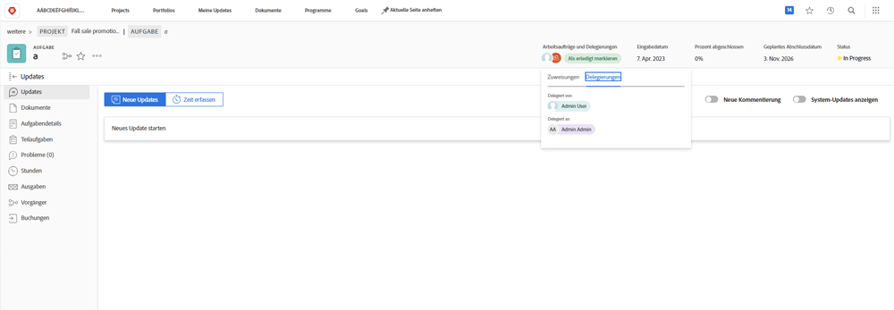
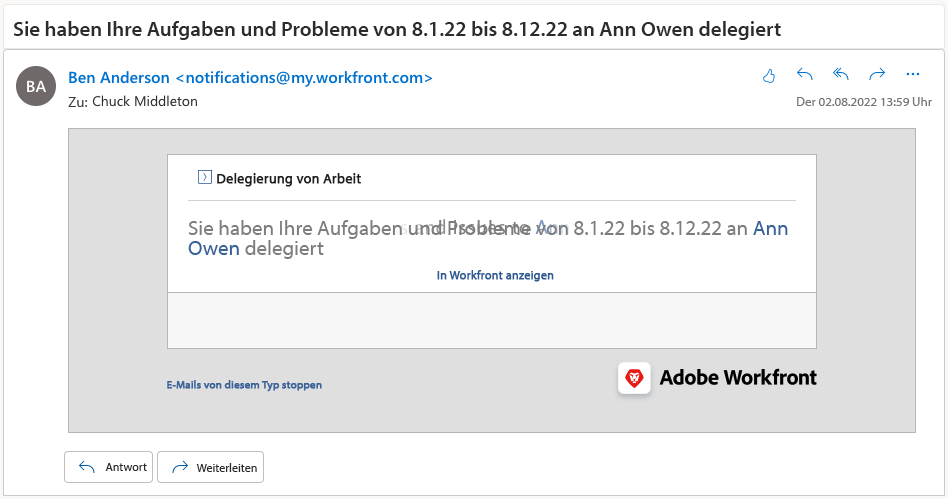

# Delegieren von Aufgaben, Problemen und Genehmigungen

Erfahren Sie, wie Sie Genehmigungen für Projekte, Aufgaben, Probleme und Zeitpläne an einen anderen Workfront-Benutzer delegieren. Erfahren Sie auch, wie Sie Aufgaben und Problemzuweisungen delegieren.

## Genehmigungen delegieren

Erfahren Sie, wie Sie Genehmigungen für Projekte, Aufgaben, Probleme und Zeitpläne an einen anderen Benutzer delegieren.

In diesem Video erfahren Sie, wie Sie:

* Zuweisen von Genehmigungen zu einer anderen Person
* Ende des Delegationszeitraums
* Ermitteln delegierter Genehmigungen

>[!VIDEO](https://video.tv.adobe.com/v/336094/?quality=12)

<!---
learn more URLS
Delegate approval request
--->

## Delegieren von Aufgaben und Problemzuweisungen

Sie können die Ihnen zugewiesenen Aufgaben und Probleme an andere Benutzer delegieren, wenn Sie nicht im Hause sein möchten.

### Aktivierung der Zuweisung von Aufgaben und Aufgaben

Bevor sie verwendet werden kann, muss die Zuweisung von Aufgaben und Problemen von einem Gruppen- oder Systemadministrator aktiviert werden. Dies geschieht in [!UICONTROL Einrichtung > Projekteinstellungen > Aufgaben und Probleme > Delegation]. Durch Aktivierung dieser Option können alle Benutzer mit einer Review- oder höheren Lizenz ihre zugewiesenen Aufgaben und Probleme delegieren.

![Screenshot zeigt [!UICONTROL Einrichtung] Delegationsvorlieben](assets/delegation-1.png)

### Delegieren von Aufgaben und Problemzuweisungen

Navigieren Sie zu [!UICONTROL Startseite] und klicken Sie auf [!UICONTROL Delegieren]und geben Sie dann den Benutzer an, an den Sie alle Ihre zugewiesenen Aufgaben delegieren, sowie den Datumsbereich an. Sie können jeden Benutzer mit einer Review- oder höheren Lizenz benennen.

![Screenshot mit der Registerkarte &quot;Delegation&quot;in [!UICONTROL Startseite]](assets/delegation-2.png)

### Ermitteln, ob eine Aufgabe oder ein Problem delegiert wurde

Sie können sehen, wann Aufgaben oder Probleme in [!UICONTROL Startseite] oder in der Aufgaben- oder Problemansicht.

![Screenshot mit der zugewiesenen Aufgabenzuweisung in [!UICONTROL Startseite]](assets/delegation-4.png)

### E-Mail-Benachrichtigungen, die für delegierte Arbeiten gelten

Ihr Gruppen- oder Systemadministrator kann E-Mail-Benachrichtigungen aktivieren, die Sie darüber informieren, wann Sie Ihre Aufgaben und Probleme zugewiesen und welche Aufgaben und Probleme Ihnen von jemandem zugewiesen wurden.

![Screenshot zeigt [!UICONTROL Einrichtung] E-Mail-Benachrichtigungsoptionen für die Zuweisung](assets/delegation-5.png)

