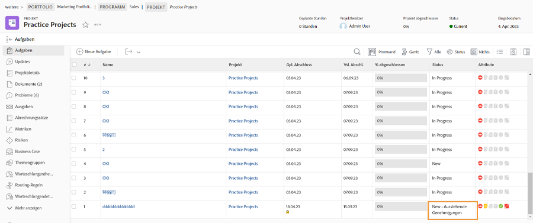

# Vollständige Genehmigungen

Genehmigungen von Aufgaben und Problemen sind Teil vieler Workflows. Nicht aufgelöste Genehmigungen können Sie jedoch daran hindern, den Projektstatus auf &quot;Fertig stellen&quot;festzulegen.

Im [!UICONTROL Aufgabe] im Abschnitt Ihres Projekts ein [!UICONTROL Ansicht] , die Folgendes enthält: [!UICONTROL Status] Spalte. Ein kurzer Blick in diese Spalte zeigt, ob eine Aufgabe mit dem Wert[!UICONTROL -Genehmigung ausstehend]&quot; nach dem Namen des Status.

Sie haben einige Möglichkeiten, wie Sie vorgehen können:

* **die Genehmigung ausfüllen —** Dies kann bedeuten, andere an die noch ausstehende Genehmigung zu erinnern. Führen Sie dazu eine Aktualisierung durch [!DNL Workfront]. Je nach [!DNL Workfront] -Berechtigungen, können Sie die Genehmigung möglicherweise selbst abschließen.
* **Entfernen Sie die Genehmigung —** Wenn die Validierung nicht erforderlich ist, kann es einfacher sein, sie einfach zu löschen. Ihre Fähigkeit dazu hängt von Ihrer [!DNL Workfront] Berechtigungen.
* **Status ändern —** Wählen Sie einen Status aus, an den keine Genehmigung angehängt ist. Stellen Sie einfach sicher, dass der Status &quot;Complete&quot;entspricht.

Wenn Ihr Unternehmen Probleme verwendet, um Probleme zu verfolgen, Bestellungen zu ändern oder andere Ereignisse während des Projekts zu ändern, führen Sie dieselben Schritte für die [!UICONTROL Probleme] -Abschnitt Ihres Projekts.
