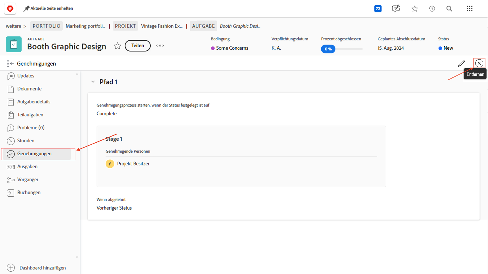

# Abschließen von Genehmigungen

Aufgaben- und Problemvalidierungen sind Teil vieler Projekte. Ungelöste Genehmigungen verhindern jedoch, dass Sie den Projektstatus auf „Abgeschlossen“ setzen können.

Hier ist, wie man sie findet und mit ihnen umgeht.

Wählen Sie im Abschnitt [!UICONTROL Aufgabe] Ihres Projekts eine [!UICONTROL Ansicht] aus, die die Spalte [!UICONTROL Status] enthält, z. B. die Ansicht [!UICONTROL Status]. Ein kurzer Blick nach unten in diese Spalte zeigt, ob eine Aufgabe unvollständig validiert wurde und die Wörter &quot;[!UICONTROL  - Ausstehende Genehmigung]&quot; hinter dem Namen des Status stehen.

Wenn Sie eine Aufgabe finden, die noch auf die Genehmigung wartet, haben Sie zwei Möglichkeiten, die folgenden Schritte durchzuführen:

## Vollziehen der Genehmigung

Dies kann bedeuten, dass die zugewiesene Person an die ausstehende Genehmigung erinnert wird. Sie können sehen, wer als Genehmiger zugewiesen wurde, indem Sie die Aufgabe öffnen und auf das Menü mit drei Punkten im Bereich Genehmigungen klicken.

Es wird ein Feld mit dem zugewiesenen Genehmiger angezeigt.

## Entfernen Sie die Genehmigung

Wenn die Validierung nicht erforderlich ist, können Sie sie entfernen. Sie können dies tun, indem Sie zuerst die Genehmigung aufrufen. Klicken Sie im Bereich &quot;Genehmigungen&quot;auf die Schaltfläche [!UICONTROL Rückruf] . Dadurch wird der Status wieder in den vorherigen Status geändert und Sie können den Genehmigungsprozess entfernen.

Klicken Sie nun links auf die Registerkarte [!UICONTROL Genehmigungen] und dann oben rechts auf die Schaltfläche [!UICONTROL Entfernen] .

## Umgang mit Problemgenehmigungen

Wenn Ihre Organisation Anfragen verwendet, um Probleme, Änderungsaufträge oder andere Ereignisse während des Projekts zu verfolgen, führen Sie die gleichen Schritte im Abschnitt [!UICONTROL Anfragen] Ihres Projekts aus.
