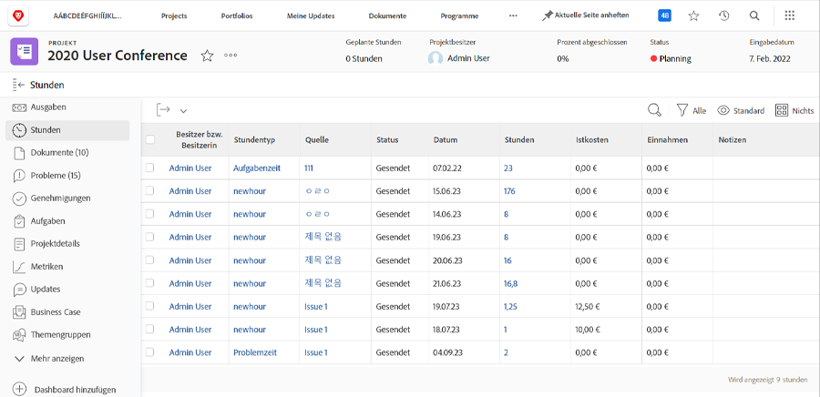

# Protokoll- und Überprüfungszeiten

Wenn die Protokollierung der tatsächlich geleisteten Arbeitsstunden Teil des Workflows Ihres Unternehmens ist, können Sie diese Stunden auf der Seite [!UICONTROL Stunden] -Abschnitt (wählen Sie ihn im linken Bedienfeldmenü aus) im Projekt aus. Hier werden alle Stunden angezeigt, die bei einzelnen Aufgaben und dem Projekt selbst protokolliert wurden. Sie können auch Stunden von dieser Seite aus protokollieren.

>[!NOTE]
>
>Ihr Unternehmen kann Sie auffordern, die Stunden zu genehmigen, bis [!DNL Workfront] timesheets. Überprüfen Sie Ihre interne [!DNL Workfront] Team, um zu sehen, welchen Prozess Sie verwenden sollten.

<!---
learn more url
Log time
--->
