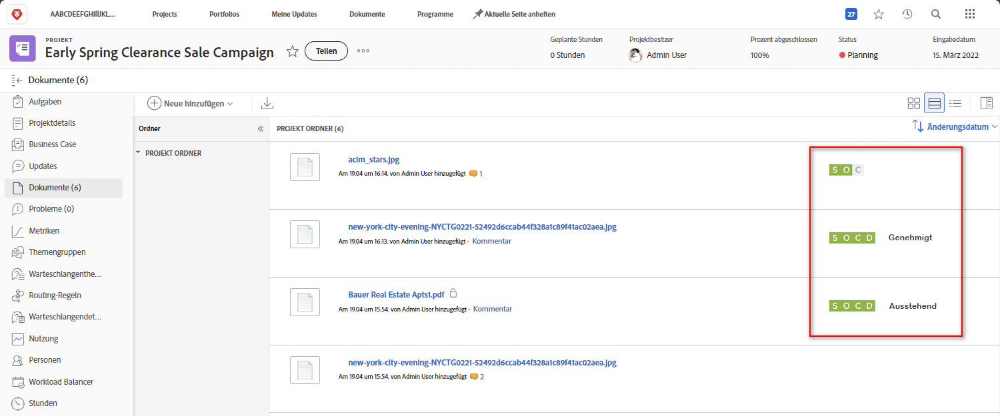
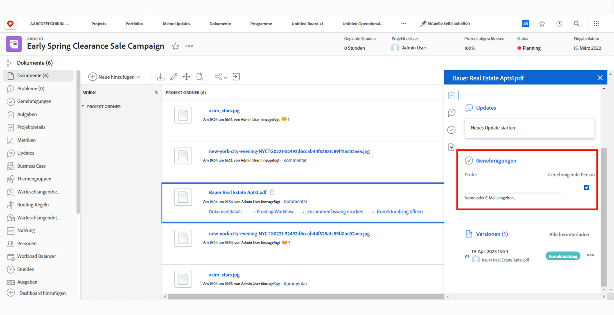

# Hochladen von Assets

Bevor Sie eine [!DNL Workfront] stellen Sie sicher, dass alle relevanten Dateien im [!UICONTROL Dokumente] Abschnitt. Laden Sie diese gemäß den Richtlinien Ihres Unternehmens als Dokument oder Testversand hoch.

Möglicherweise müssen Sie das Dokument oder den Testversand als Version einer vorhandenen Datei hochladen.

Wenn Ihr Unternehmen Testversandgenehmigungen verwendet, vergewissern Sie sich, dass alle diese mit einem kurzen Blick auf die Fortschrittssymbole ausgefüllt sind.

Wenn Ihr Unternehmen Dokumentgenehmigungen verwendet, wählen Sie jedes Element in der Liste aus und überprüfen Sie die Dokumentdetails, um festzustellen, ob die Genehmigungen abgeschlossen sind.

<!---
learn more urls
Create proofs
Add new documents to Workfront
--->
