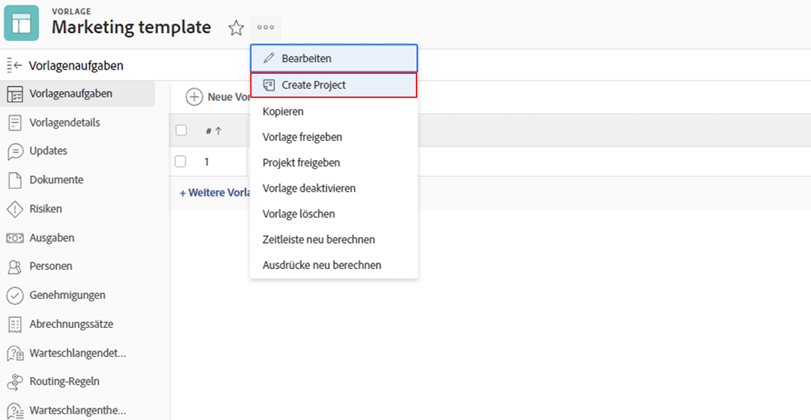
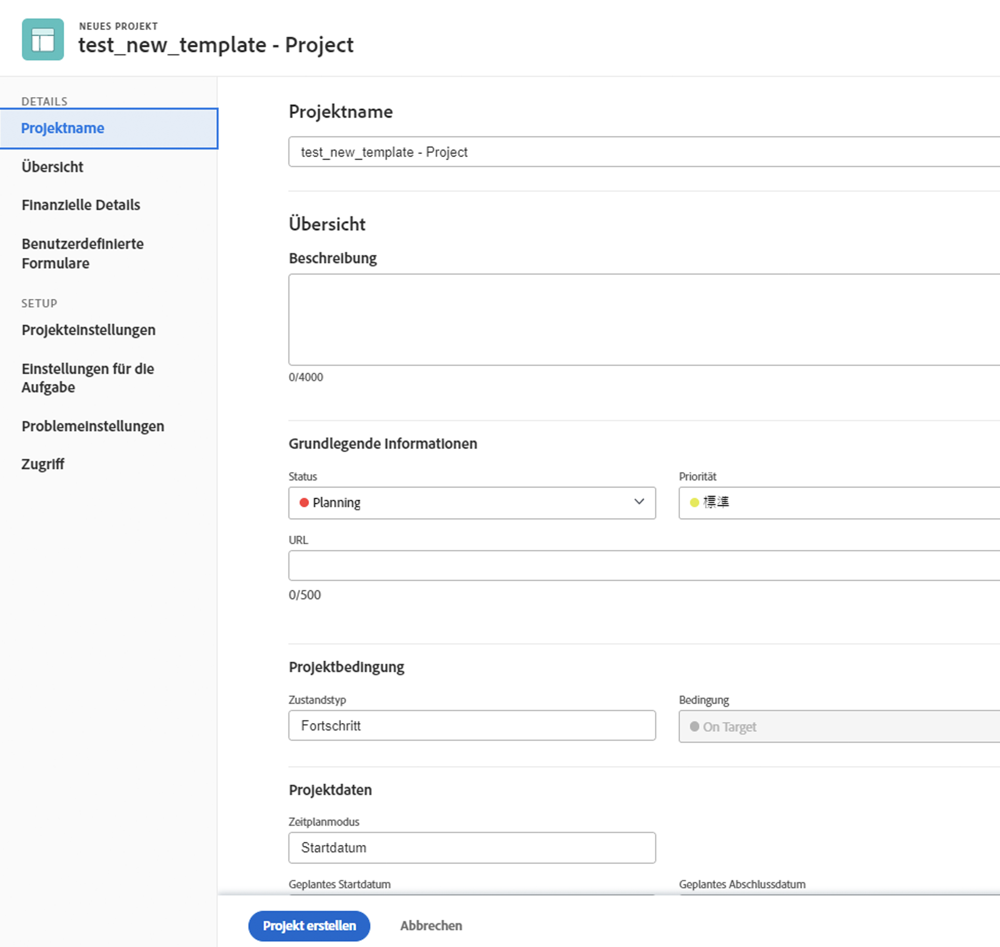
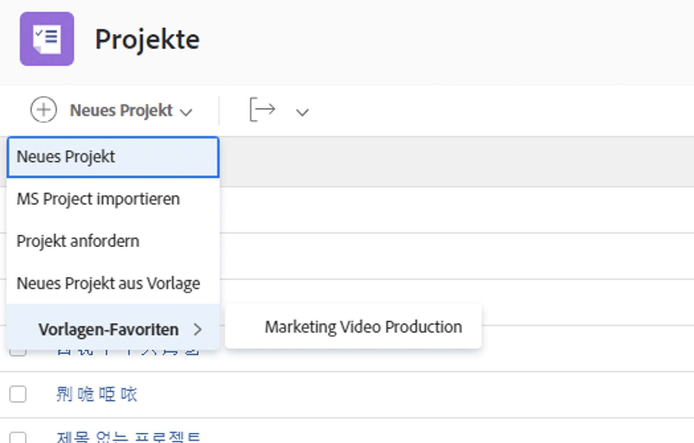

# Projekt direkt aus einer Vorlage erstellen

Wenn Sie zufällig an einer Vorlage arbeiten und ein Projekt mit dieser Vorlage erstellen müssen, klicken Sie auf das 3-Punkte-Menü neben dem Vorlagennamen. Wählen Sie dann Projekt erstellen aus.

Im Detailfenster können Sie die Einstellungen des neuen Projekts ändern.

>[!NOTE]
>
>Um ein Projekt mit dieser Methode zu erstellen, benötigen Sie Zugriff auf den Bereich &quot;Vorlagen&quot;von Workfront. Wenn Sie nicht auf Vorlagen zugreifen können, können Sie weiterhin eine Vorlage verwenden, um ein Projekt aus dem Projektbereich oder beim Konvertieren eines Problems/einer Aufgabe zu erstellen.

>[!TIP]
>
>Wenn es eine Vorlage gibt, die Sie häufig verwenden, machen Sie sie zu einem Favoriten! Die Vorlage wird im Menü Neues Projekt aufgelistet und zusätzlich im Menü Favoriten in der Navigationsleiste angezeigt.

