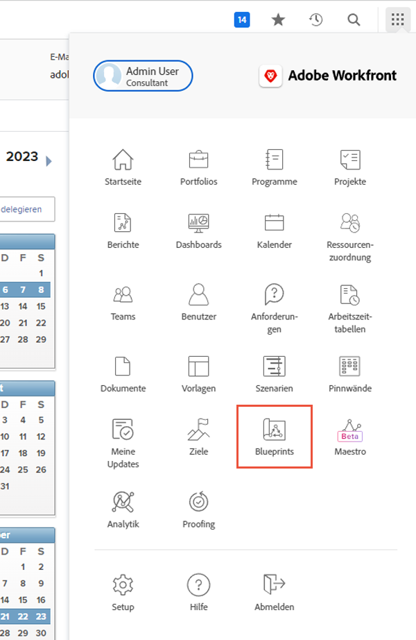
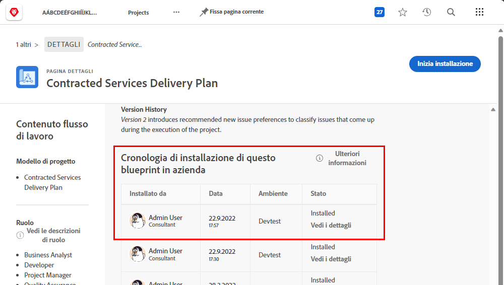
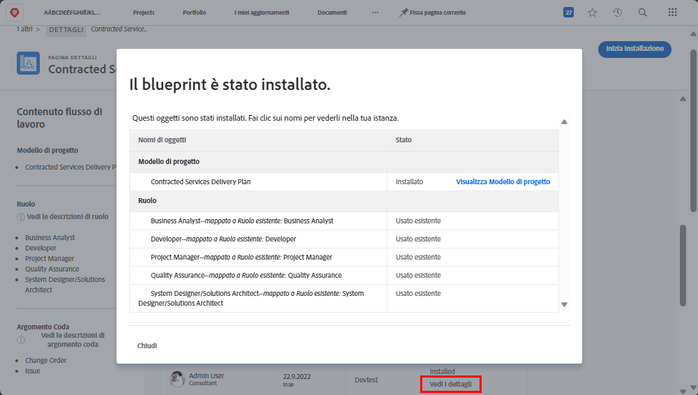

# Erstellen einer Projektvorlage und Informationen über [!UICONTROL Blueprints]

Lernen Sie, wie Sie eine Projektvorlage von Grund auf oder auf der Grundlage eines bestehenden Projekts erstellen können, und erfahren Sie, wie Sie mit [!UICONTROL Blueprints] Zugang zu einer Welt nützlicher Projektvorlagen erhalten, die von Workfront-Fachleuten erstellt wurden.

## Erstellen einer Projektvorlage

* Das Video enthält eine schrittweise Anleitung zum Erstellen und Verwenden von Vorlagen für die Produktion von Marketing-Videos. Zunächst wird erklärt, wie Sie eine neue Vorlage von Grund auf neu erstellen, benennen und speichern. Der Prozess umfasst drei Hauptschritte: das Erstellen der Aufgaben, das Einrichten der Timeline mit Laufzeiten und Vorgängern und das Zuweisen von Arbeitsaufträgen zu Aufgabengebieten anstelle von einzelnen Benutzenden. Im Video wird der Schwerpunkt auf das Organisieren der Aufgaben mithilfe von Beziehungen zwischen übergeordneten und untergeordneten Aufgaben für eine bessere Zusammenfassung und Effizienz gelegt.
* Nachdem die Vorlage erstellt wurde, kann sie zur Erstellung neuer Projekte verwendet werden. Im Video wird gezeigt, wie Sie ein neues Projekt aus der Vorlage erstellen, notwendige Anpassungen vornehmen und Aufgaben hinzufügen oder Laufzeiten nach Bedarf ändern. Außerdem wird gezeigt, wie Sie mithilfe der Funktionen „Ressourcenplanung“ und „Planung“ Aufgabengebiete zu Aufgaben zuweisen. 
* In diesem Video wird beschrieben, wie Sie ein vorhandenes Projekt als neue Vorlage speichern, um Aktualisierungen und Verbesserungen im Workflow zu ermöglichen. Es wird hervorgehoben, wie wichtig das Vorlagen-Management für das Vermeiden von Verwirrung und das Sicherstellen einer optimierten Projektausführung ist. 

>[!VIDEO](https://video.tv.adobe.com/v/335210/?quality=12&learn=on&enablevpops=0)

## Die wichtigsten Punkte

* **Erstellen einer Vorlage:** Erfahren Sie, wie Sie eine neue Vorlage von Grund auf neu erstellen, indem Sie sie benennen, Aufgaben einrichten, Timelines erstellen und Arbeitsaufträge für Aufgabengebiete zuweisen. 
* **Aufgabenorganisation:** Verwenden Sie Beziehungen zwischen übergeordneten und untergeordneten Aufgaben, um Aufgaben effizient zu organisieren und eine klare Zusammenfassung und Struktur für das Projekt bereitzustellen. 
* **Timeline-Setup** Richten Sie Aufgaben-Timelines mithilfe von Laufzeiten und Vorgängern ein, um den Zeitrahmen und die Reihenfolge der Aufgaben genau zu schätzen. 
* **Rollenbasierte Arbeitsaufträge:** Weisen Sie Aufgaben zu Aufgabengebieten anstelle von einzelnen Benutzenden zu, um die Funktionen „Ressourcenplanung“ und „Planung“ effektiv zu nutzen. 
* **Vorlagen-Management:** Speichern Sie bestehende Projekte als neue Vorlagen, um Verbesserungen einzubinden und Vorlagen zu verwalten. So vermeiden Sie Verwirrung und stellen eine effiziente Projektausführung sicher. 

## Mit [!UICONTROL Blueprints] erstellte Vorlagen

Workfront-Benutzende können [!UICONTROL Blueprints] als Hilfe verwenden, um Projektvorlagen zu erstellen. Mit dieser Funktion im Hauptmenü können Sie auf vorgefertigte, gebrauchsfertige Vorlagen zugreifen, die auf eine Abteilung und einen bestimmten Reifegrad ausgerichtet sind. Diese Vorlagen geben den Benutzenden einen Vorsprung bei der wiederholbaren Projekterstellung und helfen, die Konsistenz bei Projekten mit ähnlichem Umfang zu wahren.

Alle lizenzierten Benutzenden können die Liste der in Workfront verfügbaren Blueprints durchsuchen. Sie können einen Blueprint nicht direkt bei der Erstellung eines neuen Projekts anwenden (z. B. bei der Umwandlung einer Aufgabe oder Anfrage in ein Projekt). Ein wesentlicher Unterschied zwischen einem Blueprint und einer Projektvorlage besteht darin, dass ein Blueprint für die Erstellung einer Vorlage verwendet wird, während eine Vorlage für die Erstellung eines Projekts verwendet wird. **Der Blueprint muss von Systemadmins installiert werden, damit die entsprechende Vorlage erstellt werden kann.**

Wenn Sie einen Blueprint finden, der interessant aussieht, können Sie auf **[!UICONTROL Details]** klicken, um mehr darüber zu erfahren.

Auf dem Bildschirm [!UICONTROL Details] finden Sie weitere Informationen zum Blueprint, einschließlich des Installationsverlaufs, falls der Blueprint bereits installiert wurde.

Wenn der Blueprint installiert wurde, können Sie auf **[!UICONTROL Mehr Details]** klicken, um Links zu der erstellten Vorlage und allen anderen Objekten zu bekommen, die zur Unterstützung der Vorlage erstellt wurden.

Wenn der Blueprint noch nicht installiert ist, können Sie dies bei Ihren Systemadmins anfordern.

## Empfohlene Tutorials zu diesem Thema

* [Erstellen eines Projekts direkt aus einer Vorlage](/help/manage-work/create-and-manage-project-templates/create-a-project-directly-from-a-template.md)
* [Freigeben einer Projektvorlage](/help/manage-work/create-and-manage-project-templates/share-a-project-template.md)
* [Kopieren eines bestehenden Projekts](/help/manage-work/manage-projects/copy-an-existing-project.md)
* [Deaktivieren einer Projektvorlage](/help/manage-work/create-and-manage-project-templates/deactivate-a-project-template.md)
* [Bearbeiten des Projekt-Teams in einer Projektvorlage](/help/manage-work/create-and-manage-project-templates/edit-the-project-team-in-a-project-template.md)
