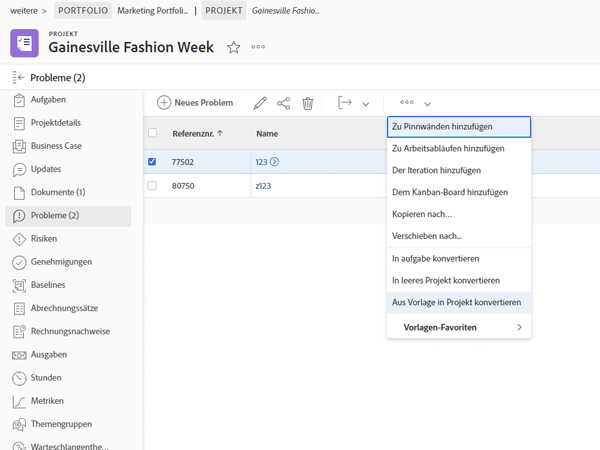

# Konvertieren von Problemen in andere Arbeitselemente

## Konvertieren eines Problems in eine Aufgabe

Ein Problem kann so bedeutsam sein, dass die Zeit und der Aufwand zur Behebung dieses Problems in der Projektzeitleiste berücksichtigt und die entsprechenden Ressourcen zugewiesen werden müssen. In diesem Fall kann das Problem in eine Aufgabe umgewandelt werden.

![Ein Bild der [!UICONTROL In Aufgabe konvertieren] Option eines Problems in [!UICONTROL Workfront].](assets/15-convert-issue-to-task-menu-option.png)

1. Navigieren Sie zum [!UICONTROL Probleme] des Projekts oder der Aufgabe, in dem das Problem protokolliert wird. Oder suchen Sie das Problem in einem Bericht, auf den Sie Zugriff haben.
1. Klicken Sie auf den Namen des Problems, um es zu öffnen.
1. Wählen Sie aus dem Menü mit 3 Punkten rechts neben dem Namen des Problems die Option **[!UICONTROL In Aufgabe konvertieren]**.
1. Füllen Sie die [!UICONTROL In Aufgabe konvertieren] Formular. Geben Sie zunächst der neuen Aufgabe einen Namen und eine Beschreibung.
1. Wenn die neue Aufgabe Teil eines anderen Projekts sein soll, geben Sie den Projektnamen ein.
1. Im [!UICONTROL Optionen] aktivieren Sie die Kontrollkästchen, um das ursprüngliche Problem beizubehalten, den Zugriff auf die neue Aufgabe zu ermöglichen und das Abschlussdatum beizubehalten. Folgen Sie beim Auswählen dieser Optionen dem Workflow Ihres Unternehmens. Hängen Sie ein benutzerdefiniertes Formular an, wenn Sie benutzerdefinierte Formulardaten vom Problem an die Aufgabe übertragen möchten. (Alle Felder, die sowohl im Formular für das Problem als auch im Aufgabenformular vorhanden sind, werden automatisch in das Aufgabenformular übertragen.)
1. Füllen Sie das benutzerdefinierte Formular aus, wenn eines angehängt ist.
1. Klicken **[!UICONTROL In Aufgabe konvertieren]** zu beenden.

![Ein Bild der [!UICONTROL In Aufgabe konvertieren] Form eines Problems in [!UICONTROL Workfront].](assets/16-convert-to-task-options.png)

Abhängig von der [!DNL Workfront] -Systemeinstellungen können Sie die Einstellungen im Abschnitt Optionen beim Konvertieren der Aufgabe ändern. Diese Optionen wirken sich sowohl auf das ursprüngliche als auch auf die neue Aufgabe aus.

* **&quot;Behalten Sie das ursprüngliche Problem bei und binden Sie die Lösung an diese Aufgabe.&quot;** behält die ursprüngliche Ausgabe und die damit verbundenen Informationen (Stunden, Dokumente usw.) bei. Wenn diese Option aktiviert ist, wird das Problem nach Abschluss der Aufgabe als behoben markiert. Wenn diese Option nicht ausgewählt ist, wird das ursprüngliche Problem beim Abschluss der Aufgabe gelöscht. Dies kann sich auf die Art und Weise auswirken, wie Ihr Unternehmen Probleme verfolgt und Berichte zu diesen erstellt.
* Die **&quot;Zugriff auf diese Aufgabe zulassen (Benutzername des Benutzers)&quot;** ermöglicht es der Person, die das Problem erstellt hat, Zugriff auf diese neue Aufgabe.
* Die **&quot;Halten Sie das geplante Abschlussdatum des Problems an&quot;** ermöglicht es Ihnen, das geplante Abschlussdatum bereits für das Problem festzulegen. Dadurch wird die Aufgabenbegrenzung auf [!UICONTROL Finish No Later Than]. Wenn das Kontrollkästchen deaktiviert ist, werden die Daten der Aufgabe so festgelegt, als ob eine neue Aufgabe innerhalb des Projekts erstellt wird.

Die neue Aufgabe wird am Ende der Aufgabenliste Ihres Projekts platziert. Verschieben Sie die Aufgabe an den gewünschten Ort, weisen Sie der Arbeit einen Benutzer oder ein Team zu, fügen Sie geplante Stunden und Dauer hinzu usw.

>[!NOTE]
>
>Sie können der Projekt-Timeline keine Probleme hinzufügen, da sie &quot;ungeplante Arbeit&quot;darstellen. Die Projektzeitleiste dient der &quot;geplanten Arbeit&quot;, d. h. Aufgaben.

## Konvertieren eines Problems in ein Projekt

Es gibt Situationen, in denen ein Problem nicht gelöst werden kann, indem das Problem selbst angegangen oder in eine Aufgabe konvertiert wird, da der Prozess der Problemlösung komplizierter koordiniert werden muss. In diesem Fall können Sie das Problem in ein Projekt konvertieren.

1. Navigieren Sie zum Abschnitt Probleme des Projekts oder der Aufgabe, bei der das Problem protokolliert wird. Oder suchen Sie das Problem in einem Bericht, auf den Sie Zugriff haben.
1. Klicken Sie auf den Namen des Problems, um es zu öffnen.
1. Klicken Sie auf das Menü mit 3 Punkten rechts neben dem Namen des Problems, um das Menü Mehr anzuzeigen.
1. Wählen Sie dann aus, ob Sie ein neues Projekt erstellen möchten, das vollständig leer ist, oder verwenden Sie eine Projektvorlage, mit der Aufgaben- und Zeitleisteninformationen vorausgefüllt werden.
1. Füllen Sie die Informationen im Fenster In Projekt konvertieren aus, beginnend mit dem Namen des Projekts.
1. Füllen Sie die anderen Projektdetails aus, wie von Ihrem Team oder Ihrer Organisation benötigt.
1. Aktivieren Sie im Abschnitt Optionen die Kontrollkästchen, um das ursprüngliche Problem beizubehalten und den Zugriff auf das neue Projekt zu ermöglichen. Folgen Sie beim Auswählen dieser Optionen dem Workflow Ihres Unternehmens.
1. Füllen Sie das benutzerdefinierte Formular aus, wenn eines angehängt ist. Hängen Sie ein benutzerdefiniertes Formular an, wenn Sie benutzerdefinierte Formulardaten aus dem Problem an das Projekt übertragen möchten. (Alle Felder, die sowohl im Formular als auch im Projektformular vorhanden sind, werden automatisch in das Projektformular übertragen.)
1. Klicken **In Projekt konvertieren** zu beenden.

Die im Fenster In Projekt konvertieren angezeigten Projektdetailfelder hängen von der Methode ab, mit der Sie das Projekt erstellt haben. Wenn Sie die Option In Projekt aus Vorlage konvertieren verwendet haben, werden im linken Menü weitere Informationen angezeigt.

>[!NOTE]
>
>Einige Abschnitte, wie der Abschnitt &quot;Optionen&quot;, sind zwar sichtbar, können aber je nach den Workfront-Systemeinstellungen Ihres Unternehmens möglicherweise nicht zugänglich sein.

* Klicken Sie auf &quot;**Behalten Sie das ursprüngliche Problem bei und binden Sie die Lösung an dieses Projekt**&quot;. Bei dieser Option werden das ursprüngliche Problem und die damit verbundenen Informationen (Stunden, Dokumente usw.) beibehalten. Wenn das neue Projekt abgeschlossen ist, wird das Problem als behoben markiert. Wenn diese Option nicht ausgewählt ist, wird das ursprüngliche Problem beim Abschluss des Projekts gelöscht. Dies kann sich auf die Art und Weise auswirken, wie Ihr Unternehmen Probleme verfolgt und Berichte zu diesen erstellt.
* Die &quot;**Zugriff auf dieses Projekt zulassen (Benutzername)** Die Option &quot; ermöglicht es der Person, die das Problem erstellt hat, Zugriff auf das zu erstellende Projekt.

## Informationen während des Konvertierungsprozesses verwalten

<!-- Need link to wf one doc article below 

To learn about what information transfers when you convert an issue to a task or project, we recommend you read through the conversion considerations in the article, Convert issues. This lists what information is kept when converting issues and what isn’t. Workfront recommends you become familiar with these considerations so you don’t lose important information when converting issues to tasks or projects.

-->

Die Übertragung der benutzerdefinierten Formulardaten erfordert Folgendes:

* Mehrere Kopien desselben benutzerdefinierten Formulars - eine für das Problem und eine für die Aufgabe oder das Projekt. Die Felder in diesen benutzerdefinierten Formularen sollten exakt übereinstimmen, sodass die Informationen von einem benutzerdefinierten Formular zum anderen übertragen werden können.

* Oder ein einzelnes benutzerdefiniertes Formular, in dem das Problem, die Aufgabe und/oder die Projektobjekte ausgewählt sind. Bei Verwendung dieser Methode müssen Sie nur benutzerdefinierte Felder in einem benutzerdefinierten Formular erstellen und verwalten. Dies ist eine Verbesserung der letzten Zeit und ist viel einfacher als mehrere Kopien desselben Formulars zu haben. Beide Methoden funktionieren jedoch.

<!-- Need link to wf one doc article below

Learn more in the article, Transfer custom form data to a larger work item.

-->

<!-- Pro tips graphic -->

Wenn Sie ein benutzerdefiniertes Formular in eine Projektvorlage aufnehmen, wird es automatisch zugewiesen, wenn die Vorlage im Konvertierungsprozess ausgewählt wird.

<!-- Learn more graphic and documentation article links 

* Convert issues
* Transfer custom form data to a larger work item
* Overview of resolving and resolvable objects
* Understanding resolving and resolvable objects
* Unlink issues from their resolvable objects

-->

## Konvertieren eines Problems in eine Aufgabe oder ein Projekt aus einer beliebigen Problemliste

Um die Effizienz Ihrer Arbeit zu erhöhen und die Konvertierung von Problemen in einer schnelllebigen Umgebung zu vereinfachen, können Sie ein Problem in eine Aufgabe oder ein Projekt aus einer beliebigen Problemliste in einem Projekt, Bericht oder Dashboard konvertieren. Wählen Sie einfach ein Problem aus und klicken Sie dann auf das 3-Punkte-Menü, das angezeigt wird.

