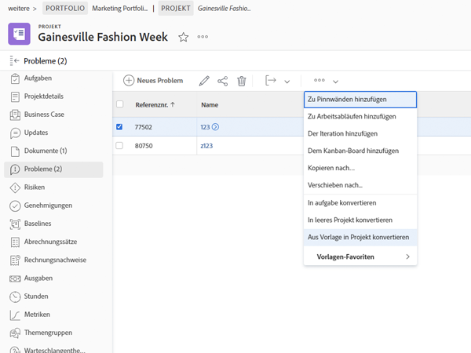

# Konvertieren eines Problems/einer Anfrage in ein Projekt

In diesem Video lernen Sie Folgendes:

* Überprüfen der mit der Anfrage übermittelten Informationen
* Auswählen der entsprechenden Projektvorlage
* Abschließen der Konvertierung von Anfrage zu Projekt

>[!VIDEO](https://video.tv.adobe.com/v/340343/?quality=12&learn=on)

## Was Sie über den Abschnitt [!UICONTROL Optionen] wissen müssen

Der Abschnitt [!UICONTROL Optionen] kann von Systemadmins ausgeblendet werden, wenn die festgelegten Standardeinstellungen verwendet werden sollen. Wenn der Abschnitt [!UICONTROL Optionen] angezeigt wird, finden Sie hier eine Definition der einzelnen Optionen:

**Ursprüngliche Anfrage beibehalten und deren Lösung mit dem Projekt verknüpfen**

Wenn diese Option ausgewählt ist, wird das ursprüngliche Problem beim Abschluss des Projekts als behoben markiert. Wenn diese Option **nicht** ausgewählt ist, wird das ursprüngliche Problem bei der Projekterstellung gelöscht.

**(Benutzername) Zugriff auf dieses Projekt erlauben**

Wenn diese Option ausgewählt ist, erhält die Person, die die Anfrage gestellt hat (oder in deren Namen die Anfrage gesendet wurde) nach der Erstellung automatisch Zugriffsrechte auf das neue Projekt. Wenn diese Option **nicht** ausgewählt ist, werden ihnen keine Rechte automatisch zugewiesen.

## Verwalten von Informationen während des Konvertierungsprozesses

Die Übertragung der benutzerdefinierten Formulardaten erfordert Folgendes:

* Mehrere Kopien desselben benutzerdefinierten Formulars – eine für das Problem und eine für die Aufgabe oder das Projekt. Die Felder in diesen benutzerdefinierten Formularen sollten exakt übereinstimmen, sodass die Informationen von einem benutzerdefinierten Formular zum anderen übertragen werden können.

* Sie können ein einzelnes benutzerdefiniertes Formular verwenden, in dem alle Probleme, Aufgaben und/oder Projektobjekte ausgewählt sind. Bei Verwendung dieser Methode müssen Sie nur benutzerdefinierte Felder in einem einzelnen benutzerdefinierten Formular erstellen und verwalten. Dies ist viel einfacher, als mehrere Kopien desselben Formulars zu haben. Beide Methoden funktionieren jedoch.

Wenn Sie ein benutzerdefiniertes Formular in eine Projektvorlage aufnehmen, wird es automatisch zugewiesen, wenn die Vorlage im Konvertierungsprozess ausgewählt wird.

## Konvertieren eines Problems in eine Aufgabe oder ein Projekt aus einer beliebigen Problemliste

Um die Effizienz Ihrer Arbeit zu erhöhen und die Konvertierung von Problemen in einer schnelllebigen Umgebung zu vereinfachen, können Sie ein Problem in eine Aufgabe oder ein Projekt aus einer beliebigen Problemliste in einem Projekt, Bericht oder Dashboard konvertieren. Wählen Sie einfach ein Problem aus und klicken Sie dann auf das 3-Punkte-Menü, das angezeigt wird.

