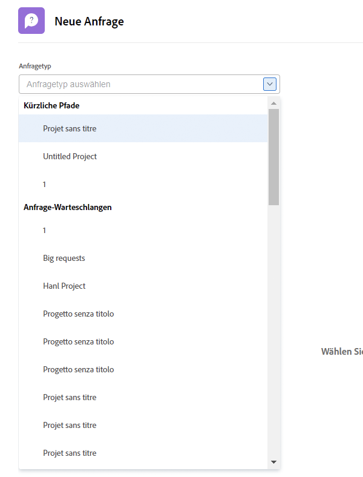
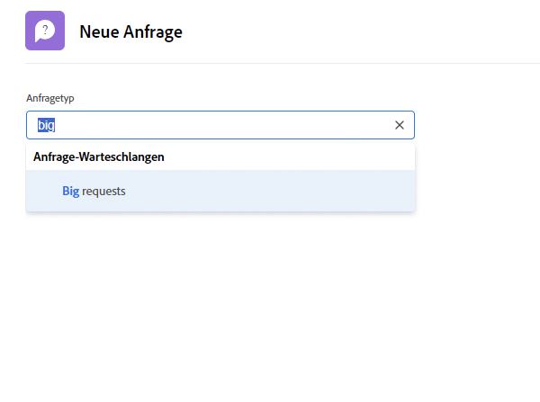
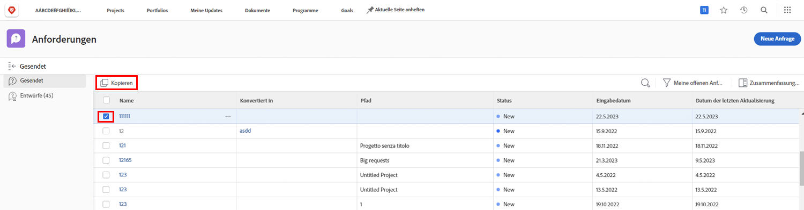
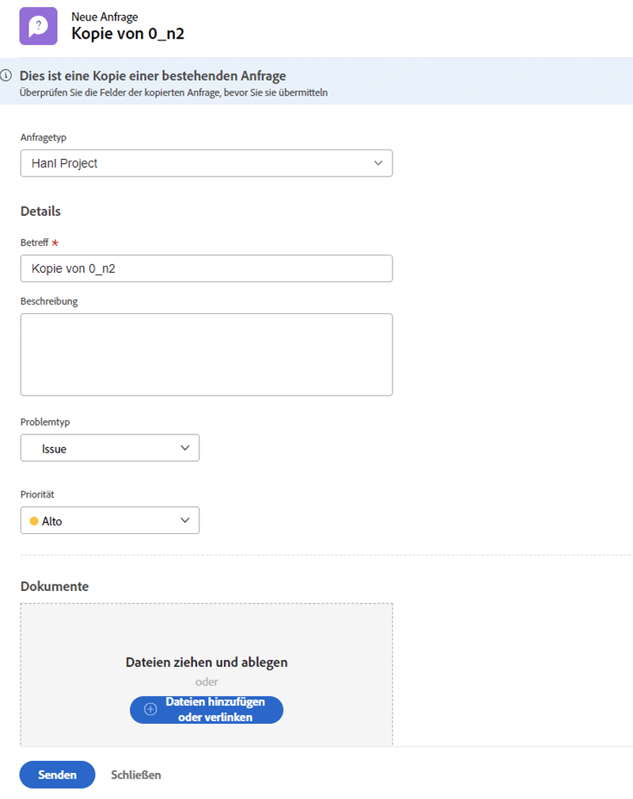

# Anfrage stellen

In vielen Unternehmen ist der erste Schritt beim Starten eines neuen Projekts, beim Entwickeln eines neuen Produkts oder beim Erstellen eines Lieferprogramms die Anforderung in [!DNL Workfront]. Sie können den Fortschritt der Anfrage verfolgen und bei Bedarf zusätzliche Informationen bereitstellen.

In diesem Video erfahren Sie, wie Sie:

* Navigieren zum Anforderungsbereich
* Anfrage stellen
* Gesendete Anforderungen anzeigen
* Anforderungsentwurf suchen

>[!VIDEO](https://video.tv.adobe.com/v/336092/?quality=12&learn=on)

## Schneller Zugriff auf Anforderungswarteschlangenpfade

Wenn Sie in die [!UICONTROL Anfragetyp] -Feld die letzten drei Anfragepfade, die Sie kürzlich gesendet haben, um automatisch oben in der Liste anzuzeigen. Wählen Sie eine Option aus, um eine weitere Anforderung in dieselbe Warteschlange zu senden.

Am Ende der Liste befinden sich alle Anforderungswarteschlangen, auf die Sie Zugriff haben. Wenn Sie nicht sicher sind, welche Warteschlange Sie für Ihre Anfrage verwenden möchten, suchen Sie mit der Suchbegriffsuche schnell und einfach nach der gewünschten Warteschlange.

Während Sie Suchbegriffe eingeben, [!DNL Workfront] führt Übereinstimmungen ein, damit Sie den Pfad der Anforderungswarteschlange finden können, der Ihren Anforderungen entspricht. Um beispielsweise einen Social-Media-Beitrag anzufordern, geben Sie in das Feld [!UICONTROL Anfragetyp] -Feld und die Liste werden dynamisch aktualisiert, um Übereinstimmungen anzuzeigen.

Wählen Sie die gewünschte Option aus, füllen Sie das Anfrageformular aus und senden Sie die Anfrage.

## Eine gesendete Anforderung kopieren, um eine neue Anforderung zu erstellen

Wenn Sie denselben Anforderungstyp häufig senden, ist es zeitaufwendig, jede neue Anforderung zu erstellen und dieselben Informationen immer wieder auszufüllen. Beschleunigen Sie den Prozess, indem Sie eine vorhandene Anforderung kopieren, nur die zu aktualisierenden Informationen ändern und als neue Anforderung senden.

1. Klicken Sie im Hauptmenü auf Anforderungen .
1. Vergewissern Sie sich, dass Sie sich im Abschnitt &quot;Gesendet&quot;befinden, indem Sie das Menü im linken Bedienfeld aktivieren.
1. Suchen und wählen Sie die Anforderung aus, die Sie kopieren möchten. Sie können jeweils nur eine Anforderung kopieren.
1. Klicken Sie links oben in der Anforderungsliste auf das Symbol Kopieren und Senden als neuen Ordner .
1. Das Fenster Neue Anfrage wird geöffnet, wobei das Feld Betreff hervorgehoben wird, damit Sie die neue Anforderung benennen können.
1. Aktualisieren Sie nach Bedarf andere Informationen in der Anfrage.
1. Klicken Sie zum Fertigstellen auf Senden .
1. Die kopierte Anforderung wird als neue Anforderung gesendet und in Ihrer Liste &quot;Gesendet&quot;angezeigt.

Sie können eine bereits gesendete Anforderung kopieren, aber keinen Entwurf einer Anforderung kopieren. Sie können eine von einer anderen Person gesendete Anforderung kopieren, solange Sie Zugriff auf die Anfrage anzeigen haben.

<!---
Learn more
Requests area overview
Create and submit Workfront requests
Guides
Make a work request
--->
