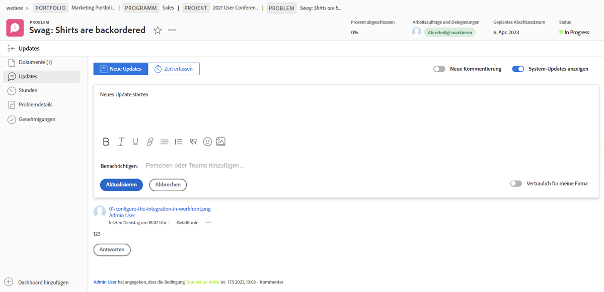
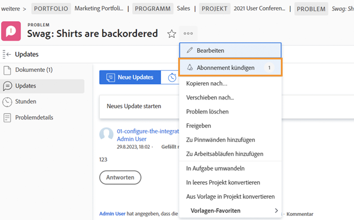
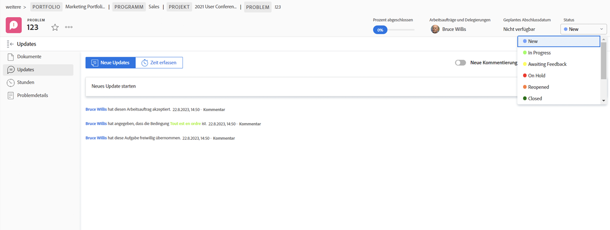
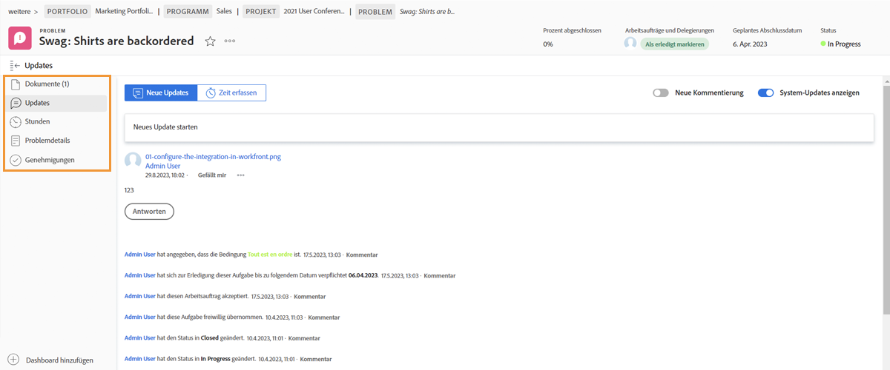

# Problemzuweisungen verwalten

## Problem zuweisen

Protokollieren des Problems in [!DNL Workfront] ist der erste Schritt zur Lösung auftretender Probleme. Der nächste Schritt besteht darin, das Problem einem einzelnen Benutzer, mehreren Benutzern oder einem Team zuzuweisen, damit alle damit verbundenen Arbeiten abgeschlossen und das Problem behoben werden kann.

Das Zuweisen eines Problems entspricht dem Zuweisen einer Aufgabe - füllen Sie das Feld [!UICONTROL Zuweisungen] -Feld. Das Problem wird dann im [!UICONTROL Arbeitsliste] in [!DNL Workfront] [!UICONTROL Startseite]. Wenn sie einem Team zugewiesen wurde, wird sie im [!UICONTROL Team-Anforderungen] Abschnitt [!UICONTROL Team] Seite.

Alle Probleme, die bei Aufgaben protokolliert werden, sowie das Projekt selbst können über die [!UICONTROL Probleme] auf der Seite des Projekts. Dadurch können Projektmanager, Planer und andere schnell projektbezogene Probleme zuweisen.

Es gibt mehrere Möglichkeiten, Probleme in zuzuweisen [!DNL Workfront].

* Navigieren Sie zu [!UICONTROL Problem] Abschnitt des Projekts oder der Aufgabe. Klicken Sie in die [!UICONTROL Zuweisungen] ein, um die Inline-Bearbeitung zu aktivieren, und geben Sie dann den Namen des Benutzers, der Benutzer oder des Teams ein, der die Arbeit abschließen soll.
Sie können die Inline-Bearbeitung auch verwenden, wenn Sie Probleme in einem [!DNL Workfront] Bericht.

* Klicken Sie auf den Namen des Problems, entweder in einem Bericht oder im **[!UICONTROL Probleme]** des Projekts oder der Aufgabe. Klicken Sie dann auf die **[!UICONTROL Zuweisungen]** in der Kopfzeile, oben rechts im Fenster. Vergessen Sie nicht, auf die **[!UICONTROL Speichern]** nach Eingabe eines Benutzers oder Teamnamens.

![Ein Bild der Inline-Bearbeitungsoption beim Klicken auf die [!UICONTROL Zuweisungen] Feld eines Problems](assets/04-issue-assign-issue-list-assignments-field.png)

<!--
Learn more graphic and documentation article links
Assign issues
Edit user assignments for multiple issues
-->

## Zuweisung eines Problems empfangen

Sie finden die Ihnen zugewiesenen Probleme im [!UICONTROL Arbeitsliste] in [!UICONTROL Startseite].

![Ein Bild einer Problemzuweisung im [!UICONTROL Arbeitsliste] in [!UICONTROL Startseite]](assets/05-workfront-home-work-list.png)

Verwenden Sie die [!UICONTROL Filter] -Menü, um die Liste so einzugrenzen, dass Sie bei Bedarf nur Probleme anzeigen.

![Ein Bild der [!UICONTROL Filter] im Menü [!UICONTROL Arbeitsliste] in [!UICONTROL Startseite]](assets/06-workfront-home-issue-filter.png)

Wenn ein Problem einem Team zugewiesen wird, wird es im [!UICONTROL Team-Anforderungen] Abschnitt [!UICONTROL Team] Seite. Ein Teammitglied kann auf die [!UICONTROL Arbeiten daran] -Schaltfläche, um die Zuweisung zu akzeptieren, oder ein Team-Lead kann auf [!UICONTROL Neu zuweisen] -Symbol, um die Anfrage an eine bestimmte Person zu senden.

![Ein Bild der [!UICONTROL Team-Anforderungen] Abschnitt [!UICONTROL Team] page](assets/07-team-page-work-on-it.png)

Dem Team zugewiesene Probleme werden auch auf der Seite [!UICONTROL Zeitplan] Abschnitt. Dadurch können Teamleiter und andere sehen, an welchen Teammitgliedern gearbeitet wird, bevor sie die Arbeit zuweisen. Ziehen Sie die Problemleiste per Drag-and-Drop aus dem [!UICONTROL Nicht zugewiesen] -Bereich in den Kalender eines Teammitglieds, um ihn zuzuweisen.

![Ein Bild von Team-Zuweisungen im [!UICONTROL Zeitplan] Abschnitt.](assets/08-issue-assignment-team-schedule.png)

Je nachdem, wie Ihr Unternehmen [!DNL Workfront] einrichten, können Ihnen oder Ihrem Team auch Probleme in einem Bericht angezeigt werden, der Teil eines Dashboards ist.

<!-- Learn more graphic and documentation article links

* Display items in the [!UICONTROL Work List] in the [!UICONTROL Home] area
* Manage work and team requests in the [!UICONTROL Home] area

-->

## Aktualisierung des Fortschritts bei Problemen

Sie und Ihre Teammitglieder können Aktualisierungen veröffentlichen und Stunden zu Problemen protokollieren, um einen Überblick über die geleistete Arbeit zu erhalten und alle Beteiligten über den Fortschritt der Arbeit auf dem Laufenden zu halten.

Da es mehrere Möglichkeiten gibt, Aktualisierungen in zu posten [!DNL Workfront]folgen Sie den Anweisungen Ihres Teams bezüglich der empfohlenen Methode für die Verwendung Ihrer Systemkonfigurationen und Workflows.

Aktualisierungen und Stunden zu diesem Problem können über [!UICONTROL Startseite]. Klicken **[!UICONTROL Neue Updates]** um einen Kommentar zu posten.

![Ein Bild vom Veröffentlichen eines Updates zu einem Problem von [!UICONTROL Startseite].](assets/09-workfront-home-update.png)

Wenn Sie einen Kommentar zu einem Problem abgeben, können Sie die Nachricht über die Funktion @name an andere Benutzer oder Teams weiterleiten, ähnlich wie bei Social Media.

Klicken Sie auf **[!UICONTROL Protokollzeit]** -Schaltfläche, um die Arbeitsstunden für das Problem aufzuzeichnen.

![Ein Bild der Protokollierungszeiten für ein Problem von [!UICONTROL Startseite].](assets/10-workfront-home-log-hours.png)

Alternativ können Sie das Problem öffnen (auf den Namen klicken) und dort Ihre Informationen aufzeichnen.

## Abonnieren eines Problems

Jeder, der Zugriff auf das Problem hat, kann [!UICONTROL Abonnieren] an ihn, der ihnen jedes Mal, wenn ein Update/Kommentar zu dem Problem vorgenommen wird, eine Benachrichtigung sendet. Sie erhalten keine Benachrichtigungen, wenn Stunden protokolliert werden, der Status geändert wird oder andere Änderungen vorgenommen werden.

Die Anmeldung eignet sich hervorragend für andere Team-Mitglieder oder Projektmanager, um die Arbeit zu verfolgen, die sie interessieren, die sie aber nicht besuchen oder aktiv daran arbeiten.

<!-- Learn more graphic and link to documentation article

* Update or edit a work item in the Home area

-->

## Status des Problems aktualisieren

Vergessen Sie nicht, den Status des Problems nicht nur zu posten, sondern auch Kommentare oder Protokollierungszeiten zu ändern, um anzugeben, dass Sie daran arbeiten. Ändern Sie sie dann erneut, um anzugeben, dass die Arbeit abgeschlossen ist.

Den Status in der Kopfzeile ändern von [!UICONTROL Startseite] oder wenn Sie die Problemseite geöffnet haben.

### Ungelöste Probleme

Ein Problem wird als &quot;ungelöst&quot;betrachtet, wenn der Status nicht aktualisiert wurde, um abgeschlossen zu sein, oder als äquivalentes Problem.

Ungelöste Probleme verhindern, dass die Aufgabe, der sie zugeordnet ist, als abgeschlossen markiert wird und dass der Projektstatus auf &quot;Fertig&quot;gesetzt wird.

<!-- Learn more graphic and documentation article link

* Mark a work item as done in the Home area

-->

## Zusätzliche Funktionen bei Problemen

Die Problemseite bietet Zugriff auf zusätzliche Informationen und Funktionen, die Teammitglieder und Projektmanager möglicherweise benötigen, um das Problem ordnungsgemäß aufzuzeichnen und zu verwalten und zu beheben.

Zusätzlich zu [!UICONTROL Updates] und [!UICONTROL Stunden]können Sie nach dem Öffnen des Problems über das Menü des linken Bedienfelds auf andere Informationen zugreifen.

* **[!UICONTROL Dokumente]**—Hochladen und Überprüfen von Dokumenten im Zusammenhang mit dem Problem.
* **[!UICONTROL Problemdetails]**—Ändern Sie Probleminformationen wie Beschreibung, Priorität, Schweregrad und geplantes Abschlussdatum.
* **[!UICONTROL Genehmigungen]**—Richten Sie einen Validierungsprozess für die einmalige Verwendung ein oder wenden Sie einen globalen Validierungsprozess an. Sie können den Fortschritt der Validierung auch in diesem Abschnitt verfolgen.

Suchen Sie die Optionen zum Kopieren, Löschen oder Freigeben eines Problems im Menü mit den 3 Punkten rechts neben dem Namen des Problems.

<!-- Learn more graphic and documentation article links

* Edit issues
* Copy issues
* Share an issue
* Move issues
* Grant access to an issue

-->
