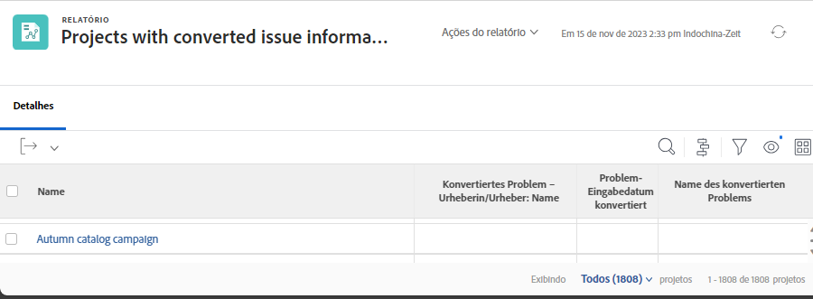

# Problembericht

Erfahren Sie, wie Sie Probleme zentralisieren können, indem Sie einen Bericht erstellen.

## Zentralisieren von Problemen durch Erstellung eines Berichts

Viele Traffic- und Projektmanager erstellen [!UICONTROL Workfront] benutzerdefinierter Bericht, um alle eingehenden Probleme zu zentralisieren. Dies erleichtert die Nachverfolgung der Neuigkeiten und erfordert Aufmerksamkeit.

Der Bericht kann dann zu einem Dashboard hinzugefügt werden, sodass alles, was Sie für Ihre Arbeit benötigen, in einer [!UICONTROL Workfront] Fenster.

![Ein Bild der [!UICONTROL Auflösen von Objekten] Spalte eines Problemberichts.](assets/18-resolving-object-report.png)

Um den Namen der Aufgabe oder des Projekts anzuzeigen, in die das Problem konvertiert wurde, fügen Sie Folgendes hinzu:[!UICONTROL Auflösen von Objekten]&quot; in der Ansicht. A[!UICONTROL Auflösen von Objekten]&quot; ist die Aufgabe oder das Projekt, die bzw. das beim Konvertieren eines Problems erstellt wurde. Wenn ein Problem nicht konvertiert wurde, wird die [!UICONTROL Auflösen von Objekten] leer ist. Dieser Bericht zeigt schnell, welche Probleme bereits konvertiert wurden, sodass Sie keine Duplikate haben. Klicken Sie einfach auf den aufgelösten Objektnamen, um ihn zu öffnen, damit Sie den Fortschritt der durchgeführten Arbeit verfolgen können.

## Informationen zu ursprünglichen Problemen in Berichten anzeigen

Wenn ein Problem in ein Projekt oder eine Aufgabe konvertiert wird, können viele der ursprünglichen Problemdetails in Projekt- oder Aufgabenberichten aufgeführt werden. Das ursprüngliche Problem wird als[!UICONTROL Konvertierte Ausgabe]&quot;.

Ein Projekt- oder Aufgabenbericht kann diese Informationen mithilfe der Variablen [!UICONTROL Urheber einer konvertierten Ausgabe] -Objekt zusammen mit zwei dedizierten Feldern ein. Diese Spalten können einer benutzerdefinierten Ansicht hinzugefügt werden, ohne dass ein Textmodus erforderlich ist:

* [!UICONTROL Problem-Eingabedatum konvertiert]
* [!UICONTROL Name des konvertierten Problems]
* [!UICONTROL Konvertierter Ausgabenautor > Name]

>[!NOTE]
>
>Anweisungen zum Erstellen einer Ansicht finden Sie unter [Basisansicht erstellen](https://experienceleague.adobe.com/docs/workfront-learn/tutorials-workfront/reporting/basic-reporting/create-a-basic-view.html?lang=en).

