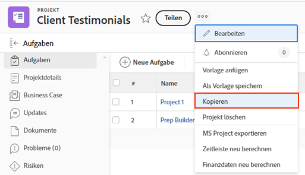

# Ein bestehendes Projekt kopieren

Manchmal brauchen Sie keine Vorlage, um ein Projekt zu erstellen, sondern müssen nur ein Projekt zur einmaligen Verwendung kopieren. Dazu benötigen Sie eine Standardlizenz mit Zugriff auf Projekte mit der Option Bearbeiten und Erstellen .

Navigieren Sie zu dem Projekt, das Sie kopieren möchten, und klicken Sie auf die drei Punkte neben dem Projektnamen. Wählen Sie dann „Kopieren“.

Im Fenster „Projekt kopieren“ können Sie den Titel und den Status ändern sowie eine Reihe von Daten löschen, die mit dem Projekt verbunden sind, z. B. Zuordnungen, Dokumente und benutzerdefinierte Daten.

Wenn Sie Zuordnungen löschen oder den Status auf „Planung“ setzen, wird verhindert, dass das kopierte Projekt direkt nach dem Kopieren Benachrichtigungen über Aufgabenzuordnungen versendet.

## Empfohlene Tutorials zu diesem Thema

* [Erstellen eines Projekts direkt aus einer Vorlage](/help/manage-work/create-and-manage-project-templates/create-a-project-directly-from-a-template.md)
* [Arbeiten mit Aufgaben](/help/manage-work/tasks/work-with-tasks.md)
* [Zuweisen von Aufgaben aus dem Projektplan](/help/manage-work/tasks/assign-tasks-from-the-project-plan.md)
