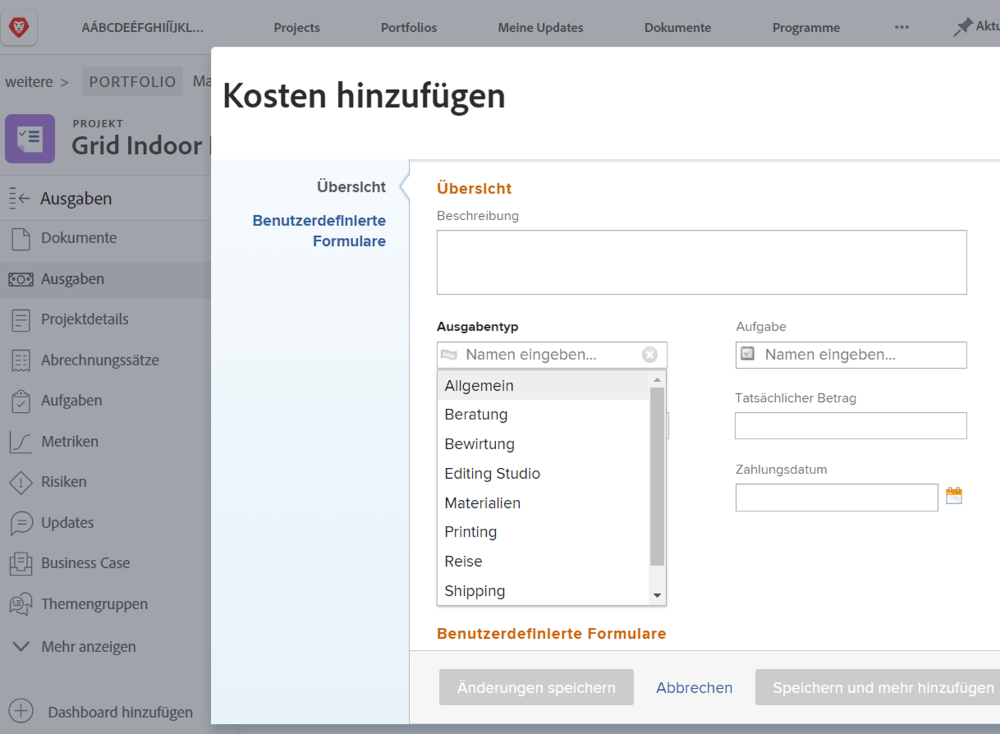

# Einrichten von Ausgabentypen

Ausgaben in [!DNL Workfront] nicht-Arbeitskosten im Zusammenhang mit Projekten und anderen Arbeiten darstellen. Kosten könnten beispielsweise Reisekosten beim Besuch eines Kunden oder der Kauf von Vorräten sein, die zum Abschluss eines Fotoshootings erforderlich sind. Diese Ausgaben sollten im Rahmen des Projekts protokolliert werden, damit geplante Kosten und tatsächliche Kosten berechnet und für jedes Projekt gemeldet werden können.

[!DNL Workfront] verfügt über vordefinierte Ausgabetypen, die bei der Eingabe von Ausgaben verwendet werden können. Die Standardeinstellungen können nicht gelöscht oder geändert werden, es können jedoch neue hinzugefügt werden.

* Werbung
* Beratung
* Bewirtung
* Allgemein
* Materialien
* Drucken
* Versand
* Reise

Ein Systemadministrator kann für seine Organisation erforderliche Ausgabentypen hinzufügen. Diese zusätzlichen Ausgabentypen können geändert, ausgeblendet oder gelöscht werden, um die in Ihrem Unternehmen benötigten Finanzberichte zu unterstützen.

Projektmanager, Führungskräfte und andere können Ausgabenberichte erstellen, in denen die individuellen Ausgaben nach Typ gruppiert werden, falls gewünscht, für Aufgaben, Projekte, Programme oder Portfolios innerhalb von [!DNL Workfront]. Projektfinanzierungen werden durch Ausgabetypen viel besser zu bewältigen.

## Ausgabentyp erstellen

**Auswählen [!UICONTROL Einrichtung] aus dem Hauptmenü**

1. Klicken **[!UICONTROL Ausgabentypen]** im Menü des linken Bedienfelds.
1. Klicken Sie auf **[!UICONTROL Neuer Ausgabentyp]** Schaltfläche.
1. Nennen Sie den Ausgabentyp.
1. Fügen Sie bei Bedarf eine Beschreibung hinzu.
1. Klicken Sie auf **[!UICONTROL Speichern]** Schaltfläche.

![Ein Bild zum Erstellen eines neuen [!UICONTROL Ausgabentyp]](assets/setting-up-finances-6.png)

## Verwendung von Ausgabentypen

Die Ausgabenoptionen werden im **[!UICONTROL Ausgabentyp]** Dropdown-Liste, wenn Benutzer Ausgaben für ein Projekt oder eine Aufgabe in [!DNL Workfront].

