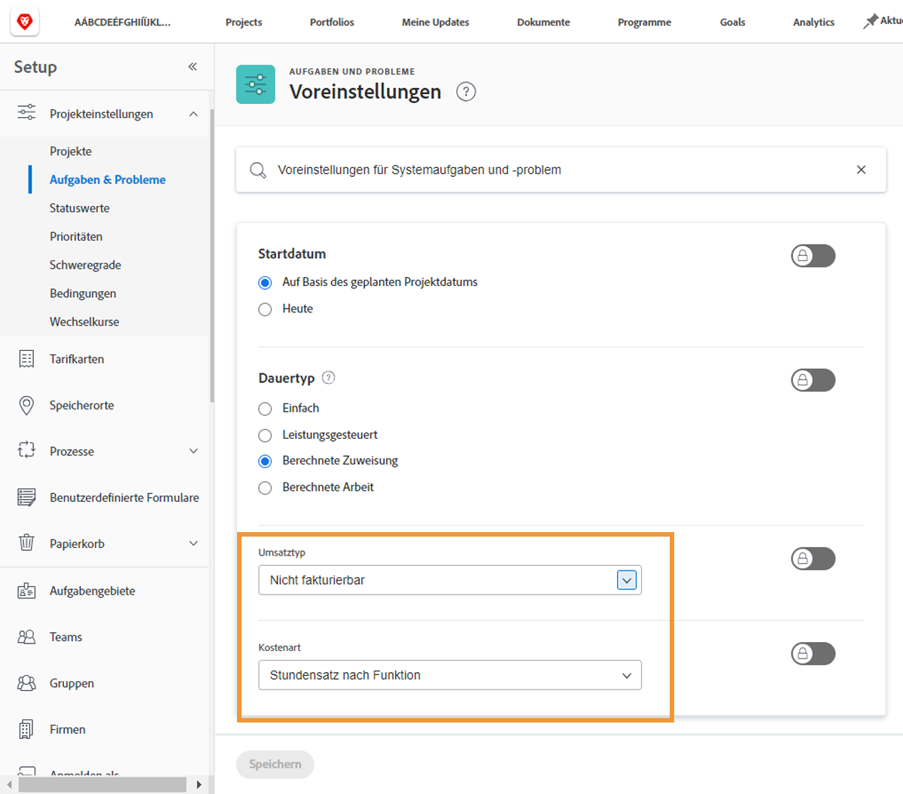

# Einrichten der standardmäßigen Einnahmen- und Kosteneinstellungen für Aufgaben

Der Ertragstyp und der Kostentyp werden zur Berechnung der geplanten und tatsächlichen Finanzinformationen für eine Aufgabe verwendet. Standardinformationen für jede dieser Aufgaben können systemweit festgelegt werden, sodass sie für jede neu erstellte Aufgabe gelten. Die Informationen können für einzelne Projekte geändert oder in Projektvorlagen festgelegt werden.

**Es stehen fünf standardmäßige Umsatztypen zur Verfügung:**

* Nicht fakturierbar
* Benutzer pro Stunde
* Stundensatz nach Funktion
* Festgelegt pro Stunde
* Festeinnahmen

**Und es stehen vier Standardkostentypen zur Verfügung:**

* Keine Kosten
* Festgelegt pro Stunde
* Benutzer pro Stunde
* Stundensatz nach Funktion

>[!NOTE]
>
>Wenn die Umsatz- oder Kostentypen auf &quot;Nicht abrechenbar&quot;oder &quot;Keine Kosten&quot;gesetzt sind, werden für die Aufgabe keine Umsatz- und Kostenschätzungen generiert. Daher trägt die Arbeit an der Aufgabe nicht zu den Einnahmen oder Kosten auf Projektebene bei.

## Festlegen von Umsatz- und Kostenstandards

Auswählen **[!UICONTROL Einrichtung]** aus dem Hauptmenü.

1. Klicken **[!UICONTROL Projektvoreinstellungen]** im Menü des linken Bedienfelds.
1. Klicken Sie anschließend auf **[!UICONTROL Aufgaben und Probleme]**.
1. Im [!UICONTROL Neuer Aufgabenstandard] wählen Sie den gewünschten [!UICONTROL Umsatztyp] und [!UICONTROL Kostentyp].
1. Klicken Sie abschließend auf Speichern .

