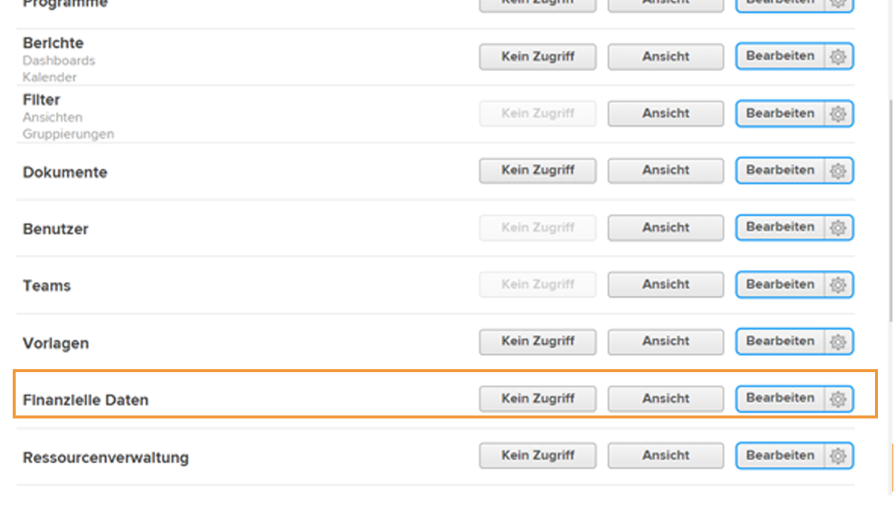

# Finanziellen Zugang verstehen

Wenn Ihr Unternehmen Finanzdaten mit [!DNL Workfront]Als Systemadministrator sind Sie dafür verantwortlich, die Benutzer zu schützen und zu verwalten, die Zugriff auf diese Informationen haben.

Zwei Dinge sind erforderlich, damit ein Benutzer Finanzinformationen anzeigen oder bearbeiten kann:

1. Zugriffsberechtigungen müssen in der [!UICONTROL Zugriffsstufe].
2. Die Berechtigung zur Nutzung dieser Zugriffsrechte muss objektabhängig erteilt werden.

Beispielsweise kann einem Benutzer die Berechtigung zum Anzeigen von Finanzdaten in seiner Zugriffsebene gewährt werden, er kann jedoch nur Finanzdaten zu einer Aufgabe anzeigen, die für ihn freigegeben ist und die finanzielle Anzeige bei der Freigabe dieser Aufgabe aktiviert ist.

So ist es möglich, dass ein Benutzer mit [!UICONTROL Zugriffsstufe] Rechte zur Anzeige von Finanzmitteln, um Finanzierungen auf einigen Objekten und nicht auf anderen anzeigen zu können, abhängig von den individuellen Teilungsoptionen dieser Objekte. Kein Benutzer kann jedoch finanzielle Mittel zu einem Objekt einsehen, es sei denn, er hat in seinem [!UICONTROL Zugriffsstufe].

## [!UICONTROL Zugriffsstufe] settings

Der allgemeine Zugang zu Finanzdaten wird zunächst durch [!DNL Workfront] Lizenztyp.

**[!UICONTROL Plan] -Lizenzen können:**

* Rechnungsdatensätze verwalten
* Verwalten und Anzeigen der Rollenabrechnung und der Kostensätze
* Benutzerabrechnung und -kosten verwalten und anzeigen
* Verwalten von Ausgaben
* Anzeigen und Bearbeiten von Finanzen

**[!UICONTROL Arbeit] -Lizenzen können:**

* Verwalten von Ausgaben
* Anzeigen von Finanzen

**[!UICONTROL Überprüfen] -Lizenzen können:**

* Anzeigen von Finanzen

**Berechtigungen können durch die [!UICONTROL Zugriffsstufe]. Die drei Optionen für den finanziellen Datenzugriff sind:**

* [!UICONTROL Kein Zugriff] — Der Benutzer kann keine Finanzinformationen anzeigen.
* [!UICONTROL Ansicht] — Benutzer können die Informationen überprüfen und teilen.
* [!UICONTROL Bearbeiten] — Benutzer können die Informationen erstellen, bearbeiten, löschen und freigeben. (Nur für eine Planungslizenz verfügbar.)

Beachten Sie, dass die Variable [!UICONTROL Ansicht] und [!UICONTROL Bearbeiten] -Optionen zusätzliche Einstellungen für eine [!UICONTROL Plan] Lizenz. Klicken Sie auf das Zahnrad auf der [!UICONTROL Ansicht] Schaltfläche für diese Optionen:

**[!UICONTROL Anzeigen]**

* Funktionsbezogene Fakturierung und Kostensätze anzeigen
* Benutzerfakturierung und Kostensätze anzeigen

**[!UICONTROL Bearbeiten]**

Diese beiden Optionen sind im [!UICONTROL Bearbeiten] -Option sowie:

* Funktionsbezogene Fakturierung und Kostensätze bearbeiten
* Benutzerfakturierung und Kostensätze bearbeiten

>[!NOTE]
>
>Ein Benutzer mit Zugriff auf zusätzliche Ausgaben kann auch die von ihm hinzugefügten Ausgaben sowie die durch seine direkten Berichte hinzugefügten Ausgaben einsehen.
