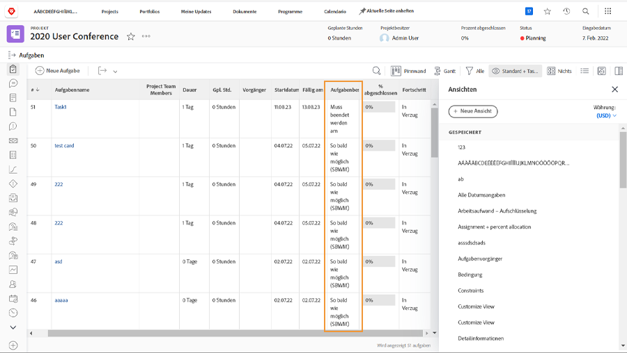

# Verfolgen des Fortschritts über die Projekt-Timeline

Stellen Sie sicher, dass die Aufgaben so vorankommen, wie sie die Projektzeiträume erreichen sollten. Während Sie durch die [!UICONTROL Aufgabe] auflisten, gibt es mehrere Funktionen in [!DNL  Workfront] die Ihnen dabei helfen, den Fortschritt und den Status der Arbeit zu überwachen.

## Prozent abgeschlossen

Der Prozentsatz, der für jede Aufgabe abgeschlossen wird, wird manchmal verwendet, um den Fortschritt der Arbeit zu messen. Es ist wichtig zu beachten...Dieses Feld muss manuell angepasst werden, da der Bevollmächtigte schätzt, wie weit sie sind.

![Liste der Projektaufgaben [!UICONTROL Prozent abgeschlossen] column](assets/planner-fund-task-percent-complete.png)

Es gibt zwei Male, wenn sich der prozentuale Abschluss automatisch ändert:

Wenn die Aufgabe [!UICONTROL Status] auf &quot;Fertig stellen&quot;eingestellt ist, wird der Prozentsatz für die Fertigstellung auf 100 gesetzt.
Wenn die Aufgabe [!UICONTROL Status] wird zurück auf Neu gesetzt, wird der prozentuale Abschluss auf 0 zurückgesetzt.

## Status

Fügen Sie die [!UICONTROL Status] in einer Spalte [!UICONTROL Ansicht] um schnell zu sehen, welche Aufgaben gestartet wurden, welche ausgeführt werden und welche abgeschlossen sind. Sie können sogar die bedingte Formatierung in einer [!UICONTROL Ansicht] um jeden Status farblich zu kennzeichnen, wodurch die Informationen leichter zu entschlüsseln sind.

## Aufgabenzuweisungen

Überprüfen Sie beim Überprüfen des Projekts die Aufgabenzuweisungen. Vielleicht fiel die Arbeit zurück, weil niemand der Aufgabe zugewiesen war. Oder vielleicht hatte die zugewiesene Person nicht die richtigen Fähigkeiten, um die Arbeit abzuschließen. Fügen Sie einer Aufgabe weitere Personen hinzu oder weisen Sie Aufgaben neu zu, um sicherzustellen, dass die Arbeit erledigt wird.

## Aufgabenbeschränkung

Manchmal werden Aufgabenbegrenzungen geändert und Sie erkennen sie nicht. Einschränkungen können sich auf das Verhalten Ihrer Timeline auswirken, sodass Sie überprüfen können, ob sie festgelegt wurden, wie Sie sie verwenden möchten.

Erstellen Sie eine benutzerdefinierte Ansicht mit [!UICONTROL Aufgabenbegrenzung] um diese Informationen in Ihrer Aufgabenliste anzuzeigen. Wenn Sie das Projekt von einem Startdatum an geplant haben, sollen Ihre Aufgaben über die [!UICONTROL So bald wie möglich] ([!UICONTROL ASAP]).
